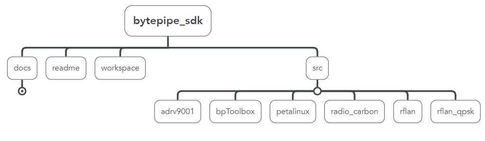

---

# BytePipe Software Development Kit

The BytePipe_x9002 SOM is a Software Defined Radio (SDR) System on Module (SOM) based on Analog Devices Inc.’s ADRV9002 Agile Transceiver™ with the Xilinx ZYNC®- UltraScale+ SoC.  The SOM can be used as an evaluation tool, prototyping platform, or integrated into a full-scale product.  The ADRV9002 2x2 MIMO transceiver with integrated DPD engine operates from 30MHz to 6GHz and supports both narrowband and wideband channel bandwidths from 12.5KHz to 40MHz.  The narrow band support makes it suitable for applications including, Land Mobile Radio, APCO P25-PII while supporting higher bandwidth applications like satellite communications, IoT, cellular,  LTE, or Wi-Fi.  NextGen RF Design, through our design services lab, can also support customized versions optimized for application specific requirements.

The BytePipe Software Development Kit (SDK) provides a framework for quickly evaluating the BytePipe hardware platform.  It also serves as a starting point for users to create custom applications.  Below is a high level block diagram of the software.  The software includes Linux Desktop running on one of the Cortex A53 application processors and the RFLAN FreeRTOS application running on one of the Cortex R5 DSP processors.  The programmable logic can be used to support a wide variety of RF communication protocols and includes MathWorks examples.  

---

# Software Overview

The BytePipe SDK software is broken into several source folders as shown below.    

The following provides links to each source folder documentation.

|  Document                                                         | Description                                                   |
|-------------------------------------------------------------------|---------------------------------------------------------------|
| [adrv9001-sdk](src/adrv9001-sdk/README.md)                        | Source files for duplicating ADRV9001-SDK Evaluation Software on the BytePipe_x9002 | 
| [axi_adrv9001](src/axi_adrv9001/README.md)                        | Production optimized ADRV9001 interface for BytePipe | 
| [bpToolbox](src/bpToolbox/README.md)                              | Matlab toolbox for interfacing to BytePipe | 
| [rflan_iqdma](src/rflan_iqdma/README.md)                          | Production example streaming IQ data to RPU | 
| [rflan_qpsk](src/axi_dma/README.md)                               | QPSK modem example using RPU and Mathworks HDL Coder | 

# Hardware Overview

The following hardware platforms are supported by the BytePipe_SDK.

|  Document                                                 | Description                           |                                                      |
|-----------------------------------------------------------|---------------------------------------|------------------------------------------------------|
| [BytePipe_x900x](docs/hardware/BytePipe_x900x/BytePipe_x900x.md)   | BytePipe ZynqMP / ADRV900x SOM        |        |
| [BytePipe HDK](docs/hardware/hdk/hdk.md)                           | BytePipe Hardware Development Kit     |                         |

# DISCLAIMER

THE SOFTWARE IS PROVIDED "AS IS", WITHOUT WARRANTY OF ANY KIND, EXPRESS OR IMPLIED, INCLUDING BUT NOT LIMITED TO THE WARRANTIES OF MERCHANTABILITY, FITNESS FOR A PARTICULAR PURPOSE AND NONINFRINGEMENT. IN NO EVENT SHALL THE AUTHORS OR COPYRIGHT HOLDERS BE LIABLE FOR ANY CLAIM, DAMAGES OR OTHER LIABILITY, WHETHER IN AN ACTION OF CONTRACT, TORT OR OTHERWISE, ARISING FROM, OUT OF OR IN CONNECTION WITH THE SOFTWARE OR THE USE OR OTHER DEALINGS IN THE SOFTWARE.

Copyright 2021 (c) NextGen RF Design, Inc. All rights reserved.
