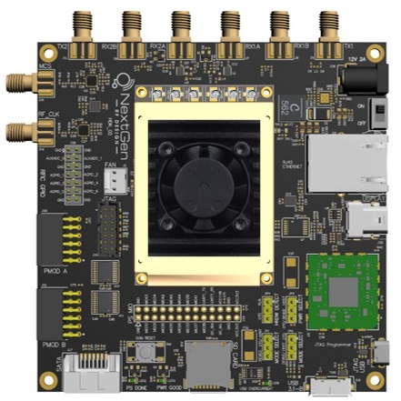

---

# BytePipe Software Development Kit

The BytePipe_x9002 SOM is a Software Defined Radio (SDR) System on Module (SOM) based on Analog Devices Inc.’s ADRV9002 Agile Transceiver™ with the Xilinx ZYNC®- UltraScale+ SoC.  The SOM can be used as an evaluation tool, prototyping platform, or integrated into a full-scale product.  The ADRV9002 2x2 MIMO transceiver with integrated DPD engine operates from 30MHz to 6GHz and supports both narrowband and wideband channel bandwidths from 12.5KHz to 40MHz.  The narrow band support makes it suitable for applications including, Land Mobile Radio, APCO P25-PII while supporting higher bandwidth applications like satellite communications, IoT, cellular,  LTE, or Wi-Fi.  NextGen RF Design, through our design services lab, can also support customized versions optimized for application specific requirements.

# Software Overview

The BytePipe Software Development Kit (SDK) provides a framework for quickly evaluating the BytePipe hardware platform.  It also serves as a starting point for users to create custom applications.  The SDK includes example projects for the Cortex A53 application processing unit, Cortex R5 real-time processing unit, and programmable logic.  The software is broken into several source folders as shown below.  Each source folder contains documentation, source files, and build scripts related to a specific component.  

If you are new to the BytePipe start with the [rflan](src/rflan/README.md) application.  The rflan software provides users with tools for evaluating the BytePipe_x9002 SOM and is the starting point for users interested in creating custom production style set of firmware.  

|  Document                                                           | Description                                                   |
|---------------------------------------------------------------------|---------------------------------------------------------------|
| [adrv9001](src/adrv9001/README.md)                                  | Production optimized ADRV9001 interface for BytePipe          | 
| [bpToolbox](src/bpToolbox/README.md)                                | Matlab toolbox for interfacing to BytePipe                    | 
| [petalinux](src/petalinux/README.md)                                | Petalinux build                                               | 
| [radio_carbon](docs/hardware/RadioCarbon/RadioCarbon.md)            | Radio Carbon RF Front End User Guide                          | 
| [rflan](src/rflan/README.md)                                        | Production example streaming IQ data to RPU                   | 
| [rflan_dpd](src/rflan_dpd/README.md)                           | Digital Pre-Distortion example using Radio Carbon and BytePipe SOM | 
| [rflan_qpsk](src/rflan_qpsk/README.md)                              | QPSK modem example using RPU and Mathworks HDL Coder          | 
| [sd_card](docs/sd_card/README.md)                                   | Detailed information on supported micro-SD cards and formats  | 
| [Video Tutorials](https://www.youtube.com/playlist?list=PL1O6z4HXixy3uAJCNkjg2Hvm9Dcu4XAUr) | Playlist of video tutorials           | 

# Hardware Overview

The following hardware platforms are supported by the BytePipe_SDK.

|  Document                                                 | Description                           |                                                      |
|-----------------------------------------------------------|---------------------------------------|------------------------------------------------------|
| [BytePipe_x900x](docs/hardware/BytePipe_x900x/BytePipe_x900x.md)   | BytePipe ZynqMP / ADRV900x SOM        |        |
| [BytePipe HDK](docs/hardware/hdk/hdk.md)                           | BytePipe Hardware Development Kit     |                         |
| [Radio Carbon](docs/hardware/RadioCarbon/RadioCarbon.md)           | Radio Carbon RF Frontend             |              |

# DISCLAIMER

THE SOFTWARE IS PROVIDED "AS IS", WITHOUT WARRANTY OF ANY KIND, EXPRESS OR IMPLIED, INCLUDING BUT NOT LIMITED TO THE WARRANTIES OF MERCHANTABILITY, FITNESS FOR A PARTICULAR PURPOSE AND NONINFRINGEMENT. IN NO EVENT SHALL THE AUTHORS OR COPYRIGHT HOLDERS BE LIABLE FOR ANY CLAIM, DAMAGES OR OTHER LIABILITY, WHETHER IN AN ACTION OF CONTRACT, TORT OR OTHERWISE, ARISING FROM, OUT OF OR IN CONNECTION WITH THE SOFTWARE OR THE USE OR OTHER DEALINGS IN THE SOFTWARE.

Copyright 2021 (c) NextGen RF Design, Inc. All rights reserved.
