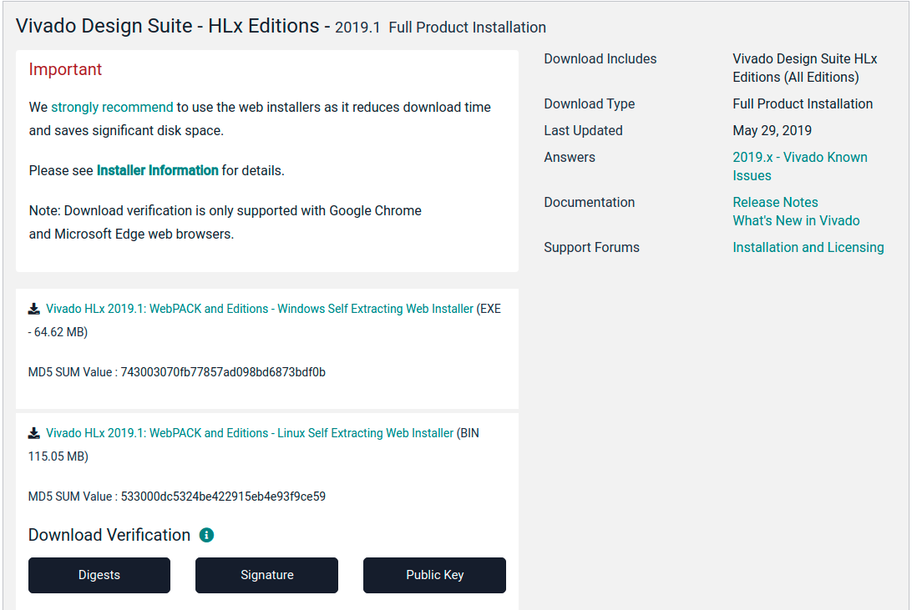

[](../../README.md)

# Build Environment

This document describes the build environment for building the BytePipe SDK components.  NextGen RF Design uses Windows 10 for building the HDL and RFLAN components however they can easily be built using a Linux PC.  The Linux components are built using a Linux PC.  The following sections describe the build environment used by NextGen RF Design along with required dependencies.

# Linux PC

There are many Linux distributions and ways to setup a Linux environment including a dedicated machine, virtual machine, or running on top of Windows.  NextGen RF Design uses Ubuntu 18.04.4 running on a dedicated machine for building the Linux application and drivers.  

To install Ubuntu as the native OS on a PC, download the Ubuntu image which can be found [here](http://old-releases.ubuntu.com/releases/18.04.4/).  It is advised to use [Rufus](https://rufus.ie/) to create a bootable USB drive using this image.  Additional information for installing Ubuntu can be found [here](https://ubuntu.com/tutorials/install-ubuntu-desktop#1-overview).  


Once the Linux system is installed, the following dependencies should be installed as shown below.

```
sudo apt-get update
sudo apt install git
sudo apt-get install build-essential
sudo apt-get install u-boot-tools 
sudo apt install snapd
sudo dpkg-reconfigure dash
```

When running `sudo dpkg-reconfigure dash` select **no** when prompted.  This will disable dash and enable bash.

# Windows PC

For building the HDL on a Windows machine NextGen RF Design uses [Cygwin](https://cygwin.com/install.html).  When installing Cygwin make sure to install the following packages shown below.

```bash
accerciser
alure-utils
checkbashisms
cmake
expect
gcc-tools-epoch2-automake
gnome-python
make
php
ruby
```

# Vivado Design Suite

The Vivado Design Suite from Xilinx must be installed on both the Windows PC and Linux PC.  The Vivado Design Suite includes the Xilinx Eclipse SDK which must be selected during installation.  This repository uses Vivado Design Suite 2019.1.3.  This can be downloaded and installed from [here](https://www.xilinx.com/support/download/index.html/content/xilinx/en/downloadNav/vivado-design-tools/archive.html).  



# PetaLinux

The PetaLinux design suite from Xilinx is used to build the Linux Kernel for BytePipe.  PetaLinux must be downloaded and installed on a Linux PC described above.  Once your Linux PC is setup download PetaLinux 2019.1 from the Archive folder [here](https://www.xilinx.com/support/download/index.html/content/xilinx/en/downloadNav/embedded-design-tools/archive.html).  Once PetaLinux is downloaded install the required dependencies followed by PetaLinux itself as shown below.  

```
sudo apt-get -y install tofrodos \
    iproute2 \
    gawk \
    make \
    net-tools \
    libncurses5-dev \
    tftpd \
    zlib1g:i386 \
    libssl-dev \
    flex \
    bison \
    libselinux1 \
    gnupg \
    wget \
    diffstat \
    chrpath \
    socat \
    xterm \
    autoconf \
    libtool \
    tar \
    unzip \
    texinfo \
    zlib1g-dev \
    gcc-multilib \
    build-essential \
    screen \
    pax \
    gzip

sudo apt install python-minimal
sudo apt-get install -y xvfb
sudo apt-get install libsdl1.2-dev
sudo apt-get install libglib2.0-dev

chmod +x petalinux-v2019.2-final-installer.run
./petalinux-v2019.2-final-installer.run

sudo dpkg-reconfigure dash
```

Ensure shell is using Bash: `sudo dpkg-reconfigure dash`. Select no when prompted.


# DISCLAIMER

THIS SOFTWARE IS COVERED BY A DISCLAIMER FOUND [HERE](../../DISCLAIMER.md).
