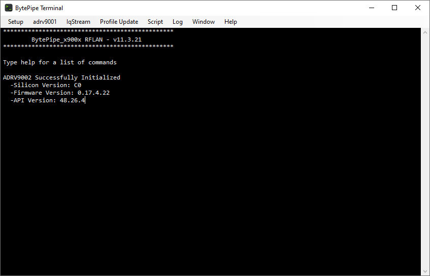

# BytePipe Terminal

The BytePipe Terminal is a PC application that interfaces to the `rflan` command line interface (CLI).  The BytePipe Terminal provides a traditional command line interface similar to `TeraTerm` or `Putty`.  BytePipe Terminal also provides GUI controls that abstract several CLI commands into user friendly controls.

The BytePipe Terminal is currently undergoing design verification testing and is not available in this release.  Future releases will support BytePipe Terminal.

# DISCLAIMER

THIS SOFTWARE IS COVERED BY A DISCLAIMER FOUND [HERE](../../DISCLAIMER.md).
