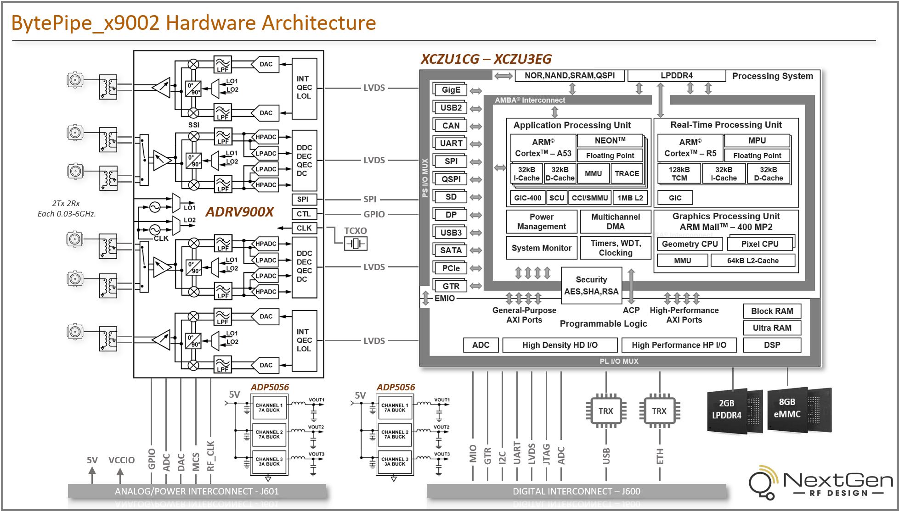
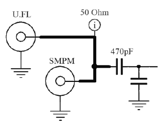

---

# BytePipe_x900x

The BytePipe_x9002 is a high performance RF System On Module (SOM).  The BytePipe_x9002 integrates a high performance Xilinx Zynq UltraScale+ baseband processor (BBP) with the Analog Devices ADRV9002 RFIC.  

# Hardware Architecture

The following shows a block diagram of the BytePipe_x900x Hardware Architecture.

# J600

J600 is a board to board connector which provides access to all of the digital signals on the SOM.  Some of these signals provide hardcoded functionality while others can be configured by the BBP.  The mating connector used on the host board is JAE Electronics WR-120S-VHF30-N1.  For additional information see the datasheet on [NextGen RF Design's website.](https://www.nextgenrf.com/products/rf-system-on-a-module/) 

|       Description             |    Signal      | Pin | Pin |    Signal      |       Description             |
|-------------------------------|----------------|-----|-----|----------------|-------------------------------|
| Gigabit transceiver data      | GTR_TX3_P      | 1   | 2   | GTR_RX3_P      | Gigabit transceiver data      |
| Gigabit transceiver data      | GTR_TX3_N      | 3   | 4   | GTR_RX3_N      | Gigabit transceiver data      |
| Ground                        | GND            | 5   | 6   | GND            | Ground                        |
| Gigabit transceiver data      | GTR_TX2_P      | 7   | 8   | GTR_RX2_P      | Gigabit transceiver data      |
| Gigabit transceiver data      | GTR_TX2_N      | 9   | 10  | GTR_RX2_N      | Gigabit transceiver data      |
| Ground                        | GND            | 11  | 12  | GND            | Ground                        |
| Gigabit transceiver data      | GTR_TX1_P      | 13  | 14  | GTR_RX1_P      | Gigabit transceiver data      |
| Gigabit transceiver data      | GTR_TX1_N      | 15  | 16  | GTR_RX1_N      | Gigabit transceiver data      |
| Ground                        | GND            | 17  | 18  | GND            | Ground                        |
| Gigabit transceiver data      | GTR_TX0_P      | 19  | 20  | GTR_RX0_P      | Gigabit transceiver data      |
| Gigabit transceiver data      | GTR_TX0_N      | 21  | 22  | GTR_RX0_N      | Gigabit transceiver data      |
| Ground                        | GND            | 23  | 24  | GND            | Ground                        |
| Gigabit transceiver clock     | GTR_REFCLK3_N  | 25  | 26  | GTR_REFCLK2_P  | Gigabit transceiver clock     |
| Gigabit transceiver clock     | GTR_REFCLK3_P  | 27  | 28  | GTR_REFCLK2_N  | Gigabit transceiver clock     |
| Ground                        | GND            | 29  | 30  | GND            | Ground                        |
| Gigabit transceiver clock     | GTR_REFCLK1_N  | 31  | 32  | GTR_REFCLK0_P  | Gigabit transceiver clock     |
| Gigabit transceiver clock     | GTR_REFCLK1_P  | 33  | 34  | GTR_REFCLK0_N  | Gigabit transceiver clock     |
| Ground                        | GND            | 35  | 36  | GND            | Ground                        |
| Ethernet Pair                 | ETH_MD3_N      | 37  | 38  | USB_N          | USB2.0                        |
| Ethernet Pair                 | ETH_MD3_P      | 39  | 40  | USB_P          | USB2.0                        |
| Ground                        | GND            | 41  | 42  | GND            | Ground                        |
| Ethernet Pair                 | ETH_MD2_N      | 43  | 44  | ETH_MD4_N      | Ethernet Pair                 |
| Ethernet Pair                 | ETH_MD2_P      | 45  | 46  | ETH_MD4_P      | Ethernet Pair                 |
| Ground                        | GND            | 47  | 48  | GND            | Ground                        |
| BPP PL I/O                    | IO_L3_P        | 49  | 50  | ETH_MD1_N      | Ethernet Pair                 |
| BPP PL I/O                    | IO_L3_N        | 51  | 52  | ETH_MD1_P      | Ethernet Pair                 |
| Ground                        | GND            | 53  | 54  | GND            | Ground                        |
| BPP PL I/O                    | IO_L2_P        | 55  | 56  | IO_L12_N       | BPP PL I/O                    |
| BPP PL I/O                    | IO_L2_N        | 57  | 58  | IO_L12_P       | BPP PL I/O                    |
| Ground                        | GND            | 59  | 60  | GND            | Ground                        |
| BPP PL I/O                    | IO_L1_N        | 61  | 62  | IO_L11_P       | BPP PL I/O                    |
| BPP PL I/O                    | IO_L1_P        | 63  | 64  | IO_L11_N       | BPP PL I/O                    |
| Ground                        | GND            | 65  | 66  | GND            | Ground                        |
| BPP PL I/O                    | IO_L4_P        | 67  | 68  | IO_L10_P       | BPP PL I/O                    |
| BPP PL I/O                    | IO_L4_N        | 69  | 70  | IO_L10_N       | BPP PL I/O                    |
| Ground                        | GND            | 71  | 72  | GND            | Ground                        |
| BPP PL I/O                    | IO_L5_P        | 73  | 74  | USB_VBUS       | USB Bus Voltage               |
| BPP PL I/O                    | IO_L5_N        | 75  | 76  | USB_CPEN       | USB Output Enable             |
| Ground                        | GND            | 77  | 78  | USB_ID         | USB ID                        |
| Ethernet Activity Indicator   | ETH_PHY_LED1   | 79  | 80  | UART0_TX       | UART0 Output                  |
| Ethernet Speed Indicator      | ETH_PHY_LED0   | 81  | 82  | UART1_TX       | UART1  Output                 |
| I2C data (VCCO_PSIO_501)      | I2C1_SDA       | 83  | 84  | UART0_RX       | UART0 Input                   |
| I2C clock (VCCO_PSIO_501)     | I2C1_SCL       | 85  | 86  | UART1_RX       | UART1 Input                   |
| Multiplexed I/O               | MIO37          | 87  | 88  | MIO38          | Multiplexed I/O               |
| Multiplexed I/O               | MIO46          | 89  | 90  | MIO41          | Multiplexed I/O               |
| Multiplexed I/O               | MIO28          | 91  | 92  | MIO39          | Multiplexed I/O               |
| Multiplexed I/O               | MIO33          | 93  | 94  | MIO45          | Multiplexed I/O               |
| Multiplexed I/O               | MIO26          | 95  | 96  | MIO44          | Multiplexed I/O               |
| Multiplexed I/O               | MIO29          | 97  | 98  | MIO40          | Multiplexed I/O               |
| Multiplexed I/O               | MIO30          | 99  | 100 | MIO42          | Multiplexed I/O               |
| Multiplexed I/O               | MIO35          | 101 | 102 | MIO34          | Multiplexed I/O               |
| Multiplexed I/O               | MIO36          | 103 | 104 | MIO47          | Multiplexed I/O               |
| Multiplexed I/O               | MIO27          | 105 | 106 | MIO48          | Multiplexed I/O               |
| Multiplexed I/O               | MIO31          | 107 | 108 | MIO43          | Multiplexed I/O               |
| Multiplexed I/O               | MIO49          | 109 | 110 | MIO50          | Multiplexed I/O               |
| Multiplexed I/O               | MIO32          | 111 | 112 | MIO51          | Multiplexed I/O               |
| Done Booting                  | PS_DONE        | 113 | 114 | PS_JTAG_TCK    | JTAG                          |
| BBP Reset                     | PS_SRST_N      | 115 | 116 | PS_JTAG_TDI    | JTAG                          |
| Power Good                    | PWR_GOOD       | 117 | 118 | PS_JTAG_TDO    | JTAG                          |
| 1.8V JTAG power reference.    | PS_JTAG_PWR    | 119 | 120 | PS_JTAG_TMS    | JTAG                          |

# J601

J601 is a board to board connector which provides access to power and RF control signals.  The mating connector used on the host board is JAE Electronics WR-40SB-VHF30-N1.  The following table defines the signal connections including connections associated with the ADRV9002.  The SDK function represents the software functionality included in the Software Development Kit. 

|   SDK Function   |       Description             |        Signal         | Pin | Pin |        Signal         |       Description             |   SDK Function   |
|------------------|-------------------------------|-----------------------|-----|-----|-----------------------|-------------------------------|------------------|                 
|                  | Ground                        | GND                   | 1   | 2   | GND                   | Ground                        |                  |
|                  | RF External Clock             | RF_CLK_N              | 3   | 4   | MCS_P                 | ADRV9002 MCS+ (D7)            |                  |
|                  | RF External Clock             | RF_CLK_P              | 5   | 6   | MCS_N                 | ADRV9002 MCS- (D8)            |                  |
|                  | Ground                        | GND                   | 7   | 8   | GND                   | Ground                        |                  |
|                  | ADRV9002 AGPIO_2 (E3)         | AGPIO_2               | 9   | 10  | AUXADC_0              | ADRV9002 AUXADC_0 (H11)       |                  |
|                  | ADRV9002 AGPIO_4 (F4)         | AGPIO_4               | 11  | 12  | AUXADC_1              | ADRV9002 AUXADC_1 (B8)        |                  |
| RX1 Enable       | ADRV9002 AGPIO_6 (G6)         | AGPIO_6               | 13  | 14  | GND                   | Ground                        |                  |
|                  | Ground                        | GND                   | 15  | 16  | AGPIO_1               | ADRV9002 AGPIO_1 (F10)        |                  |
|                  | Ground                        | GND                   | 17  | 18  | AGPIO_3               | ADRV9002 AGPIO_3 (F5)         |                  |
|                  | Ground                        | GND                   | 19  | 20  | AGPIO_5               | ADRV9002 AGPIO_5 (G4)         | RX2 Enable       |
|                  | MIO Reference Voltage         | VCCIO                 | 21  | 22  | GND                   | Ground                        |                  |
|                  | Ground                        | GND                   | 23  | 24  | GND                   | Ground                        |                  |
|                  | Ground                        | GND                   | 25  | 26  | GND                   | Ground                        |                  |
|                  | Ground                        | GND                   | 27  | 28  | GND                   | Ground                        |                  |
|                  | 5V                            | VCC5V0                | 29  | 30  | VCC5V0                | 5V                            |                  |
|                  | 5V                            | VCC5V0                | 31  | 32  | VCC5V0                | 5V                            |                  |
|                  | 5V                            | VCC5V0                | 33  | 34  | VCC5V0                | 5V                            |                  |
|                  | 5V                            | VCC5V0                | 35  | 36  | VCC5V0                | 5V                            |                  |
|                  | 5V                            | VCC5V0                | 37  | 38  | VCC5V0                | 5V                            |                  |
|                  | 5V                            | VCC5V0                | 39  | 40  | VCC5V0                | 5V                            |                  |

# Boot Switch

The boot switch allows the user to select the location of boot code for the baseband processor.  When SD is selected the BBP will boot from the external SD card.  When EMMC is selected the BBP will boot from the 8GB on-board eMMC flash.    

# ADRV900x Interface

Additional information can be found on [NextGen RF Design's website.](https://www.nextgenrf.com/products/rf-system-on-a-module/)

# DAC

The BytePipe_x9002 provides three 12-bit digital to analog converters (DAC) for controlling external analog peripherals.

# ADC

The BytePipe_x9002 supports several different analog to digital converter (ADC) channels accessible by the host.  Two ADRV9002 auxiliary ADCs are useful for measuring DC and near-DC signals.  The auxiliary ADCs operate from 0.05V to 0.95V with 12-bits of resolution.  In addition to the auxiliary ADCs, the BBP supports up to 4 differential ADC channels through J600.  The BBP ADCs support up to 200kSps with 10-bits of resolution.

# MCS

The BytePipe_x9002 allows for multiple SOMs to be synchronized by connecting the multi-chip synchronization (MCS) signal between devices.  When multi-chip synchronization is used, the RF clock must also be shared across devices.

# SPI

Up to two SPI peripherals can be mapped to the PS MIO pins.   Each SPI peripheral supports the following functionality: 
*	128 byte read and write FIFO
*	Master or slave modes
*	Up to three chip select lines
*	Multi-master support
*	Poll or interrupt modes

# UART

The BytePipe_x9002 has two dedicated UART channels, UART0 and UART1.   Both channels operate at the host defined VCCIO voltage.  They are connected to PS bank 500 and routed to the two internal PS UART channels.  The following table shows the BBP connections. Each UART can be configured for any standard baud rate from 110 baud to 921600 baud.  If additional UART channels or non-standard baud rates are required, they can be implemented using the programmable logic and connected to a combination of IO_L[x]_N/P pins.

|  Signal             | BBP Pin     | Description                  |
|---------------------|-------------|------------------------------|
| UART0_TX            | MIO11       | UART0 transmit output        |
| UART0_RX            | MIO10       | UART0 receive input          |
| UART1_TX            | MIO8        | UART1 transmit output        |
| UART1_RX            | MIO9        | UART1 receive input          |

# I2C

The BytePipe_x9002 has one dedicated I2C channel (I2C1) operating at the host defined VCCIO voltage.  This interface is connected to PS bank 500 and routed to the PS I2C1 module internal to the BBP.  

|  Signal             | BBP Pin     | Description                  |
|---------------------|-------------|------------------------------|
| I2C1_SCL            | MIO24       | I2C1 bi-directional clock    |
| I2C1_SDA            | MIO25       | I2C1 bi-directional data     |

# CAN

Up to two CAN peripherals can be mapped to the PS MIO pins.  Each CAN peripheral supports the following functionality:
*	Conforms to the ISO 11898-1, CAN2.0A, and CAN 2.0B standards
*	Both standard (11-bit identifier) and extended (29-bit identifier) frames
*	Bit rates up to 1Mb/s
*	64 byte transmit and receive FIFOs
*	Interrupt support
*	Automatic re-transmission on errors or arbitration loss in normal mode
*	Sleep Mode with automatic wake-up
*	Snoop Mode
*	16-bit timestamping for receive messages

# GPIO

The PS multiplexed I/O (MIO) are connected directly to bank 501 of the BBP.   The table below shows the supported interfaces for each pin.  The voltage for bank 501 is supplied by the host and can be 1.8V, 2.5V, or 3.3V.

# GigaBit Transceivers (GTR)

Four gigabit transceivers (GTR) are connected from bank 505 to J600.  Each of the four GTR channels can be connected to one of five high-speed serial I/O peripherals.  The serial I/O peripherals include PCIe, SATA, Display Port, USB3.0, and GMII.  

# RF Ports

The BytePipe_x9002 RF interface allows for a wide range of applications.  The ADRV9002’s two transmit and four receive ports are matched to a single-ended 50ohm impedance and accessible through U.FL top side connectors or SMPM bottom side connectors.  All 6 ports support 30MHz to 6GHz.  The top side U.FL connectors allow for cabled connections to be made to any of the ports.  The SMPM bottom side connectors allow for either a cabled connector or board to board connection using a SMPM blind adapter.  The connectors are not switched.  Instead both the U.FL and SMPM connections are connected in parallel and directly above or below one another.  A single via connects directly to both connectors from the 50ohm RF stripline.  This connection is not ideal, but it is sufficient and allows users to connect using top side U.FL cables or bottom side SMPM board to board connectors with minimal complexity.  Most applications will require an external RF frontend due to the modest output power and relatively high receiver noise figure of the ADRV9002.  The minimal losses associated with the connectors will be easily made up for on the transmit path with an external PA and on the receive path where an external LNA is required to reduce the noise figure.

# RF Clock

The RF clock provides the ADRV9002 a reference for its internal PLLs and clocks.  It can be supplied using an on-board 38.4MHz VC-TCXO or supplied externally by the host through J601.  A mux allows the ADRV9002 to control which reference clock to use.  By default, the VC-TCXO is enabled.  The VC-TCXO can be fine-tuned using the AGPIO0 DAC from the ADRV9002.  For applications requiring specific clocking requirements or for multi-chip synchronization a clock can be supplied externally through J601.  

# Gigabit Ethernet

The Gigabit Ethernet signals are generated by the DP83867IRRGZR Ethernet transceiver connected to the BBP via RGMII interface through PS bank 502. The BBP includes a gigabit Ethernet MAC (GEM) controller which implements a 10/100/1000 Mb/s Ethernet MAC that is compatible with the IEEE Standard for Ethernet (IEEE Std 802.3-2008) and capable of operating in either half or full-duplex mode in 10/100 mode and full-duplex in 1000 mode. The following table shows the BBP connections to the Ethernet transceiver. 

|  Signal             | BBP Pin    | Description                  |
|---------------------|------------|------------------------------|
| TX_CLK              | MIO64      | Transmit Clock               |
| TX_DATA[0]          | MIO65      | Transmit Data                |
| TX_DATA[1]          | MIO66      | Transmit Data                |
| TX_DATA[2]          | MIO67      | Transmit Data                |
| TX_DATA[3]          | MIO68      | Transmit Data                |
| TX_CTL              | MIO69      | Transmit Control             |
| RX_CLK              | MIO70      | Receive Clock                |
| RX_DATA[0]          | MIO71      | Receive Data                 |
| RX_DATA[1]          | MIO72      | Receive Data                 |
| RX_DATA[2]          | MIO73      | Receive Data                 |
| RX_DATA[3]          | MIO74      | Receive Data                 |
| RX_CTL              | MIO75      | Receive Control              |
| MDC                 | MIO76      | MDC Clock                    |
| MDCIO               | MIO77      | MDC Data                     |

The BBP supports up to four GEMs. GEM3 is used for the dedicated BytePipe_x9002 gigabit Ethernet interface. GEM0 or GEM1 can be configured to implement additional gigabit Ethernet interfaces on the host PCB. This is supported by configuring PS bank 501 MIO pins as reduced gigabit media independent interface (RGMII) 2.0. The host will have to implement an Ethernet transceiver like the DP83867IRRGZR.

* IEEE Standard 802.3-2008 compatible
* 10/100/1000 Mb/s transfer rates
* RGMII with external PHY attached to MIO pins
* GMII/MII interface to PL (TBI, RGMII v2.0).
* SGMII to PS GTR transceivers (1000 Mb/s rate, only)
* 1000BASE-SX and 1000BASE-LX to PS GTR transceivers
* IPv4 and IPv6 transmit and receive IP, TCP, and UDP checksum offload
* MDIO interface for physical layer management
* 64-bit AXI DMA master
* Interrupt generation
* Automatic CRC
* Automatic Frame filtering
* Full duplex flow control
* Address checking
* Ethernet loopback mode
* IEEE Precision Time Protocol (PTP)
* Statistics counter registers for RMON/MIB
* Jumbo frames up to 10,240 bytes.

The BytePipe_x9002 SOM comes pre-programmed with a globally unique EUI-64TM which can be used for the MAC address. This is implemented using the Microchip 24AA025E64T-I/OT EEPROM device.

# USB PHY

USB2.0 and USB3.0 are supported when using a combination of the USB2.0 PHY and GTR channels. USB on-the-go (OTG), host mode, or device mode is supported. The USB2.0 interface uses the Microchip USB3320 USB2.0 ULPI PHY. The USB2.0 PHY is connected PS bank 502 of the BBP.

|  Signal         | BBP Pin    | Description              |
|-----------------|------------|--------------------------|
| CLK             | MIO52      | ULPI PHY Clock           |
| DIR             | MIO53      | Data Bus Direction       |
| DATA[0]         | MIO56      | Data Bus                 |
| DATA[1]         | MIO57      | Data Bus                 |
| DATA[2]         | MIO54      | Data Bus                 |
| DATA[3]         | MIO59      | Data Bus                 |
| DATA[4]         | MIO60      | Data Bus                 |
| DATA[5]         | MIO61      | Data Bus                 |
| DATA[6]         | MIO62      | Data Bus                 |
| DATA[7]         | MIO63      | Data Bus                 |
| NXT             | MIO55      | Data Throttle            |
| STP             | MIO58      | Data Stop                |

# Cover

The gold anodized aluminum cover provides RF shielding along with a heat sink interface.  

# ADRV900x Version
Early engineering samples of the BytePipe_x9002 had a mix of ADRV9002 silicon.  These versions used the ADRV9002 RevB0 silicon while later versions used the ADRV9002 RevC0 silicon.  Currently all released versions of the BytePipe_x9002 have the ADRV9002 RevC0 silicon. 

# DISCLAIMER

THIS SOFTWARE IS COVERED BY A DISCLAIMER FOUND [HERE](../../DISCLAIMER.md).
