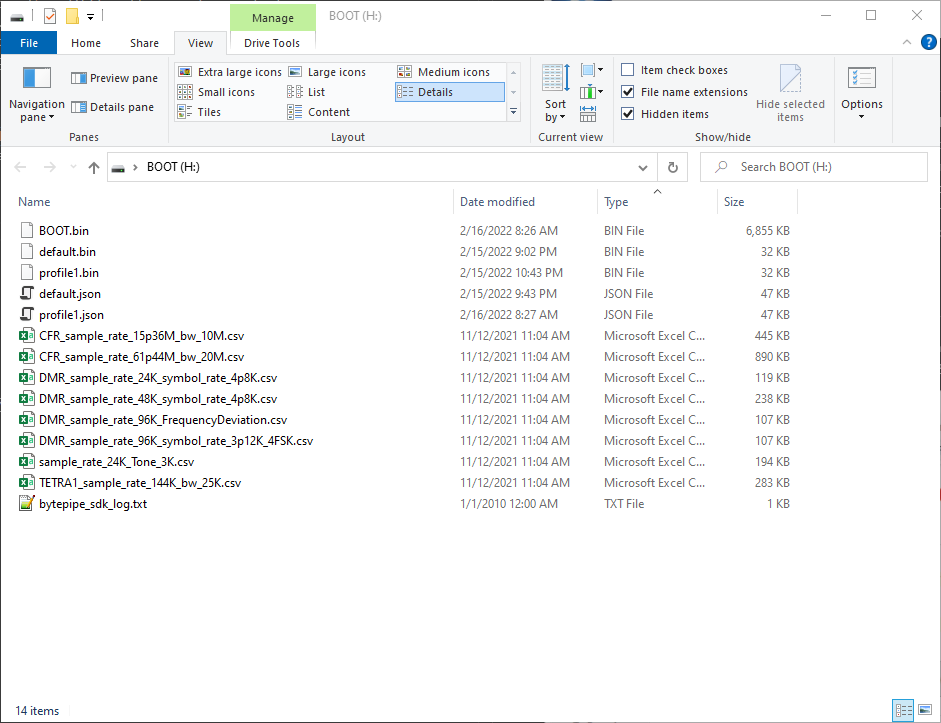

[](../../README.md)
---

# Dynamic Profile

The BytePipe_x900x supports dynamic profile loading using Analog Devices Transceiver Evaluation Software (TES).  A profile defines all the tranceiver settings in the form of a single json file.  A default profile is provided as part of the BytePipe SDK and loaded on the SD card.  On powerup the software retrieves the `default.json` file and programs the RF transceiver with the corresponding settings.  The default profile can be modified by creating a new profile in TES and saving it to the SD card with `default.json` as the name.  Additional profiles can be loaded from the SD card dynamically using the CLI or by writing user code to switch between profiles.  Along with the json profile a binary image needs to be generated and loaded into the Stream processor inside the RF tranceiver.  This is done by Generating the Stream Image using TES and placing it on the SD card.  The default stream image which corresponds to the default profile is labeled `default.bin`.         

# Generating Profile from TES

To create a profile download the latest ADRV9001 SDK from Analog Devices [here](https://www.analog.com/en/design-center/landing-pages/001/transceiver-evaluation-software.html).  Install the transceiver evaluation software (TES).  Once installed, launch TES and select the desired settings.  For additional information on TES settings see the ADRV9001 User Guide found [here](https://www.analog.com/en/products/adrv9002.html).


Once the desired settings are made, navigate to `File->Generate Profile File` and save it to the SD card with the desired name.  Next navigate to `File->Generate Stream Image` and save it to the SD card with the desired name. 


The following shows a SD card with both the default profile and stream image along with a profile and stream imaged named `profile1`.  On boot the BytePipe will load the `default.json` and `default.bin` files.  The user can then dynamically load `profile1.json` and `profile1.bin` using the CLI as shown in the example below.



```

************************************************
        BytePipe_x900x RFLAN - v2.15.22
************************************************

Type help for a list of commands

ADRV9002 Version Information:
  -Silicon Version: C0
  -Firmware Version: 0.17.4.22
  -API Version: 48.26.4

help SampleRate
Adrv9001GetSampleRate: Get SSI IQ Sample Rate
Adrv9001GetSampleRate < port ( Rx1,Rx2,Tx1,Tx2) >


Adrv9001GetSampleRate Tx1
15360000 Hz


help Profile
PhyAdrv9001LoadProfile:  Load ADRV9001 Profile
PhyAdrv9001LoadProfile < ProfileName, StreamImageName >


ls
bytepipe_sdk_log.txt (147 bytes)
System Volume Information (0 bytes)
CFR_sample_rate_15p36M_bw_10M.csv (455336 bytes)
CFR_sample_rate_61p44M_bw_20M.csv (910946 bytes)
DMR_sample_rate_24K_symbol_rate_4p8K.csv (121543 bytes)
DMR_sample_rate_48K_symbol_rate_4p8K.csv (243023 bytes)
DMR_sample_rate_96K_FrequencyDeviation.csv (108988 bytes)
DMR_sample_rate_96K_symbol_rate_3p12K_4FSK.csv (108988 bytes)
sample_rate_24K_Tone_3K.csv (198248 bytes)
TETRA1_sample_rate_144K_bw_25K.csv (288812 bytes)
BOOT.BIN (7018904 bytes)
default.bin (32768 bytes)
default.json (47121 bytes)
profile1.bin (32768 bytes)
profile1.json (47384 bytes)


PhyAdrv9001LoadProfile profile1.json profile1.bin
Updating ADRV9001 Profile...
Success
Success


Adrv9001GetSampleRate Tx1
61440000 Hz


```

# Profile Build

Documentation comming soon.

# DISCLAIMER

THIS SOFTWARE IS COVERED BY A DISCLAIMER FOUND [HERE](../../DISCLAIMER.md).
