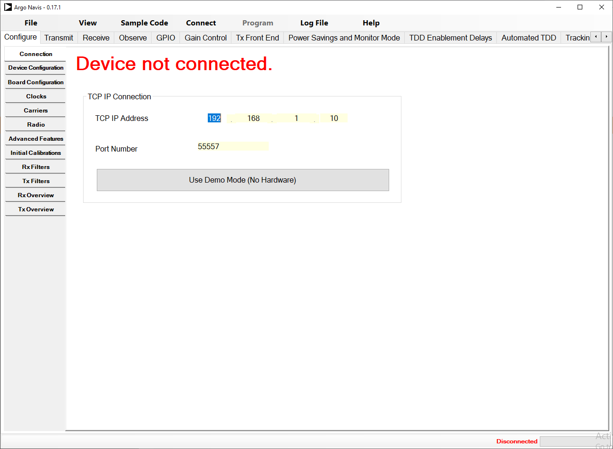
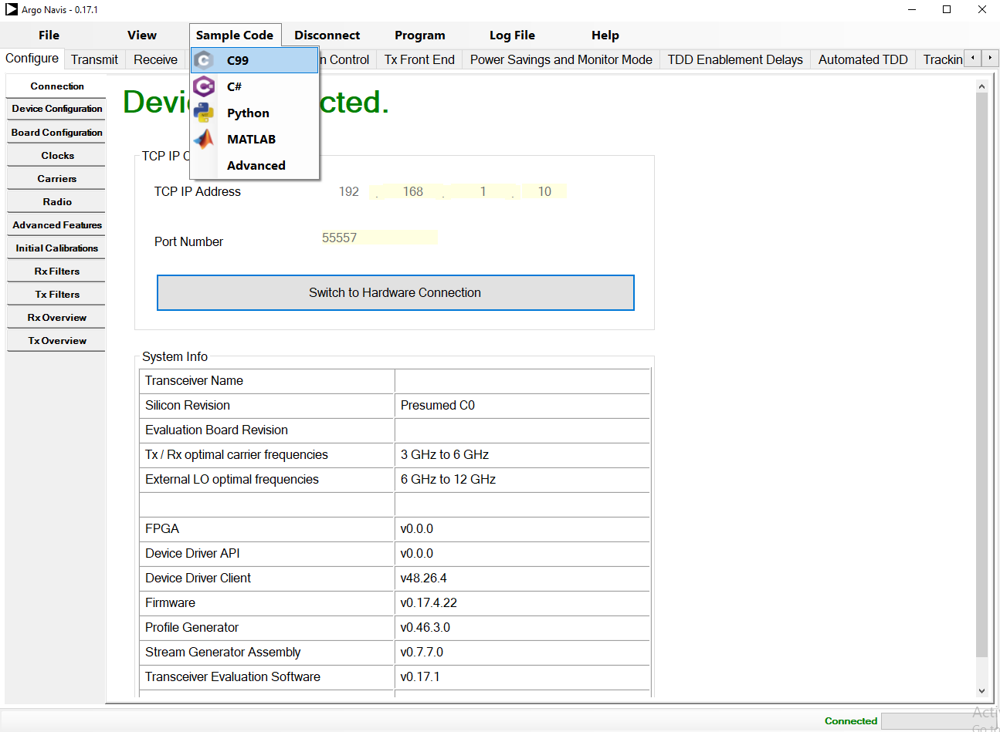

---

# Dynamic Profile

Documentation is currently not available.

# Generating Profile from TES

To create a profile download the latest ADRV9001 SDK from Analog Devices [here](https://www.analog.com/en/design-center/landing-pages/001/transceiver-evaluation-software.html).  Install the transceiver evaluation software (TES).  Once installed, launch TES and select the desired settings.  For additional information on TES settings see the ADRV9001 User Guide found [here](https://www.analog.com/en/products/adrv9002.html).

Once the desired settings are made, navigate to `Sample Code` and select `C99`.  This will export the C99 code to the user provided directory.

# Profile Build

Documentation is currently not available.

### Disclaimer
----------------------
NextGen RF Design makes no warranty for the use of this code or design. This code is provided  "As Is". NextGen RF Design assumes no responsibility for
any errors, which may appear in this code, nor does it make a commitment to update the information contained herein. NextGen RF Design specifically
disclaims any implied warranties of fitness for a particular purpose.
Copyright(c) NextGen RF Design
All rights reserved.