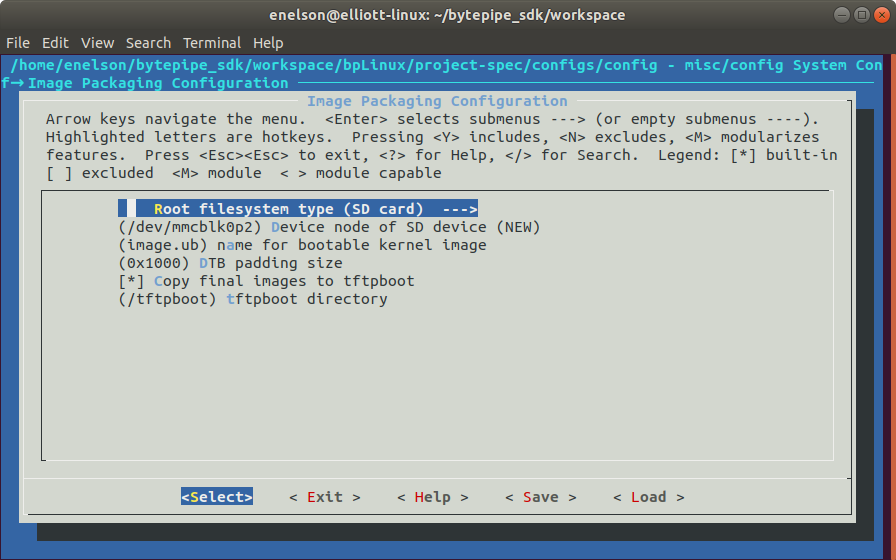

[](../../README.md)

# Building Linux

This document details building of the BytePipe Linux Kernel from source.  The linux kernel is built using Petalinux, details for installing PetaLinux and the operating environment can be found [here](../BuildEnv/BuildEnv.md).  The following must be performed on a Linux host machine.


# Create Workspace

Create a workspace folder on the host PC. This can be created anywhere and deleted once the build is done.  These instructions will create the workspace folder under the `bytepipe_sdk` folder created from cloning the project.

```
cd ~/
git clone git clone https://github.com/NextGenRF-Design-Inc/bytepipe_sdk.git
cd bytepipe_sdk
mkdir workspace
cd workspace
```

# Hardware Definition File

To build the BytePipe Linux kernel a hardware definition file is required.  The hardware definition file is generated from the HDL build.  Addition information for building the HDL can be found [here](../HdlBuild/HdlBuild.md).  If you don't want to build the HDL from source the latest hardware definition file (system_top.hdf) can be found on the releases page [here](https://github.com/NextGenRF-Design-Inc/bytepipe_sdk/releases).


 Place `system_top.hdf` at the top of your workspace folder. The build scripts will use this to create the board support package used by the application and linux kernel.

```
wget https://github.com/NextGenRF-Design-Inc/bytepipe_sdk/releases/download/<release>/system_top.hdf

```

# PetaLinux

Setup the PetaLinux environment by sourcing the settings script from the location of your PetaLinux install.  

```
source ~/tools/Xilinx/petalinux/2019.1/settings.sh
```

The Linux kernel is built by running a single build script from the workspace folder.

```
make -f ~/bytepipe_sdk/linux/Makefile
```

The script starts by fetching the necessary source code and creating a Petalinux project. Once the project is created a configuration menu will come up. To generate a complete file system instead of initramfs navigate to `Image Packaging Configuration->Root filesystem type` and select SD card as shown below.


 
Exit and save the configuration using the menu items at the bottom.  Once the project and kernel has been configured the script will setup the appropriate device tree and execute a petalinux-build. 

Once the build is finished the necessary boot and rootfs files will be copied to the top of the workspace folder.


# DISCLAIMER

THIS SOFTWARE IS COVERED BY A DISCLAIMER FOUND [HERE](../../DISCLAIMER.md).
