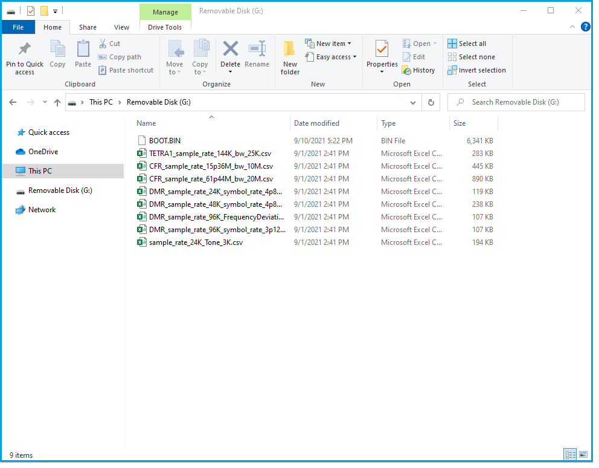
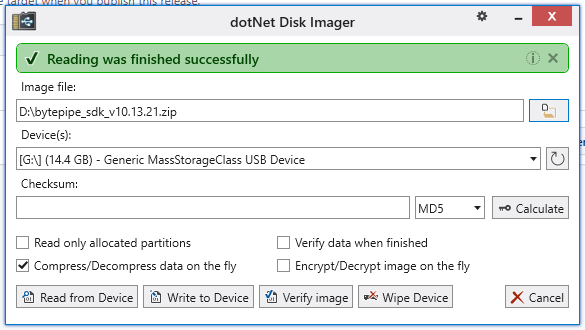
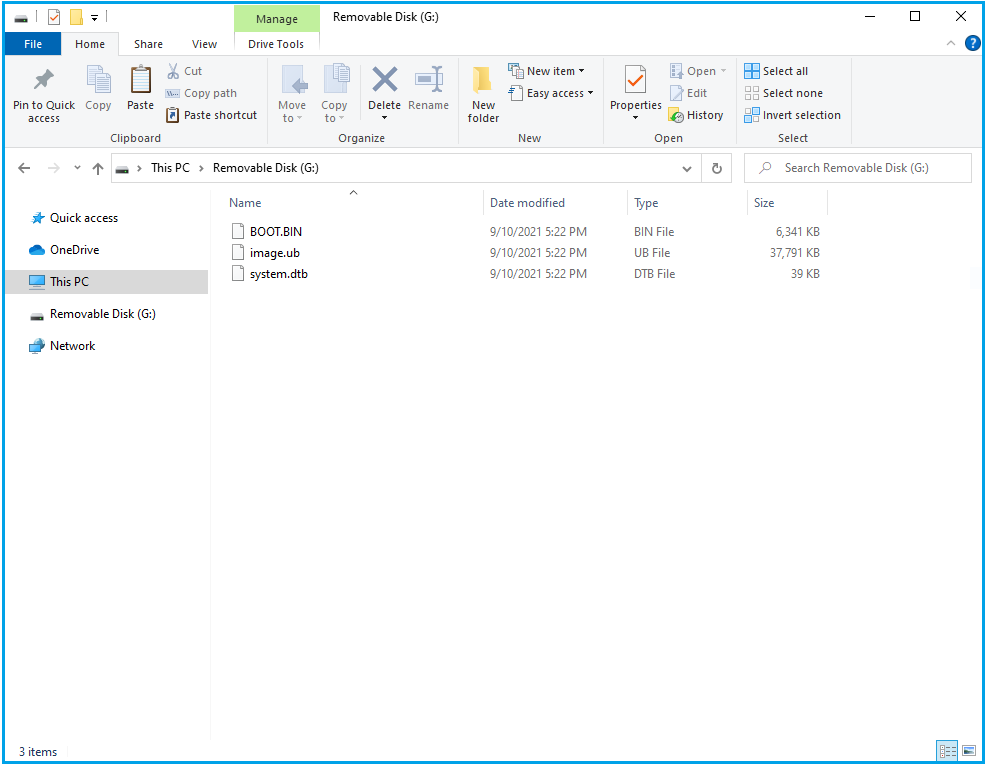

---

# BytePipe SDK Quick Start Guide

The following instructions guide users through setting up and exercising the BytePipe hardware with the latest BytePipe SDK release.

# HDK Unboxing

The following video shows unboxing of the BytePipe hardware development kit.

# Hardware Setup

The following diagram shows the basic hardware setup.  At a minimum a 12V 24W power supply (included with the HDK), an SD card flashed with the latest software release, and either a serial port connected to a PC or an Ethernet network connection are required.  Additional items such as a display connected to the display port, keyboard and mouse, PMODs, and SSD are optional.

The RF receive and transmit ports can be connected to the HDK with the supplied SMPM blind adapters or connected through the U.FL connectors on the top side of the SOM.  When plugging the SOM into the HDK take care to properly align the board to board connections including the SMPM adapters.

If it is desired to connect a keyboard and mouse an [OTG USB Adapter](https://www.amazon.com/UGREEN-Adapter-Samsung-Controller-Smartphone/dp/B00LN3LQKQ/ref=sr_1_5?dchild=1&keywords=usb+otg+adapter&qid=1624389445&sr=8-5) is required.  If using a display it should be connected using a mini display port cable. The display must natively support display port and no display port adapters should be used.

:memo: Note: Both the OTG and display port are only supported when using a Linux release.

# Programming

The BytePipe software boots from eMMC or an SD card.  The process for programming either boot disk is similar with the exception of copying the files to the physical device.  The files created and the process for creating them are the same whether booting from the eMMC or SD card.  The most foolproof method for ensuring the boot disk is formatted correctly and all the appropriate files are copied is to flash it with a pre-built image.  This is especially true if Linux is included as multiple disk partitions must be created.  For Linux applications the disk must be formatted with an EXT4 partition and a FAT partition.  The FAT partition is referred to as the BOOT partition while the EXT4 partition is used for the Linux file system.  See [Flashing SD Card](#flashing-sd-card), [Flashing eMMC](#flashing-emmc), or [Programming Boot Partition](#programming-boot-partition) sections below for more information.

If you are only interested in the RFLAN application without Linux, the most efficient way is to review [Programming Boot Partition](#programming-boot-partition) and simply copy the latest BOOT.BIN to the SD card.

In addition to the firmware files, the BOOT partition can contain additional files used by the RFLAN application.  For example, the RFLAN uses the BOOT partition for streaming waveform files to and from the radio.  Waveform files can be pre-loaded when programming the SD card.  The following shows the BOOT partition loaded with the RFLAN BOOT.BIN firmware along with several pre-generated waveforms that can be used for transmission.  

# Flashing SD Card

Flashing the SD card ensures it is formatted and all necessary files are copied correctly.  This section assumes there is an SD card image available and does not detail the steps for creating the image.  Released versions which can be found [here](https://github.com/NextGenRF-Design-Inc/bytepipe_sdk/releases) typically include a preformatted image that has been tested.  To flash the SD card, download and install [dotNet Disk Imager](https://sourceforge.net/projects/dotnetdiskimager/).  Begin by selecting `Wipe Device` to make sure you are starting with a clean SD card.  Then browse to the downloaded image and select `Write to Device`.  

:memo: Note: The HDK does not include a connection that enumerates the SD card as a storage device.  To flash the SD card, it must be placed in an SD card reader connected to a PC.

# Flashing eMMC

For additional information see [eMMC](../eMMC/eMMC%20Partition.md).

# Programming Boot Partition

The BOOT partition is formatted as a FAT file system and is required whether running Linux or the RFLAN application.  At a minimum, the FAT partition must include a `BOOT.BIN` file.  The boot file includes the first stage bootloader (`FSBL`).  For Linux applications the `FSBL` loads `U-BOOT` which then loads the separate Linux image from the FAT file system.  The `FSBL` also loads any additional bare-metal applications included in BOOT.BIN that run on other processors.  For example, when booting the RFLAN application, the BOOT.BIN includes both the `FSBL` and `rflan.elf` application.  If Linux is also included, BOOT.BIN will include the `FSBL`, `rflan.elf`, and `U-BOOT.elf`.  `U-BOOT.elf` will then load the Linux kernel and device tree from separate files on the FAT file system labeled `image.ub` and `system.dtb` respectively.  The following shows the required files on the FAT partition for booting Linux.  If Linux isn't included, only `BOOT.BIN` is required. 

The latest BOOT.BIN and Linux images can be found in the latest release folder [here](https://github.com/NextGenRF-Design-Inc/bytepipe_sdk/releases).  The SD card must have a FAT partition created either by flashing the disk with a pre-built image or by formatting the SD card.  

:memo: Note: The HDK does not include a connection that enumerates the SD card as a storage device.  To format and/or write files to the SD card, it must be placed in an SD card reader connected to a PC.

# User Interface

The BytePipe SDK supports several different user interface tools.  For interfacing to the RFLAN directly refer to [RFLAN CLI](../RflanCli/RflanCli.md) and [BytePipe Terminal](../BytePipeTerminal/BytePipeTerminal.md).  For interfacing to the Linux framework refer to [BytePipe Terminal](../BytePipeTerminal/BytePipeTerminal.md), [Industrial I/O](../IIO/IIO.md), and [Ubuntu Desktop](../Ubuntu/Ubuntu.md).

The [Industrial I/O](../IIO/IIO.md) Linux kernel driver supports several off the shelf programs including [Matlab](../Matlab/Matlab.md), [GNU Radio](../GnuRadio/GnuRadio.md), [IIO-Oscilloscope](../IIO-Oscilloscope/IIO-Oscilloscope.md), and many other tools that support the [Industrial I/O Driver](https://www.kernel.org/doc/html/v5.0/driver-api/iio/index.html).

# DISCLAIMER

THIS SOFTWARE IS COVERED BY A DISCLAIMER FOUND [HERE](../../DISCLAIMER.md).
