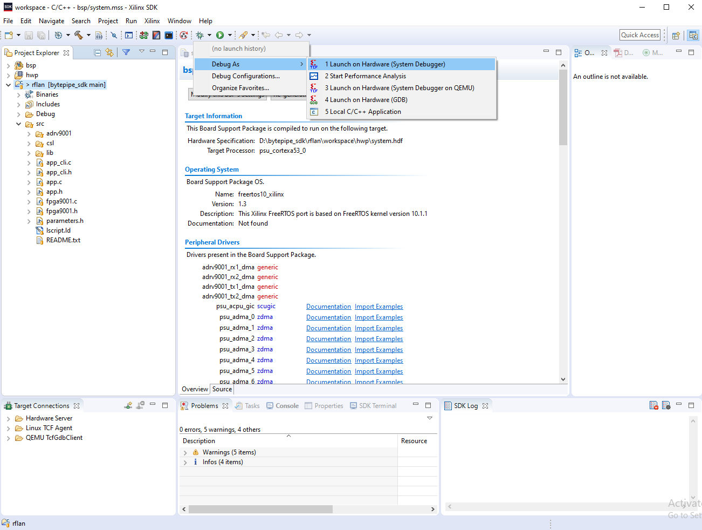
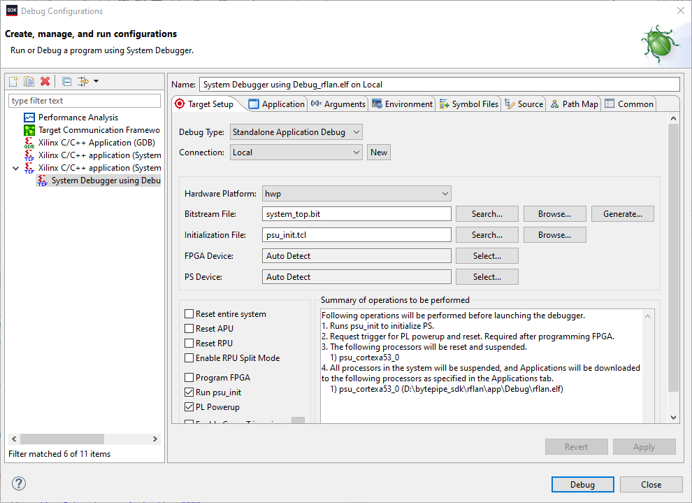

# Debugging Source

This document describes debugging the RFLAN application.  Once the application is built, navigate to `Debug As` and select the debugger as shown below.  Make sure the `rflan` project is selected in the project explorer before doing this.

Once the debugger is launched, right click and disconnect it.  Navigate to Run->Debug Configurations and check `Reset entire system`.  This should automatically check `Program FPGA` as shown below.

Select `Apply` then `Debug`.  The ZynqMP processor does not allow for the debugger to be restarted.  To restart, the debug session must be terminated and re-launched.

# DISCLAIMER

THIS SOFTWARE IS COVERED BY A DISCLAIMER FOUND [HERE](../../DISCLAIMER.md).
