---
# Building RFLAN Source

The RFLAN is a standalone project within the BytePipe_SDK.  The Xilinx SDK IDE is used for creating the RFLAN project and building it.  The following instructions assume the bytepipe_sdk repository is downloaded to the `D:` drive and a workspace folder is created in `D:\bytepipe_sdk\workspace`.  

```bash
cd D:/
git clone https://github.com/NextGenRF-Design-Inc/bytepipe_sdk.git
cd bytepipe_sdk
mkdir workspace
cd workspace
```

The next step is to launch the Xilinx SDK software selecting the previously generated workspace folder as the workspace.

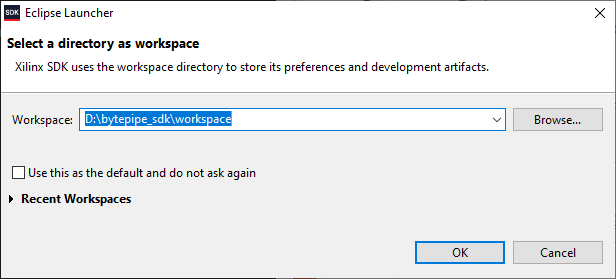

# Hardware Platform

The hardware platform is created based on the HDL outputs.  The HDL can be built from source by following the HDL build instructions [here](../HdlBuild/HdlBuild.md).  The latest pre-built HDL outputs can also be used from the releases folder [here](https://github.com/NextGenRF-Design-Inc/bytepipe_sdk/releases).  Once the HDL is built or downloaded from the latest release, `system_top.hdf` must be copied to the workspace folder.  

Next navigate to file->new->other in the Xilinx SDK.  Select Hardware Platform Specification as shown below, then click Next.


Set the project name to `hwp` and browse to the hardware specification created from the HDL build.  Select finish, the hardware platform will be created as a separate project within the SDK.

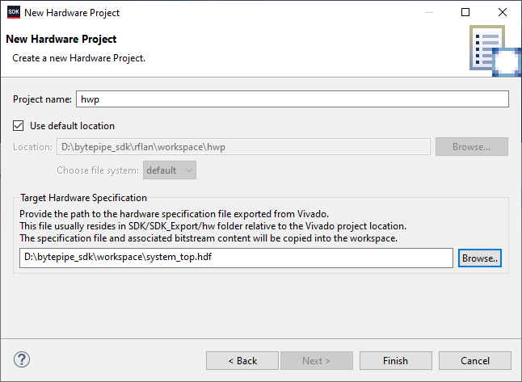

# BSP

Next a board support package must be created based on the hardware platform.  Navigate to File->New->Board Support Package.  Select a project name, target hardware platform, and operating system as shown below, and then click finish.

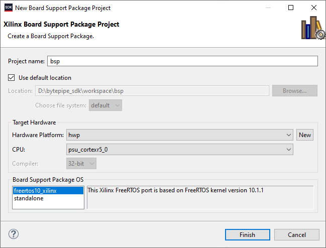

The board support package settings window will be displayed.  Enable the Generic Fat File System Library as shown below.  Select ok, this will create the BSP project.

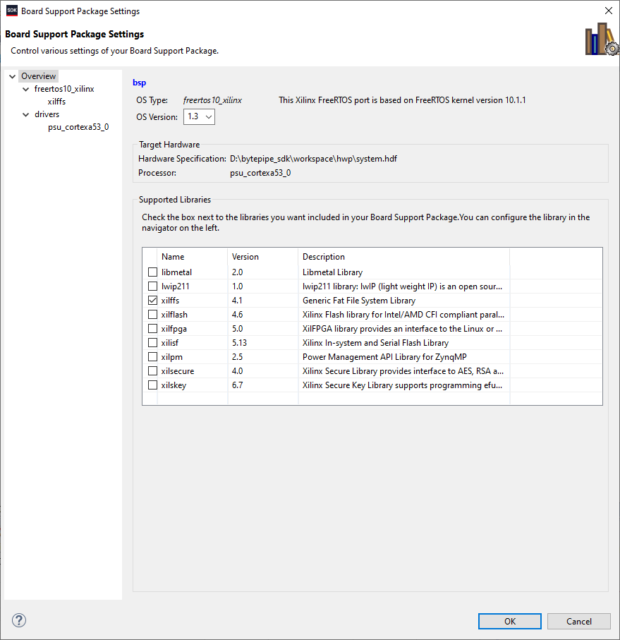

Next configure FreeRTOS.  Change the `tick_rate` to 10000, `total_heap_size` to 16777216, and set `generate_runtime_stats` to 1 as shown below.


Then configure the file system by changing the maximum supported file name length `use_lfn` from 0 to 1 as shown below. 

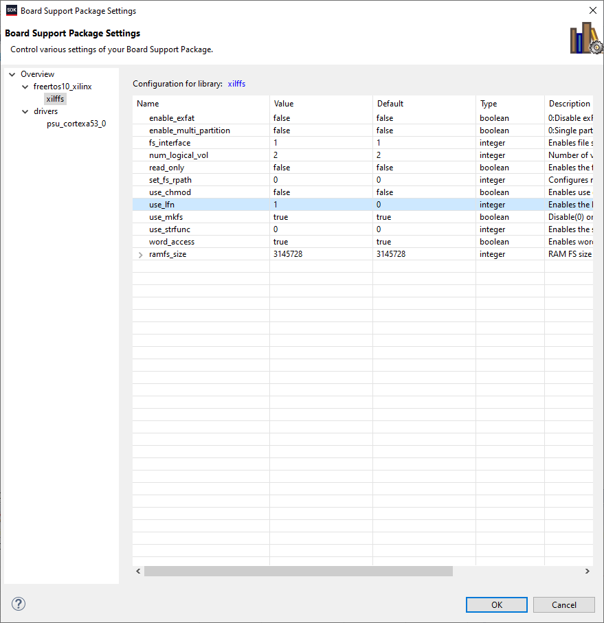

Configure the display port driver by changing `psu_dp` to `dppsu` as shown below. 


# Creating RFLAN Application

To create the application navigate to file->new->application.  Create a new application as shown below.  Make sure to select the correct OS platform and existing BSP.  Also change the default location as shown below.  Click next and select Empty Application followed by finish.

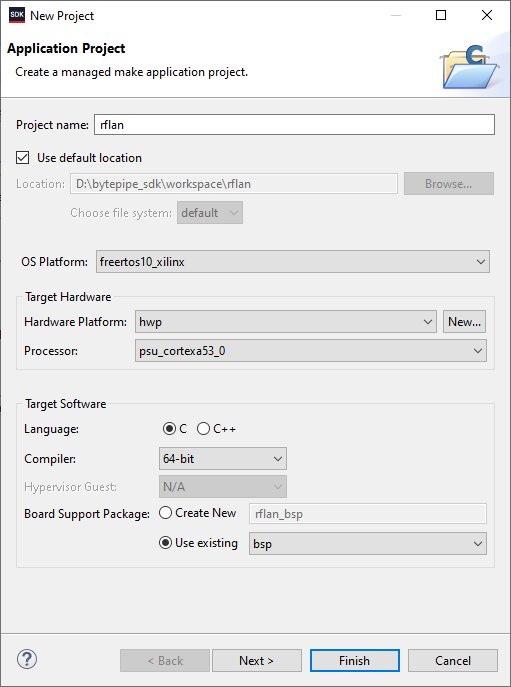


Right click on the `src` folder under the `rflan` project in the project explorer.  Delete the `src` folder as shown below.

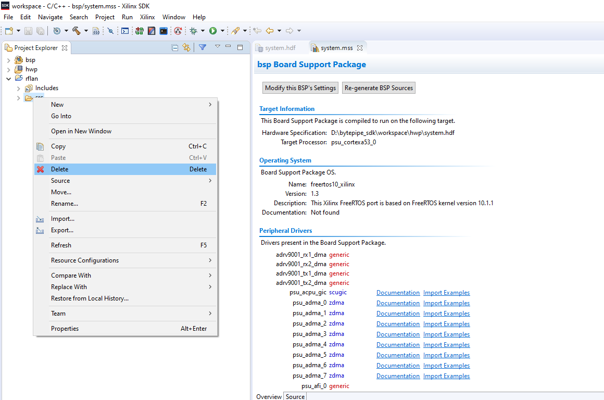

After the src folder is deleted right click on the `rflan` project in the project explorer.  Select New->Folder. Add a linked folder as shown below.


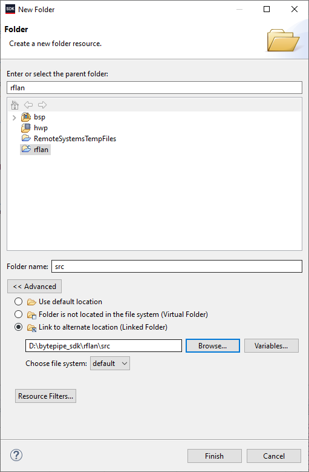

Right click on the `rflan` project and select properties.  Add the following symbols as shown below.

```
ARMR5
CUSTOMER_PLATFORM
ADI_DYNAMIC_PROFILE_LOAD
ADI_ADRV9001_ARM_VERBOSE
XPS_BOARD_ZCU102
```

```
__KERNEL__
CLIENT_IGNORE
ADRV9001_BITFIELD_NULL_CHECK
```

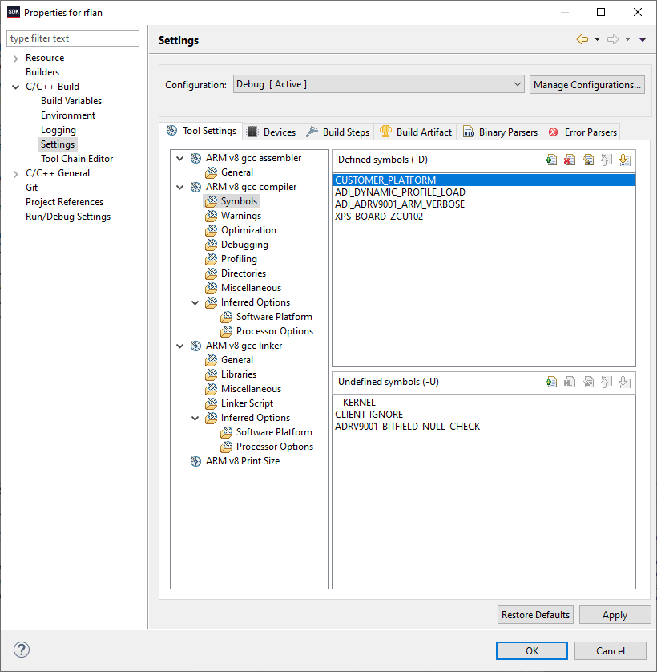

Add the directories as shown below.

```
"${workspace_loc:/${ProjName}/src/adrv9001}"
"${workspace_loc:/${ProjName}/src/adrv9001/adi_adrv9001}"
"${workspace_loc:/${ProjName}/src/adrv9001/adi_adrv9001/private/include}"
"${workspace_loc:/${ProjName}/src/adrv9001/adi_adrv9001/private/include/bitfields/c0}"
"${workspace_loc:/${ProjName}/src/adrv9001/adi_adrv9001/public/include}"
"${workspace_loc:/${ProjName}/src/adrv9001/common}"
"${workspace_loc:/${ProjName}/src/adrv9001/jsmn}"
"${workspace_loc:/${ProjName}/src/csl}"
"${workspace_loc:/${ProjName}/src/phy}"
"${workspace_loc:/${ProjName}/src/lib}"
"${workspace_loc:/${ProjName}/src}"
```
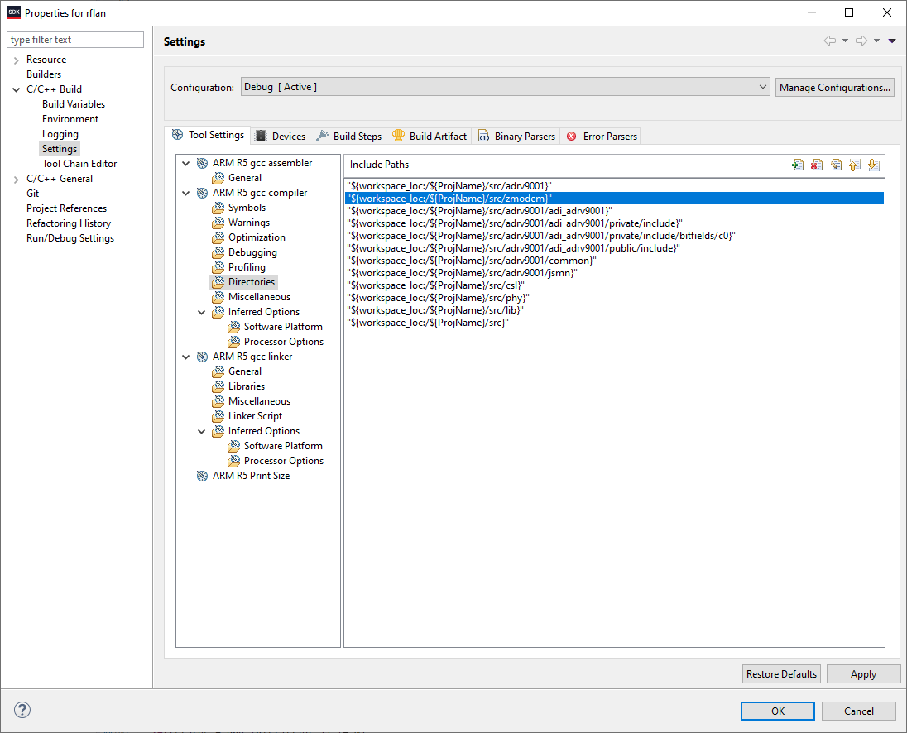

Add the library as shown below.

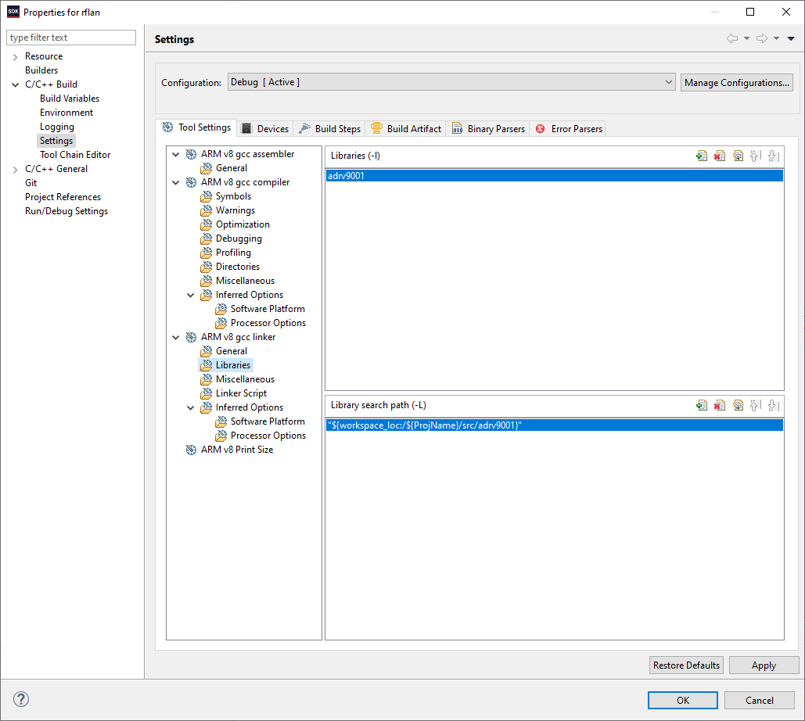

Update the path to the linker script as shown below.

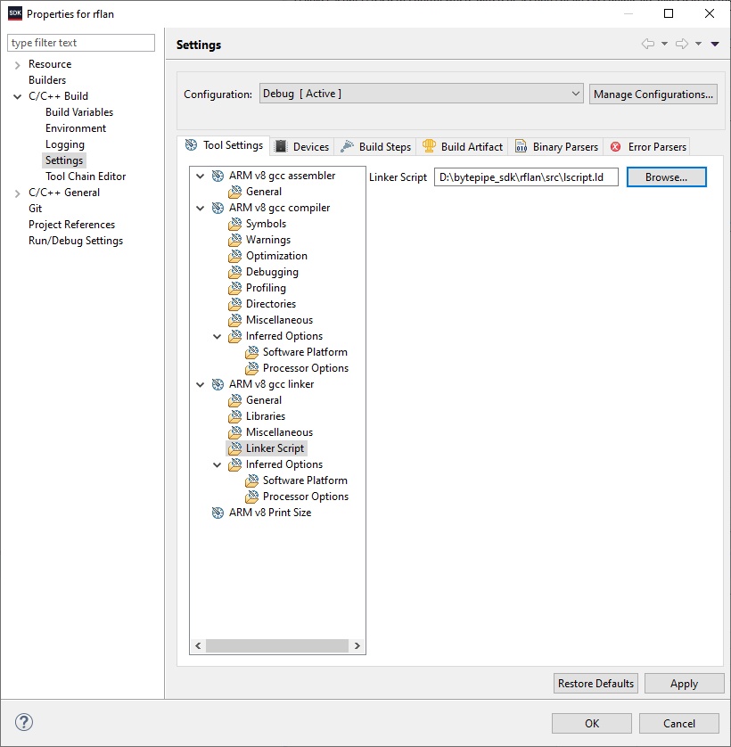

Import the settings file from the repo as shown below.

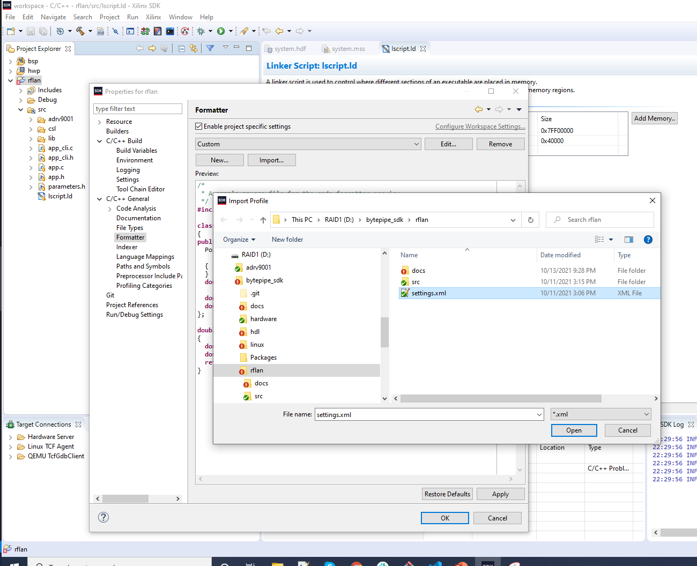


# First Stage Bootloader

Next navigate to file->new->application.  Create a new application called fsbl as shown below.  Click next and select the Zynq MP FSBL template.  Select finish, this will create a BSP and first stage bootloader application as separate projects.

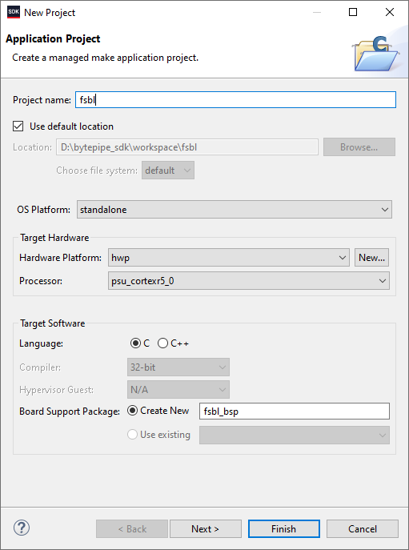

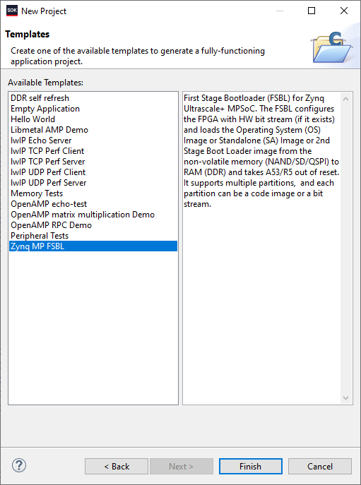

# Create Boot Image

Select the `rflan` project in the project explorer.  Navigate to Xilinx->Create Boot Image.  This should automatically import the appropriate files as shown below.  If not, exit and make sure the `rflan` project is highlighted in the project explorer before trying again.  Select create image, this will generate a BOOT.bin under the `rflan` folder which can be loaded onto the device for testing.

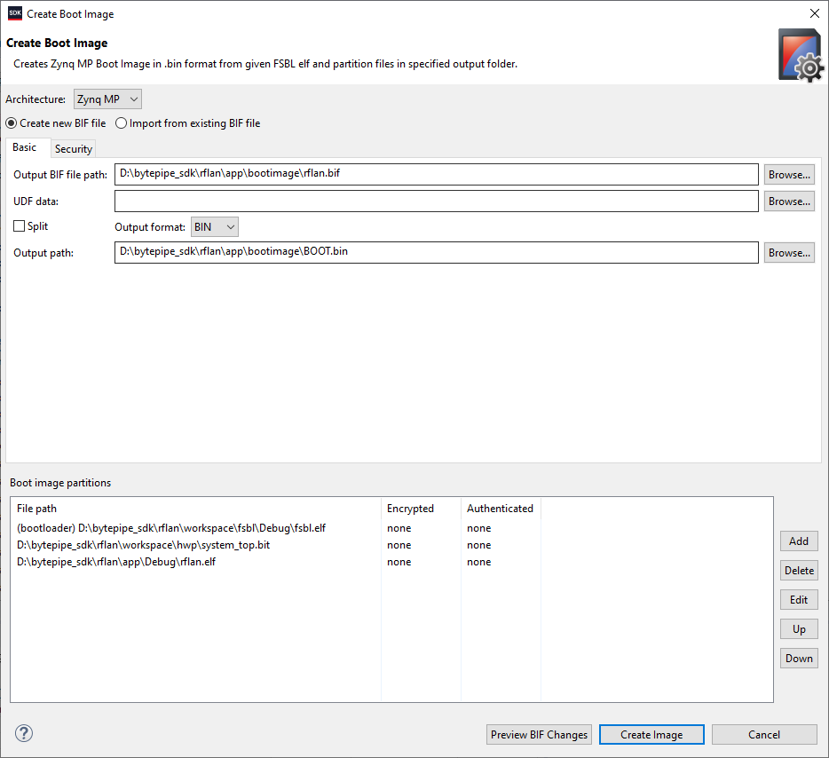

# Debugging

See [Debugging](./Debugging.md) for additional information.

# DISCLAIMER

THIS SOFTWARE IS COVERED BY A DISCLAIMER FOUND [HERE](../../DISCLAIMER.md).
