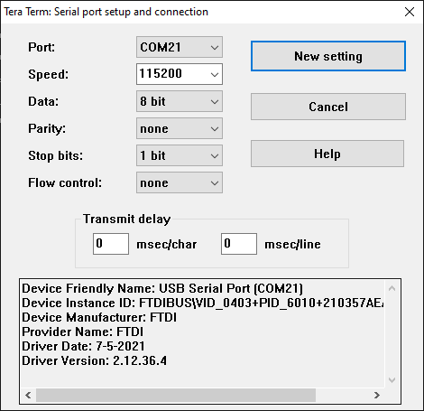
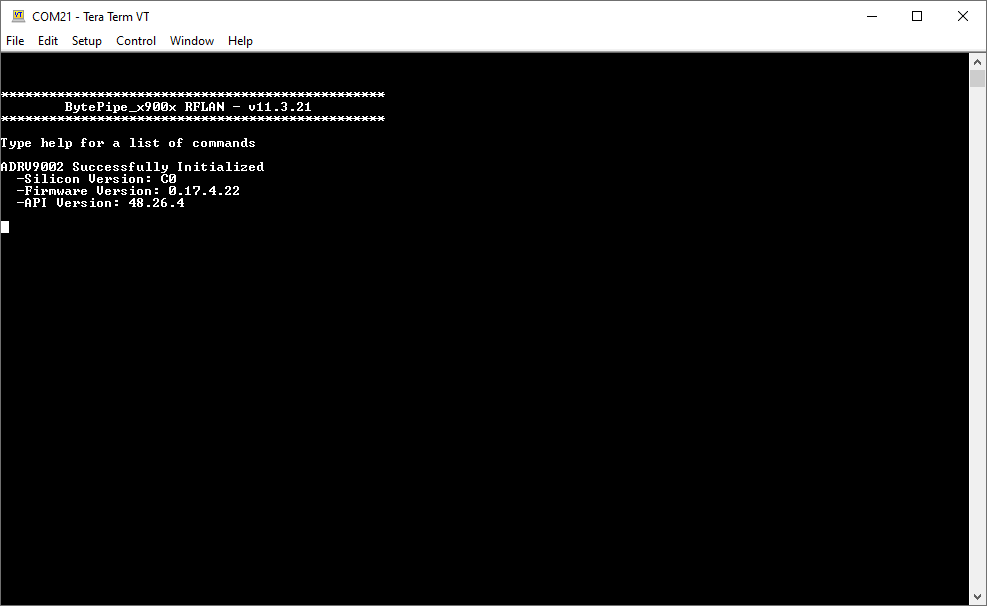
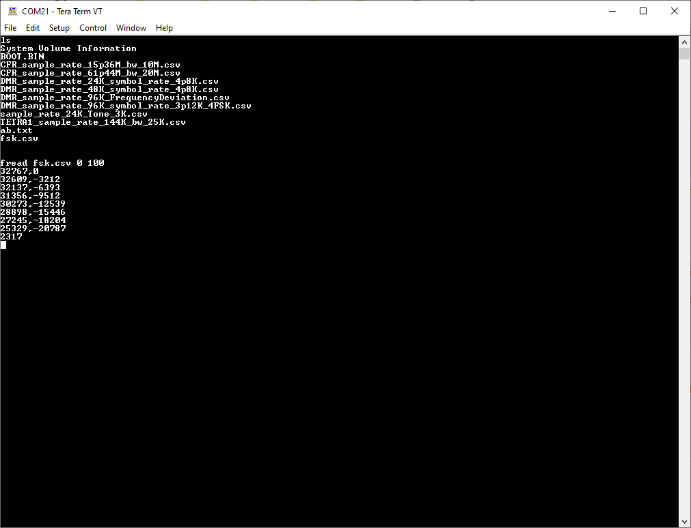
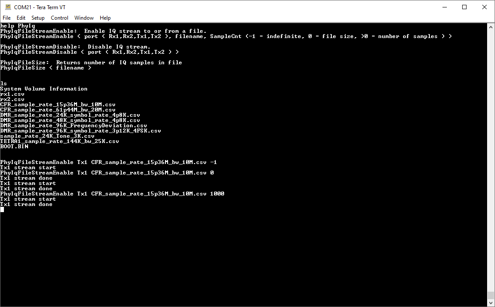
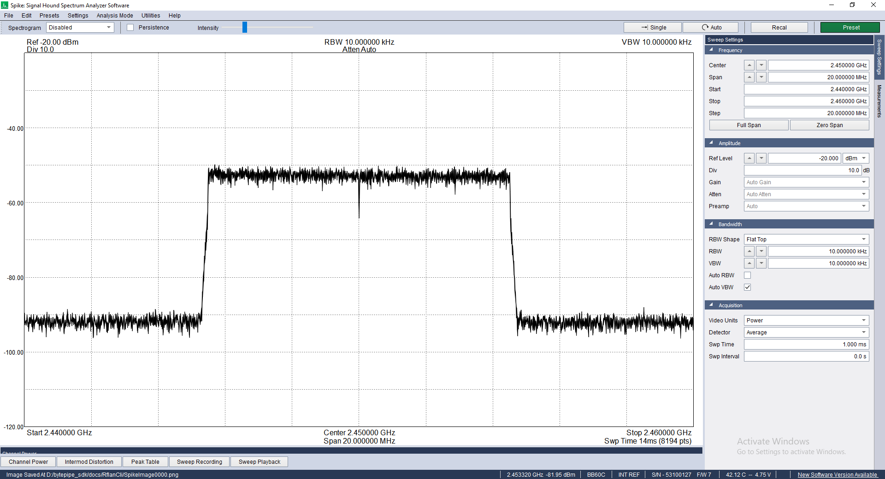
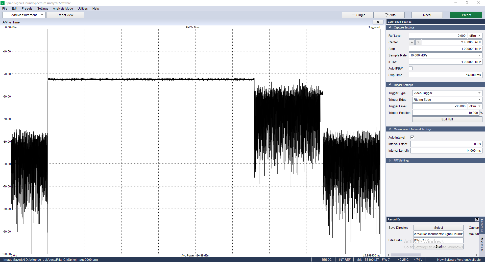
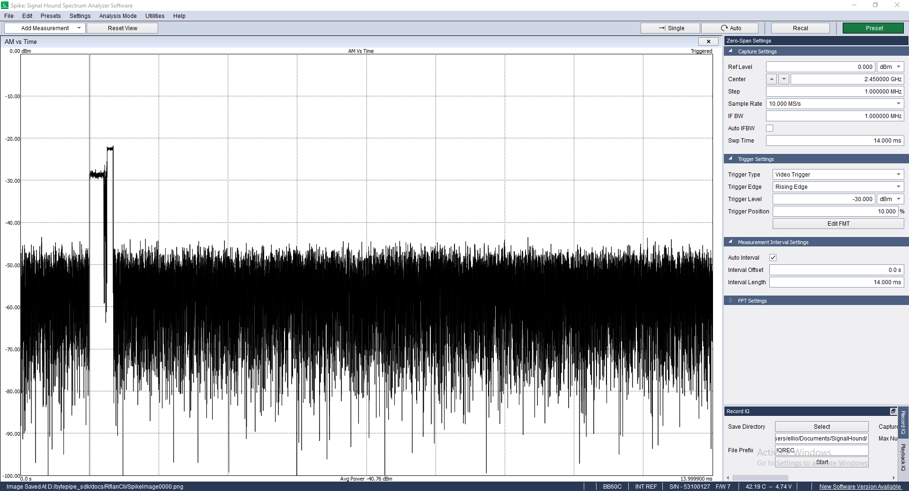
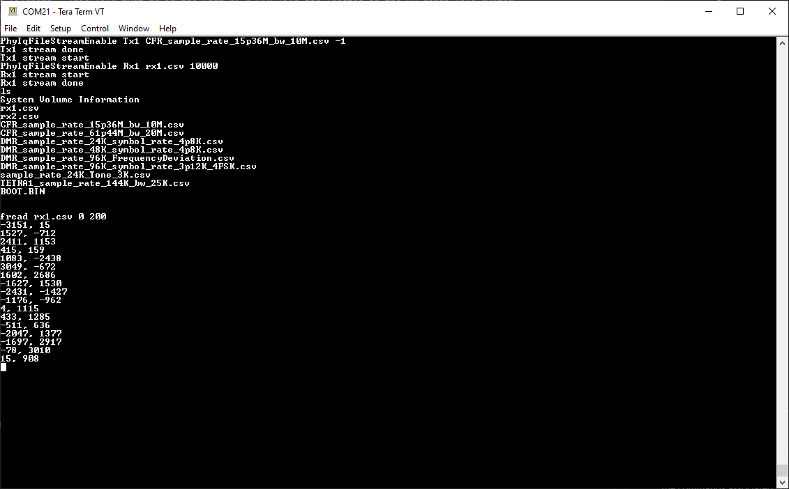
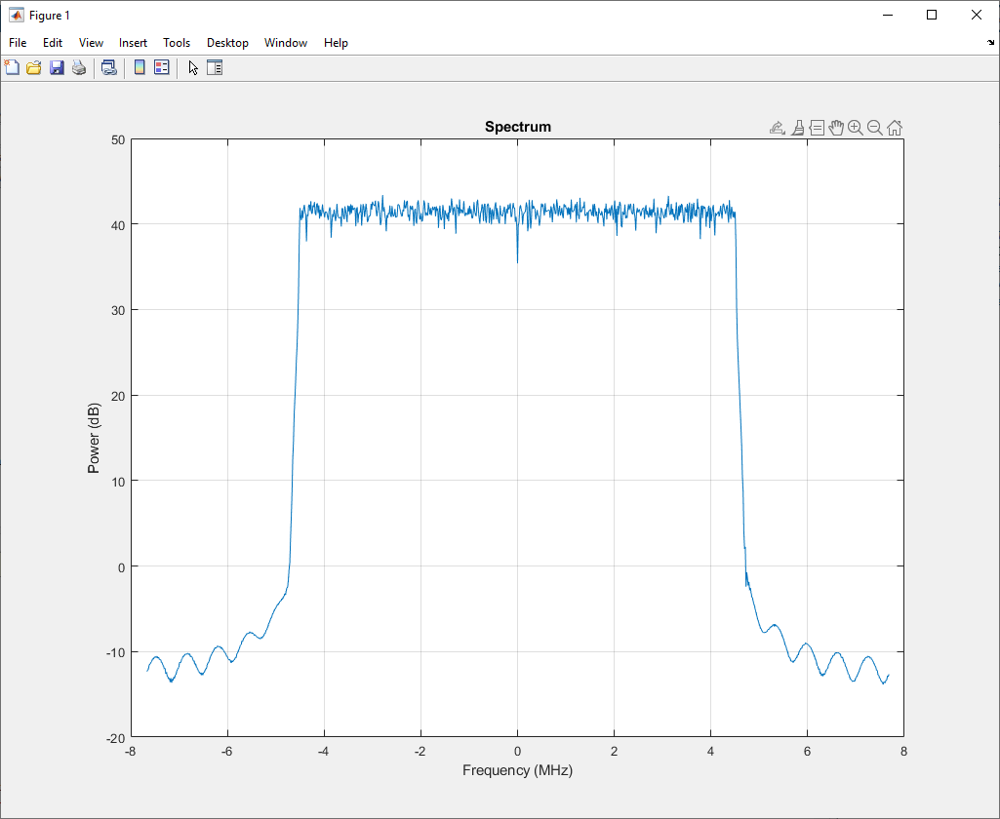

# RFLAN CLI

The RFLAN application supports a custom command line interface (CLI) allowing users to interact with the RFLAN through a serial port and terminal program.  For information on adding custom CLI commands refer to [RFLAN CLI Architecture](../Architecture/Architecture.md#rflcli).

# Hardware Connection

To connect to the RFLAN serial port, plug a USB Micro-B cable into the JTAG & Serial Port connector on the BytePipe HDK.

# Software Connection

To access the RFLAN CLI a serial terminal such as [Tera Term](https://osdn.net/projects/ttssh2/releases/) or [Putty](https://www.chiark.greenend.org.uk/~sgtatham/putty/latest.html) should be installed.  The serial port on the BytePipe HDK will enumerate as a Virtual COM port using the [FTDI USB Driver](https://ftdichip.com/drivers/). Open the terminal program on the PC and connect to the appropriate COM port with the settings shown below.

# Bootup

When the RFLAN is initially booted it will display welcome text followed by the results of the ADRV900x initialization.  The welcome text includes the RFLAN version and instructions for displaying a list of CLI commands.

# Help

Typing `help` displays all the CLI commands available and instructions for using them.  Typing `help` followed by text will display CLI commands that contain the provided text.

# File System

To list the files BOOT partition type `ls`.  Files can be read issuing the `fread` command.  

# Waveform Streaming

The RFLAN application supports streaming of IQ data to and from the file system to the radio.  The following shows the results from typeing `help PhyIq` and shows the commands associated with streaming IQ data.  The stream commands are associated with one of the two receive or two transmit ports.  If a transmit port is indicated the IQ samples will be read from the provided filename.  This file must be in the form of a CSV file and located on the SD cards file system.  Example IQ files can be found in [rflan/resources](https://github.com/NextGenRF-Design-Inc/bytepipe_sdk/tree/main/rflan/resources).  If the SampleCnt parameter is set to -1 the IQ samples from the file will be streamed continuously.  If the SampleCnt parameter is set to 0 the entire file will be streamed only once resulting in a transmit burst with the length based on the file length.  SampleCnt values greater then 0 will result in the first SampleCnt samples being transmitted.

If a receive port is indicated a file will be created with the provided filename and the receiver will stream IQ samples to it.  If the file is already on the disk it will be deleted before creating a new one and saving the latest IQ samples.  For IQ streaming from receive ports the SampleCnt must be greater than 0 and cannot be indefinate.  Up to four IQ streams can be active at once, two transmit and two receive streams.  If a stream request is made for a port that is already active it will abort the active stream and start the newly requested one.  

# Transmit Waveform Streaming

The following example shows three transmit uses cases.  The first continuously transmits, the second transmits all IQ samples once, and the third example transmits only the first 1000 samples.  

The following plots show the output power for each transmit use case.

# Receive Waveform Streaming

The following example shows streaming of received IQ samples to a file.  For this test transmit port 1 is connected to RX1A receive port using a SMA cable and a 20dB pad.  The transmitter is enabled to continuously stream IQ data and the receiver is enabled to save 10,000 samples.  The first 200 bytes of the received IQ file are inspected using the `fread` CLI command.  

Next the SD card was removed from the device and connected to a PC.  The received IQ samples were then plotted by executing the [BytePipe_WavformFileExample.m](https://github.com/NextGenRF-Design-Inc/bytepipe_sdk/tree/main/matlab) Matlab script.

# DISCLAIMER

THIS SOFTWARE IS COVERED BY A DISCLAIMER FOUND [HERE](../../DISCLAIMER.md).
