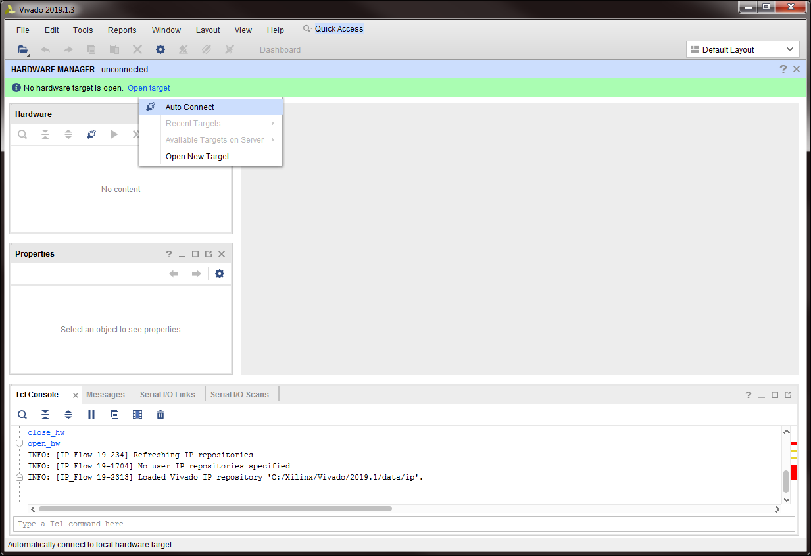

---

# Prerequisites

- PC or Laptop
- Xilinx Vivado 2022.2 Software
- HDK with Power Supply
- USB micro B Cable

# Partitioning the eMMC 

To partion the eMMC on a new unit, follow these steps:

1. Place the SOM on the HDK ensuring both board-to-board connectors are fully seated.

2. Connect the PC to the micro B USB port of the HDK.

3. Open Vivado.

4. Under "Tasks", click `"Open Hardware Manager"`.

5. Power up the HDK.
- Note: You do not need to have an SD card installed.

6. Near the top of the Hardware Manager is a notification stating "No hardware target is open."  Click the `"Open target"` link next to the notification, then click `"Auto Connect"`.

7. You should now see a device connected named "xczu3_0".

8. In the "Hardware" box, right-click on `"xczu3_0"`, then click `"Add Configuration Memory Device"`.

9. In the pop-up window, change the "Type" dropdown menu to `"emmc"`.

10. Near the bottom under "Select Configuration Memory Part", select `"jedec4.51-32gb-emmc"`, then click `"OK"`.

11. A confirmation window will appear.  Click `"OK"`.

12. Another pop-up window will appear.  Click the `"+"` button under "Files to load".

13. In the file selection pop-up, navigate to "C:\BytePipe\eMMC Programming" (the program should remember this location) and select `"README.html"`, then click `"OK"`.

14. Then click the three dots `"..."` to the right of "Zynq FSBL:".

15. Select the `"fsbl.elf"` file, then click `"OK"`.

16. Now click `"OK"` 

17. The device will now be programmed.  This step will take a few minutes.

18. You may get a warning message stating the current boot mode is SD1.  This is ok, click `"OK"`.

19. Other warnings may also appear and are likely not an issue.  Click `"OK"` for those as well.  The device will be tested at the end.

20. Once complete, you should see the "jedec4.51-32gb-emmc" device in the hardware manager.  If you do, continue to the next step.  If you do not, the process failed - complete the next step, check all of your connections, and repeat the process.

21. Disconnect from the device by right-clicking on "xilinx_tcf..." and selecting `"Close Target"`.

22.  The eMMC is now programmed and can be run through the self-test process, then disconnected.  If you are programming another eMMC, you can leave the Hardware Manager open, plug in the new unit, power it on, and skip back to step 6.  Some settings will be retained until the Vivado is closed.

# Flashing BytePipe eMMc

1. Connect the BytePipe SoM to a carrier board anc connect to the JTAG connector vie either J24 or J26 connector ports.

2. Open Vitis 2022.2 and select your workspace directory.

3. Build the project to generate a `BOOT.bin` and `fsbl.elf` file. these two files are needed for the next step.

4. Open the `Program Flash` tool under the `Xilinx` tab.

5. Once opened, select the location of the two files and then click `Program`. This will take around 5-10 minutes to complete.

# End

Return to [Main](../../README.md)

# DISCLAIMER

THIS SOFTWARE IS COVERED BY A DISCLAIMER FOUND [HERE](../../DISCLAIMER.md).
