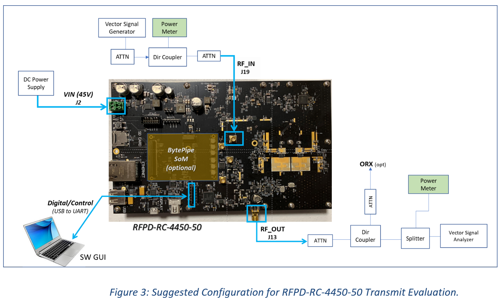
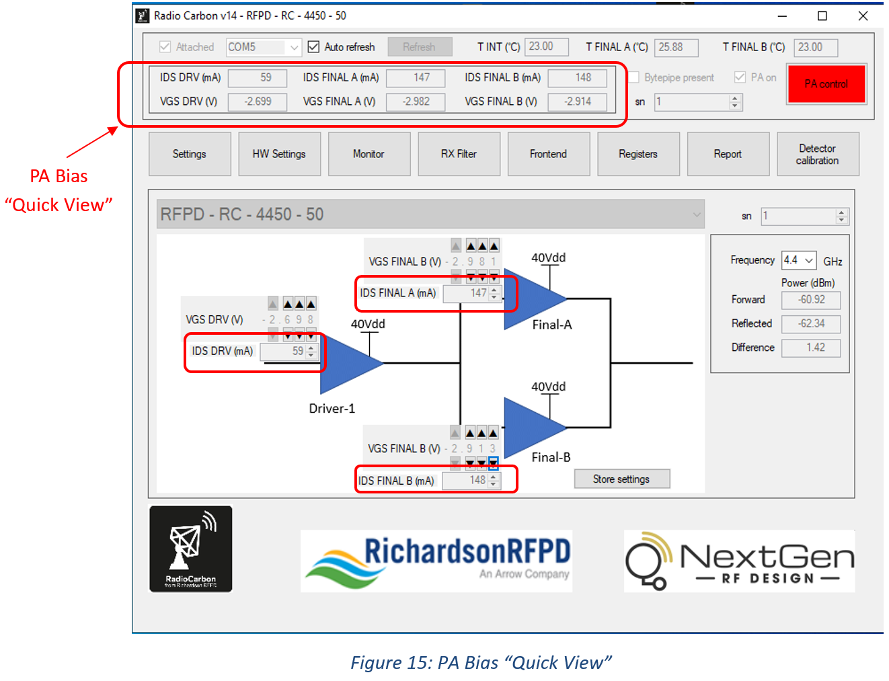
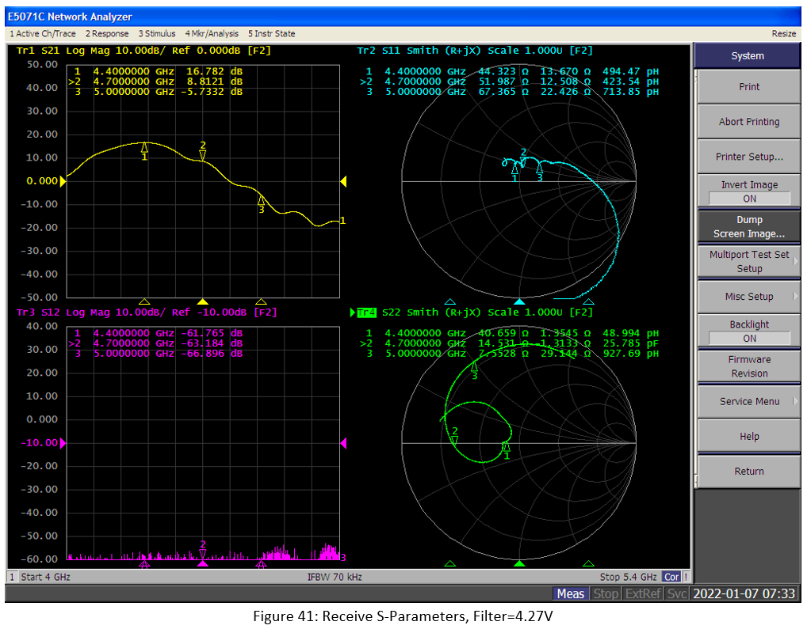

---

# RFPD-RC-4450-50 4.4-5 GHz, 2W Linear Front-End Design Accelerator

This document serves as a User Guide to assist users in powering up and performing Bench level testing/evaluation of the `RadioCarbon` `RFPD-RC-4450-50 RF Frontend module` from Richardson RFPD. The RFPD-RC-4450-50 Frontend module serves as a “Design Accelerator” platform targeting RF Frontend communications applications in the 4.4 to 5 GHz frequency band.

A high-level systems block diagram of the RFPD-RC-4450-50 Frontend module is shown below in Figure 1.  As illustrated, this RF Frontend module was designed with flexibility to accommodate multiple configurations, including Plug-in of the BytePipe SoM (System on Module) from NextGen RF that uses the ADRV9002 Integrated Transceiver, or in “Stand-alone” mode which will be described in greater detail here in this document.  In Stand-alone mode, it can be operated with an external Integrated Transceiver hardware platform including several of the Radio Verse family of Integrated Transceiver ICs from Analog Devices.

# RFPD-RC-4450-50 Module – Standalone Mode

For this document, in Standalone mode, the input RF Transmitter signal to the RFPD-RC-4450-50 module is sourced from a Signal Generator and is applied at the 50 Ohm TX_IN Port (J19) as shown in the picture in Figure 2 below which shows the actual RFPD-RC-4450-50 module with the various input/Output connections. Please note that Port J19 is a MCX connector and there is a MCX to SMA cable included in the kit. The RF Output signal is delivered to the 50 Ohm RF_OUT port (J13), padded down with a 50 Ohm coaxial attenuator and measured with a Signal/Spectrum Analyzer and Power Meter. 

DC Power to the module is provided via an external DC Power Supply and is applied at the DC Voltage (VIN) port J2 ( Figure 2 above). This power supply input feeds a series of on-board switching regulators that generate the additional voltages required for the individual circuits used (including MCU and PA Bias Controller ICs) onboard the RFPD-RC-4450-50 module.  

The RFPD-RC-4450-50 module also comes with a software GUI that allows the user to control vital tasks on the module such as ON/ Off Power sequencing of the GaN Power Amplifier devices as well as setting optimum PA bias voltages and other key parameters both in the TX and RX paths of the system.  The GUI also allows for real time monitoring of the PA’s Drain voltages and currents, on-board Temperature Sensor readings as well as forward power levels in the transmitter.  In future reversions we will add the ability to detect reflected power levels from the antenna. 

# RF Bench Setup –Standalone Transmit 

The recommended Hardware Bench setup required to properly test the RFPD-RC-4450-50 in Stand-alone Transmit mode is shown in Figure 3 below.  For optimum RF performance it is recommended that high quality, low loss 50 Ohm cables, adaptors and connections are used. All RF interfaces on the RFPD-RC-4450-50 module are 50 Ohms. The RF output Attenuator needs to have at least 30dB attenuation and be able to handle 50W CW power.

# Hardware Setup – Standalone Transmit

This section of the QSG outlines the sequence of steps required for proper Hardware connections on the RFPD-RC-4450-50 for Transmit operation.

## DC Power Supply Connection

Connect the “DC Power Jumpers shown below (provided in the RFPD-RC-4450-50 KIT, RADIOCARBON11) at the 2-PIN Input Voltage Terminal block (J2) as shown in Figure 4 below.  The nominal Input DC Voltage to the RC module is 45V, but Input Voltages ranging between 42V and 60V DC can be used.

**IMPORTANT**:  Make sure the VIN power supply meets the Minimum/Maximum Voltage and Minimum Current capacity requirements listed below for the RFPD-RC-4450-50: 

MIN/MAX DC Power Supply requirements:
- DC Input Voltage (VIN) Range: 42V (MIN) to 60V (MAX) 
- Recommended (nominal) VIN: 45V DC
- Minimum Current capacity: 3.5A 

**IMPORTANT**:  Keep DC Power Supply Turned OFF at this point.

## Digital/Control - USB/TTL Cable Connection 

As illustrated in Figure 5, Software control is provided via a RadioCarbon SW APP running on a PC so a serial USB to UART/TTL cable needs to be connected between the PC and the module.  Connect the USB to TTL/UART Serial Cable provided (Figure 5) between USB port on the PC to the 6-pin header (J15) on the RFPD-RC-4450-50 module (Figure 6). Make sure the digital control of the board is set for standalone as shown in Table X (Digital Control Hardware Configurations - RFPD-RC-4450-50 Micro/GUI vs. BytePipe).

## RF Port Connections  

Make all 50 Ohm RF Output connections between the RFPD-RC-4450-50 module at ANT Port (J13) and the test equipment shown in Figure 2. **Make sure to insert a 30 dB (or higher) Attenuator Pad capable of handling 50W CW, from the ANT port to the test equipment.** 

Make all 50 Ohm connections between the RFPD-RC-4450-50 module and the “Input” test equipment as shown in Figure 2. This should be Figure 3, not Figure 2 Please note that TX_IN (J19) is a MCX connector and there is a MCX to SMA cable included in the kit

Depending on the position of a 5.6 pF capacitor on C213 and C175, the input signal for the transmit will be allowed to come from either the BytePipe SoM or an external input.  For standalone operation, where the RF input signal is fed directly into the RC module at J19, it’s important to make sure the coupling cap (5.6 pF Cap) is populated on C213 (circled in red) and C176 is left open as shown in Figure 7. 

**IMPORTANT:**  Keep the RF input source (signal generator) turned OFF at this point.

# Software Setup – Standalone Transmit

The RFPD-RC-4450-50 Software GUI that comes with the KIT handles the sequencing of the Gate and Drain voltages on the GaN power devices in the Power Amplifier. It also provides the user the ability to establish and monitor the Quiescent Idq currents of the driver device (CGHV1F006S) and both final stage devices (CGHV1F025S) for optimum PA performance.  

**NOTE:** This RFPD-RC-4450-50 Software App is designed to run on Windows based PC’s running a 64-Bit OS 

## Launch RadioCarbon Software App

- Copy the RadioCarbon Software App ZIP file from the USB thumb drive provided with the RFPD-RC-4450-50 KIT to a folder and Extract files 
- Turn ON the 45V power supply input to the module at VIN (J2).
- Open the App for the RFPD-RC-4450-50 Frontend module by clicking on the icon (Figure 8) in the RadioCarbon folder created. 

- Once the App is launched, the following Main Window (Figure 9) appears. 

- Verify that the appropriate COM port shows up and that the Attached Box is Checked as highlighted below (Figure 10):

**Note:** If COM port is not visible, check the serial USB/TTL cable, USB driver, and hardware connection on RFPD-RC-4450-50 at the 6-pin header J15.

- Check the “Auto refresh” box (Figure 11) on the GUI. This provides for real-time updates to the GUI every second. 

# Sequencing RadioCarbon PA 

The Sequencing and Biasing of the GaN Driver and Final stage devices is done via the SW GUI. When the 45V
VIN is applied to the RadioCarbon module, the Vgs (Gate voltages) to the Driver and Final stage devices will be
set to any previously stored values. If no values were stored, the default -3V will appear on the Gates. 
However, in either case the 40V Drain voltage will not be applied until the PA is turned on.

- To turn on the PA, click the Green PA Control Box (Figure 12). This will result in the PA Control Box turning Red as shown in Figure 13 below. Also, the “PA ON” Box should be checked as indicated in Figure 1Figure 13 below. 

With the PA now ON, 40V is applied to the Drains of the Driver stage device as well as the two Final stage devices. Now the “desired” VGS voltages for the required quiescent Drain currents (IDQ) can be precisely set via the GUI.

# Biasing the RadioCarbon PA

To assist the user in biasing the PA, the GUI provides 3 scroll wheels (Figure 14) which set the Gate to Source voltage (VGS) for the Driver stage and for the Final stage devices. The resolution of the VGS Bias voltages using the scroll wheels is as small as 1mV.

- For class AB operation, set the VGS voltage for the Driver and the Final Stage A and B devices to match the IDQ quiescent currents shown in Table 1. 

Once the VGS values are all set, the resulting IDQ current values can be observed on the main window both in the schematic section (next to the scroll wheel) as highlighted in Figure 15 below but also near the top of the GUI in the area labeled “PA Bias Quick View”. Here the 3 VGS voltages and IDS currents are all captured together for easy viewing.

Note that there may be slight differences from one RadioCarbon board to another in the exact VGS values that corresponds to the desired IDQ values. This variation is primarily due to the device to device differences in forward transconductance and threshold values, VGS(th), that will likely exist between the GaN devices used in the PA.    

# Turn RF signal ON 

Now that the PA is set to the proper quiescent bias conditions, the RF signal can be Turned **ON**. 

- Turn ON the RF input signal applied at port J19. It’s recommended to start with a lower Input Power level (PIN) than required and ramp PIN up until the final desired RF Output Power level (Pout) is reached as measured at SMA port J13. 

**Note:  The typical Gain of the RFPD-RC-4450-50 TX chain is 42 dB, so for an AVG Pout of 2W, an RF input signal level of only -9dBm at J19 is needed.**

# Real Time Current and Voltage Monitoring

Real time monitoring of the Gate to Source (VGS) voltages on the Driver and Final stage devices, as well as the Drain to Source (IDS) currents flowing thru each of those devices is possible via the GUI.

- To observe VGS and IDS in real time, click on the “Monitor” Block from the Main window circled in Figure 16 below:

This takes you to the following screen that shows the Driver and Final stage VGS and IDS values graphically displayed in Figure 17 in real time.

# Real Time Temperature Sensing

One of the components included on the RFPD-RC-4450-50 module is the AD7293 IC which is primarily used for setting the bias of the PA, but also has an internal Temperature sensor plus internal circuitry that interfaces to 2 external temperature sensors. 

The external temp sensors are placed near the final stage PA devices thus enabling real-time monitoring of PA temperature directly from the GUI. The 3 Temperature readings are shown on the GUI main page as highlighted in Figure 18 below.

# RF Detector Calibration and Measurements 

Monitoring of Forward RF Power is also possible on the RFPD-RC-4450-50 as it includes an onboard 30dB directional coupler and a Bi-directional RF Detector IC. Calibration of the onboard RF Detectors is required.  Monitoring of Reverse power will be enabled in future revisions.

- To calibrate the Forward Power Detector, click on the Detector Calibration Box from the Main Window shown in Figure 19 below:

The “Uncalibrated” Detector window pictured in Figure 20 below opens. 

Note - The default calibration Power level is 0.0 dBm for all 3 frequencies. The recommended RF output power level (at J13) for calibrating the RF Detector is 27.0 dBm.

Note - The user must calibrate each of the 3 Frequencies (4.4GHz, 4.7GHz and 5.0 GHz) separately. 

- From the Detector Calibration window shown above, enter 27.0 dBm for each of the 3 frequencies.

- With RF ON, set the RF input signal to the RadioCarbon module to one of the 3 frequencies (4.7 GHz used in this example) and increase the input Power (PIN) at J19 until RFout = 27.0 dBm as measured at SMA port J13, then click the Red SAVE button shown in Figure 21 below in Step 2. The Save box will turn Green.  

- Go Back to the Main Window and select the Frequency (Pull Down) to 4.7GHz as shown below in Figure 22 below. 

The resulting Power level (in dBm) that appears in the Forward Detector field corresponds to the Power level measured at the RF output port (J13).

- Repeat the Calibration steps above for both 4.4 GHz and 5.0 GHz

- Once all 3 frequencies are calibrated, and Saved (SAVE buttons are Green), Store the settings by clicking the “Store Values” button as indicated in the in Figure 23 below.  These will store the values for the next time you turn on the system. 
  

A 1-point calib ration at 3 different frequencies is being used to estimate the TX power out, giving a pretty accurate measurement at the calibrated power level/frequency and about 40 dB below that power level.  The accuracy could be degraded for power levels above and below those levels.  When using the GUI to determine the output power of the PA, set the frequency to the closest frequency you are operating at.  The Reflected and Difference power detection boxes are grayed out because the current software does not support those yet.  That feature will be added in the future.

# Observation Rx

The onboard Directional Coupler (CP3) provides a 30dB coupled signal from the output of the PA. This signal goes through a 3 dB splitter and is further attenuated using a 10 dB resistive pad and can be measured at MCX port J1 or the BytePipe SMPM connector with the proper placement of the coupling cap at C209/C210. To steer the PA coupled signal to J1, cap C210 needs to be in place and C209 open. 

This RF coupled signal at can serve as the Observation RX signal that’s required for closed loop operation of the DPD engine, where we are able to get about -50dBc ACPR with a 2W output and a signal with a 10dB Peak to average signal using ADI’s ADRV9002 or NextGen RF’s BytePipe.

# RF Transmitter Performance 

Typical performance of the Transmit signal chain in the RFPD-RC-4450-50’s module is captured in the graphs below.

In Figure 24, Figure 25 and Figure 26 , Pout, Gain and Efficiency vs PIN at 3 test frequencies, 4.4GHz, 4.7GHz and 5.0GHz respectively, are plotted. 

Two-tone 3rd Order Intermodulation (IM3) performance of the RFPD-RC-4450-50 vs Tone Spacing over the same 3 test frequency (4.4, 4.7 and 5.0 GHz) is captured in Figure 26 and below:

# Transmitter Turn OFF Sequence

Follow the steps outlined below to properly Turn OFF the RFPD-RC-4450-50 Transmitter and GUI:

- TURN OFF the RF input signal at the Signal Generator.  

- Turn Off the PA by clicking the Red “PA Control” box on the Main GUI screen (below). This action performs the power-down sequencing of the Gate/Drain voltages.

Once the PA is OFF the PA Control Box is Green as seen below.

- Verify that the Idq quiescent currents are at 0mA at the Driver and Final stage IDS fields on the GUI as highlighted in Figure 30 below: 

- To save the VGS Bias voltage , Hit the “Store Settings” button 

- Exit the GUI by clicking the “close wondow” X  

- Turn OFF the 45V DC Power supply input.

# Hardware Setup – Receiver Operation

To evaluate the Receiver portion of the RFPD-RC-4450-50 module, the following Test Bench setup below (Figure 31) is recommended. 

As illustrated above, the specific RX test performed will determine what test equipment and port configurations are required. For example, for Noise Figure (NF) testing, it’s recommended to use a Noise Figure Analyzer with the configuration shown above. For s-parameter testing (S11, S21, S22, S12), a Network analyzer is required and for Third Order Intermodulation testing (e.g. IIP3), a two-tone measurement setup using 2 signal generators at the input and a spectrum analyzer at the output will be needed.

# RX Port Selection

As indicated in the RX Test Bench diagram (Figure 32), the RadioCarbon module has 2 sets of output ports available for RX testing. RF ports J3/J4 are placed after the 2 LNA stages and before the Tunable Band Pass Filter IC. The 2nd RX output set is at RF ports J16/J17 which follows the Tunable Bandpass filter, so testing the RadioCarbon module at either port J16 or J17 will include the LNA stages plus the Tunable BPF in the Receive path.  

Note: Similar to the TX Hardware setup, the RX hardware configuration requires the user to make sure the “steering” or coupling caps used on the board in the RX path are soldered in the proper place.  The configuration necessary for the receiver to be in standalone mode and the tunable filter to be included, has a 5.6 pF capacitor placed on C75 (near J4) and C212 (near J17).  It would also leave C76, C203, and C211 open.  See Figure 32.   

To have the receiver in standalone mode and not include the tunable filter, C76 should be populated with a 5.6 pF capacitor.  C203 and C75 should be left open.  Please note it doesn’t matter if C212 or C211 are populated if C75 is left open.  See Figure 33.

For more configuration possibilities, please read sections xx-xx Alternate Configurations. 

# Software Setup – Receiver Operation

RX Testing of the RFPD-RC-4450-50 will require the user to configure the module via the SW GUI.

- Make sure all 50 Ohm cable connections between the RFPD-RC-4450-50 module and the test equipment as shown in the RX Test Bench setup diagram in Fig X are secure.

- Make sure the digital control of the board is set for standalone as shown in Table X (Digital Control Hardware Configurations - RFPD-RC-4450-50 Micro/GUI vs. BytePipe)

- Keep RF Receiver signal source OFF at this point

- Turn ON 45V input power supply voltage at VIN.

- Launch the RFPD-RC-4450-50 software GUI and follow steps for making Initial connection to the module as outlined in the Transmitter Section 6.1.

# RX Frontend configuration

The GUI’s “RX Frontend” Tab allows the user to choose the LNA “Bypass” mode as well as the configuration of the RF Switch (TX or RX). 

- Select the “Frontend” Tab from the Main Window as shown in Figure 34 below:

This takes you to the following screen (Figure 35) where the Frontend RX configuration can now be set.

- Select “RX” to enable the Receive path on the T/R Switch 

- Choose which Bypass mode is desired. If “OFF” is selected, the 2nd stage amp following the LNA is enabled. IF “ON” is selected, the 2nd stage RX amp is bypassed. 

# RX Tunable Bandpass filter 

The RFPD-RC-4450-50 includes an analog Tunable Bandpass Filter IC in the RX path for improved receiver performance.   If you are going to use the filter, make sure the configuration of the receiver is set to standalone mode with the tunable filter included in the RX chain as outlined in section 8.1 (RX Port Selection).  This filter can be tuned via the GUI across the 4.4 to 5.0 GHz frequency band.  

- Select “RX Filter” Box from the Main window (Figure 36):

This opens the Filter Tuning screen shown below (Figure 37). 

- Move the Blue slider tool left or right to tune the center frequency (fc) of the BPF.

As indicated above, the slider position is set for a center frequency of 4.7 GHz by tuning the voltage on the VFCTL pin of the HC892A.  Access to the HMC892A’s V_BWCTL pin is given via the two pins on J11 (Pin 1 = CNTL, Pin 2 = GND).  The bandwidth of the tunable filter can be changed by applying an external 0 V - 14 V between the two pins.   

# Turn ON Receiver

Now that the Receiver section of the RFPD-RC-4450-50 module is properly configured, RX testing can proceed.
 
- Turn on the input signal source for the specific RX tests performed

# Receiver Performance 

The Typical RF Receiver performance of the RFPD-RC-4450-50 is captured and displayed in the following graphs. 

NF, Gain, IIP3 vs Frequency  (over 4.4 to 5.0 GHz band) 

IRL vs Frequency  (over 4.4 to 5.0 GHz band) 

# Turn Receiver OFF

- To turn OFF the Receiver, 1st turn OFF the RF signal source. 

- Exit GUI by closing window (X)

- Turn OFF the 45V power supply.

# Alterative Configurations – RF Connections for Standalone vs. BytePipe vs. Tunable Filter (Elias please add section)

 The RFPD-RC-4450-50 is highly configurable with both digital and hardware control.  The RF inputs and outputs can be routed to both SMPM connectors (configured to allow the BytePipe SoM to be mounted to the RFPD-RC-4450-50) and MCX connectors (MCX to SMA transitions are included with the RFPD-RC-4450-50) through the proper placement of 5.6 pF capacitors.  Users also have the ability to bypass the tunable filter (HMC892A).  Table X shows the hardware configuration for various use cases.  “C” = attaching a 5.6 pF capacitor and “OP” = leaving the spot open.  DM = Doesn’t Matter

No BytePipe attached is the configuration the board is in when this document refers to the RFPD-RC-4450-50 in standalone mode and the RF signals are routed to the MCX connectors.
BytePipe attached is when the RFPD-RC-4450-50 is configured so the RF signal is routed to the SMPM connectors that are configured to mount the BytePipe directly to the RFPD-RC-4450-50.
“Tunable Filter” refers to the RF signal being routed through the HMC892A and “No Tunable Filter” refers to the HMC892A being bypassed.  Boards purchased under the part # RFPD-RC-4450-50 come in the “No BytePipe – Tunable Filter” configuration as shown in Figure 44 and Figure 45.

# Alterative Configurations – Digital Hardware Control Configurations - RFPD-RC-4450-50 Micro/GUI vs. BytePipe (Elias please add section)

The RFPD-RC-4450-50 allows the digital control of both PA amplifiers bias, driver amplifier bias, bypass switch around the 2nd stage LNA, tunable filter, RX vs Power detect switch, and power detection/calibration. This control can come from either the microcontroller/GUI on the RFPD-RC-4450-50  or when the BytePipe SoM is attached, it can be controlled by it.  When the BytePipe is attached, it mounts directly to the SMPM, WR-40SB-VFH30-N1 (P2), and WR-120S-VFH30-N1 (P1) connectors on the RFPD-RC-4450-50  (For more information on controlling the RFPD-RC-4450-50 using the BytePipe, go to the BytePipes GitHub site https://github.com/NextGenRF-Design-Inc/bytepipe_sdk) 
Note that the RFPD-RC-4450-50 can be controlled by its own microcontroller/GUI, even when the BytePipe is attached.  Resisters need to be configured properly in order to enable the proper source of control.  The Tunable filter’s (HMC892A) VBWCTL control pin can only be controlled through J11.  Table X indicates where the 0 ohm resistors need to be placed to enable the appropriate source for the digital control.  Boards purchased under the part # RFPD-RC-4450-50 come in the “RFPD-RC-4450-50 Control” configuration as shown in Figure 46.  

# Reference Information

For more information on the BytePipe mounted on the RFPD-RC-4450-50, please refer to NextGen RF’s GitHub site https://github.com/NextGenRF-Design-Inc/bytepipe_sdk

For support, please refer to Analog Device’s Partner Zone https://ez.analog.com/

# DISCLAIMER
THIS SOFTWARE IS COVERED BY A DISCLAIMER FOUND [HERE](https://github.com/NextGenRF-Design-Inc/bytepipe_sdk/blob/main/DISCLAIMER.md).
