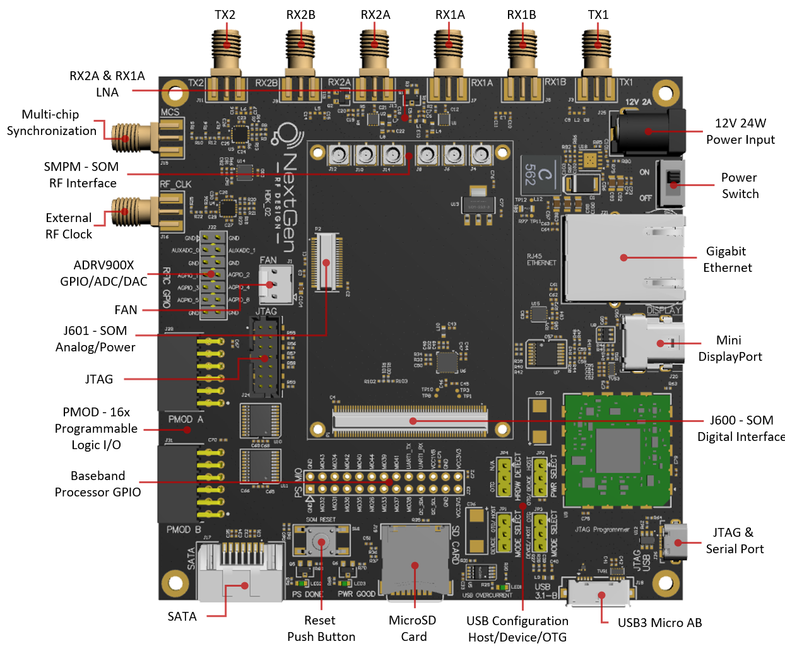
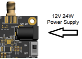
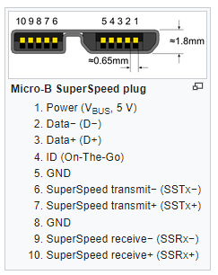
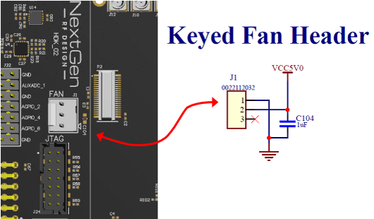
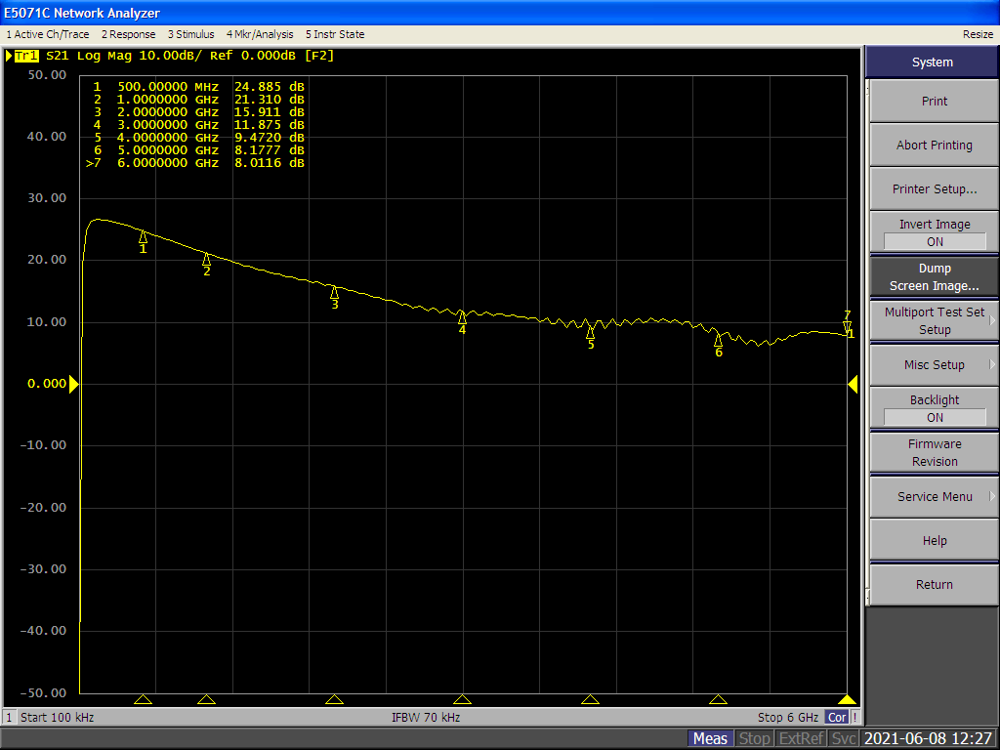
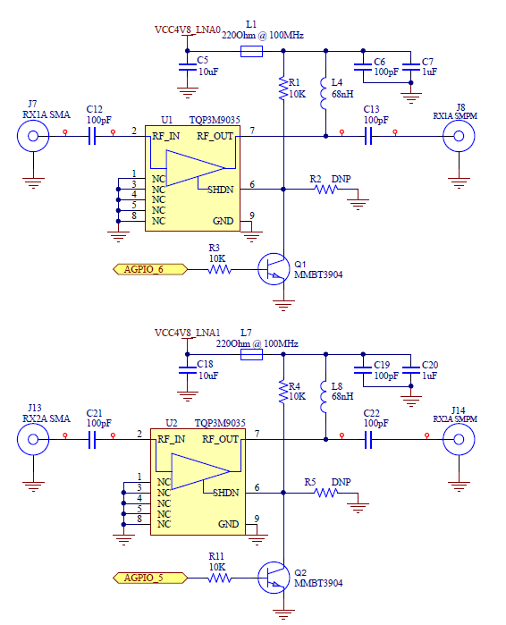
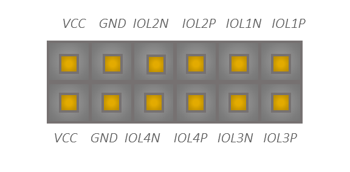
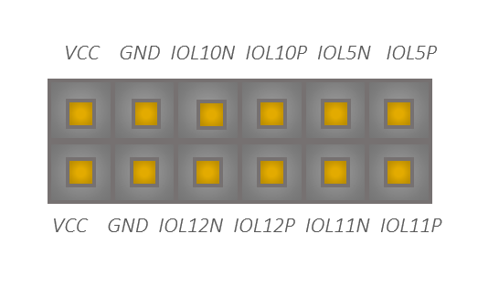
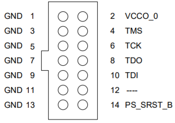

---

# BytePipe Hardware Development Kit

The BytePipe SOM requires a carrier board to supply power and provide access to its peripherals.  NextGen RF Design provides a hardware development kit (HDK) described in following sections.

# Hardware Components

# Power

The power jack supplies power to the HDK and SOM.  A nominal 12V 24W power supply should be connected using a 2.1mm x 5.5mm center positive barrel jack.  Although 12V is suggested the input can range from 7V to 24V as long as the supply is capable of sourcing 24W.   

# Power Switch

The power switch is next to the power jack and clearly labeled "ON" and "OFF".  When turned on a 5.0V regulator supplies power to the HDK, SOM, and fan.

# Ethernet

The Ethernet signals are accessible through J600. 

# DisplayPort

The HDK uses the MIO pins combined with dual GTR channels to support a 4K DisplayPort output.

|  Signal           | J600 Pin      | Description                     |
|-------------------|---------------|---------------------------------|
| DP_OE             | MIO29         | AUX channel output enable       |
| DP_AUX_OUT        | MIO27         | AUX channel output              |
| DP_AUX_IN         | MIO30         | AUX channel input               |
| DP_HPD            | MIO28         | Data Pairs                      |
| DP_LANE0_P        | GTR_TX[2]_P   | Hot-plug detect                 |
| DP_LANE0_N        | GTR_TX[2]_N   | Data Pairs                      |
| DP_LANE1_P        | GTR_TX[3]_P   | Data Pairs                      |
| DP_LANE1_N        | GTR_TX[3]_N   | Data Pairs                      |

# USB

The HDK supports USB2 and USB3.0 by combining the USB signals from the SOM with a single GTR land.  A micro-B USB connector allows for USB2 or USB3.0 along with Device, Host, or OTG modes.  The following table shows the jumper locations for configuring the appropriate modes.

|  Jumper   | Host Mode | Device Mode | OTG Mode  |
|-----------|-----------|-------------|-----------|
| JP1       | 1-2       | open        | 1-2       |
| JP2       | 1-2       | 2-3         | 2-3       |
| JP3       | 2-3       | 2-3         | 1-2       |
| JP4       | 1-2       | 2-3         | 2-3       |

# SD Card

The HDK implements an SD card using the following MIO signals.

|  Signal           | J600 Pin      | Description                     |
|-------------------|---------------|---------------------------------|
| SD1_DATA0         | MIO46         | Data                            |
| SD1_DATA1         | MIO47         | Data                            |
| SD1_DATA2         | MIO48         | Data                            |
| SD1_DATA3         | MIO49         | Data                            |
| SD1_CMD           | MIO50         | Command                         |
| D1_CLK            | MIO51         | Clock                           |
| SD1_DETECT        | MIO45         | Detect                          |

# SATA

The HDK implements a 6Gbps SATA interface using GTR_TX1 and GTR_RX1 signals.

# PS MIO

The HDK routes unused MIO signals to J23.

|       Description  |    Signal   | Pin | Pin |    Signal   |       Description  |
|--------------------|-------------|-----|-----|-------------|--------------------|
| Ground             | GND         | 1   | 2   | GND         | Ground             |
| GPIO               | MIO32       | 3   | 4   | MIO43       | GPIO               |
| GPIO               | MIO31       | 5   | 6   | MIO34       | GPIO               |
| GPIO               | MIO36       | 7   | 8   | MIO42       | GPIO               |
| GPIO               | MIO35       | 9   | 10  | MIO40       | GPIO               |
| GPIO               | MIO26       | 11  | 12  | MIO44       | GPIO               |
| GPIO               | MIO33       | 13  | 14  | MIO39       | GPIO               |
| GPIO               | MIO37       | 15  | 16  | MIO41       | GPIO               |
| GPIO               | MIO38       | 17  | 18  | UART1_RX    | UART1 Rx Input     |
| I2C Clock          | I2C1_SCL    | 19  | 20  | UART1_TX    | UART1 Tx Output    |
| I2C Data           | I2C1_SDA    | 21  | 22  | VCC1V8      | 1.8V VCC           |
| Ground             | GND         | 23  | 24  | GND         | Ground             |
| 3.3V  VCCIO        | VCC3V3      | 25  | 26  | VCC3V3      | 3.3V  VCCIO        |

# RFIC GPIO

The HDK routes unused RFIC GPIO to J22.

|       Description  |    Signal   | Pin | Pin |    Signal   |       Description  |
|--------------------|-------------|-----|-----|-------------|--------------------|
| Ground             | GND         | 1   | 2   | GND         | Ground             |
| ADC Input          | AUXADC_0    | 3   | 4   | AUXADC_1    | GPIO               |
| Ground             | GND         | 5   | 6   | GND         | Ground             |
| GPIO or DAC        | AGPIO_1     | 7   | 8   | AGPIO_2     | GPIO or DAC        |
| GPIO or DAC        | AGPIO_3     | 9   | 10  | AGPIO_4     | GPIO               |
| GPIO               | AGPIO_5     | 11  | 12  | AGPIO_6     | GPIO               |
| Ground             | GND         | 13  | 14  | GND         | Ground             |

# RF Clock

The HDK allows for an external RF clock to be connected to J16.  Software can be configured to enable this clock.

# MCS

The HDK allows for an external MCS signal be connected to J15.  Software can be configured to enable this functionality.

# Fan

The HDK supports a 3pin 5V fan connection using J1.  

|  Signal    | J1 Pin  | Description     |
|------------|---------|-----------------|
| VCC5V0     | 1       | Fan Supply      |
| GND        | 2       | Ground          |
|            | NC      | No Connect      |

# RF SMA Ports

The HDK provides direct access to the SOM transmit and receive RF ports.  In addition, each receiver can be routed through a TQP3M9035 low noise amplifier (LNA) on the HDK.   

|  Signal     | Connector   | Description                           |
|-------------|-------------|---------------------------------------|
| TX1         | J3          | Transmit channel 1 direct connection  |
| TX2         | J11         | Transmit channel 2 direct connection  |
| RX1A        | J7          | Receive channel 1 with LNA            |
| RX2A        | J13         | Receive channel 2 with LNA            |
| RX1B        | J5          | Receive channel 1 direct connection   |
| RX2B        | J9          | Receive channel 2 with LNA            |

# LNA

The HDK includes an LNA connected to RX1A and RX2A.  Currently IIO-Oscilloscope does not support the enabling of the LNAs.  By default the LNAs are powered down resulting in roughly 20dB of insertion loss.  The LNAs can be enabled by applying a jumper between the LNA enable pin and 1.8V from the HDK J22 and J23.

|  LNA Enable Pin  | Receive Port  | Connector |Description                              |
|------------------|---------------|-----------|-----------------------------------------|
| AGPIO_6          | RX1A          | J22.12    |Add jumper between enable pin and 1.8V.  |
| AGPIO_5          | RX2A          | J22.11    |Add jumper between enable pin and 1.8V.  |

# PMOD

The HDK routes the baseband processor (BBP) programmable logic I/O through two peripheral module (PMOD) interfaces, J28 and J31.  All signals are level shifted from 1.8V to 3.3V to comply with the PMOD standard. 

PMODA - J28:

| BBP Pin  |  SOM Signal     |  HDK Signal | Pin | Pin | HDK Signal  |  SOM Signal     | BBP Pin  |
|----------|-----------------|-------------|-----|-----|-------------|-----------------|----------|
| T3       | IO_L1_P         | PMOD_A0_P   | 1   | 7   | PMOD_A2_P   | IO_L3_P         | U2       |
| T2       | IO_L1_N         | PMOD_A0_N   | 2   | 8   | PMOD_A2_N   | IO_L3_N         | U1       |
| P3       | IO_L2_P         | PMOD_A1_P   | 3   | 9   | PMOD_A3_P   | IO_L4_P         | R4       |
| R3       | IO_L2_N         | PMOD_A1_N   | 4   | 10  | PMOD_A3_N   | IO_L4_N         | T4       |
|          | Ground          | GND         | 5   | 11  | GND         | Ground          |          |
|          | 3.3V            | VCC3V3      | 6   | 12  | VCC3V3      | 3.3V            |          |

PMODB - J31:

| BBP Pin  |  SOM Signal     |  HDK Signal | Pin | Pin | HDK Signal  |  SOM Signal     | BBP Pin  |
|----------|-----------------|-------------|-----|-----|-------------|-----------------|----------|
| R1       | IO_L5_P         | PMOD_B0_P   | 1   | 7   | PMOD_B2_P   | IO_L11_P        | L2       |
| T1       | IO_L5_N         | PMOD_B0_N   | 2   | 8   | PMOD_B2_N   | IO_L11_N        | L1       |
| M5       | IO_L10_P        | PMOD_B1_P   | 3   | 9   | PMOD_B3_P   | IO_L12_P        | L4       |
| M4       | IO_L10_N        | PMOD_B1_N   | 4   | 10  | PMOD_B3_N   | IO_L12_N        | L3       |
|          | Ground          | GND         | 5   | 11  | GND         | Ground          |          |
|          | 3.3V            | VCC3V3      | 6   | 12  | VCC3V3      | 3.3V            |          |

# JTAG

The HDK supports access to the JTAG signals through an on board [digilent](https://store.digilentinc.com/jtag-smt3-nc-surface-mount-programming-module/) USB programming module or through a standard 14-pin Xilinx System Board Header.  Either connection can be used without hardware configuration.

# Serial Port

The HDK provides serial port access through the UART0 signals via the [digilent](https://store.digilentinc.com/jtag-smt3-nc-surface-mount-programming-module/) programming module.  An additional serial port connection can be made using UART1 signals on J23.

# Reset Button

The HDK connects PS_SRST_N to SW1 providing a push button reset to the user.

# DISCLAIMER

THIS SOFTWARE IS COVERED BY A DISCLAIMER FOUND [HERE](../../DISCLAIMER.md).
