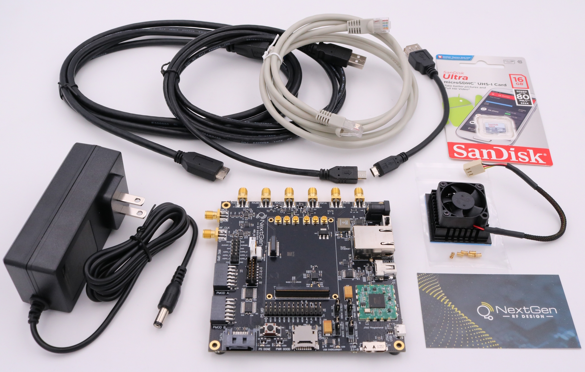
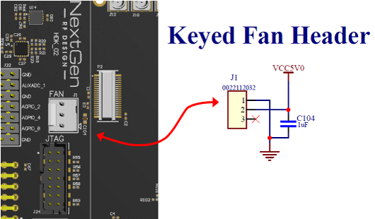
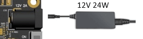

---

# HDK Quick Start Guide

## Overview
The BytePipe SDR Development Kit consists of a Hardware Development Kit (HDK) main board combined with a Software Defined Radio (SDR) System on a Module (SOM) and supporting cables, power supply, and software to enable testing and development with the NextGen RF BytePipe SOM.

The SOM Development Kit can be used as an evaluation tool and prototyping platform to aid in integration of the SOM into a full-scale product, or as a starting point to explore custom development of an SDR transceiver.

## Features

  - USB 2.0/3.0 Host/Device/OTG Connector
  - 10/100/1000 Ethernet Connector
  - Mini DisplayPort Connector
  - SATA Interface Connector
  - JTAG/UART Interface
  - RF Device Clock & MCS
  - Micro-SD Card Slot
  - PMOD Connectors
  - DC Power Regulators
  - Square Form Factor – 4.25” x 4.25” (PCB Only)

•	Developer Kit Main Board
•	6 – SOM RF Interconnects
•	SOM Heatsink and Fan
•	Power Supply
•	USB Cables
•	Ethernet Cable
•	Micro-SD Card (Blank)
•	6 Hours NextGen RF Engineering Support

# Kit Contents – HDK Only
The HDK can be purchased with or without a SOM.  If purchased without a SOM, the kit will arrive with everything needed to install a SOM, but the SOM will need to be properly installed on the HDK prior to use.  Instructions for installation are included later in this document.

  - Developer Kit Main Board
  - 6 – SOM RF Interconnects
  - SOM Heatsink and Fan
  - Power Supply
  - USB Cables
  - Ethernet Cable
  - Micro-SD Card (Blank)
  - 6 Hours NextGen RF Engineering Support

Figure 1: Developer Kit Contents – HDK Only

# Kit Contents – HDK + SOM
The HDK can be purchased with or without a SOM.  If purchased with a SOM, the kit will arrive with the SOM preinstalled and is ready to be used right out of the box.  

  - Developer Kit Main Board
  - BytePipe SDR SOM
  - 6 – SOM RF Interconnects
  - SOM Heatsink and Fan
  - Power Supply
  - USB Cables
  - Ethernet Cable
  - Micro-SD Card with Pre-Installed Software
  - 6 Hours NextGen RF Engineering Support
  - SOM Mounting Hardware

Figure 2: Developer Kit Contents – HDK + SOM

# SOM Mounting Hardware
The HDK/SOM combo kit includes spacers and screws securing the SOM on the HDK.  These are to ensure the SOM does not become disengaged from the HDK and damaged during shipping.  This hardware is not required for operation and can be left in place or discarded.

Figure 3: SOM Mounting Hardware Installed

Figure 4: SOM Mounting Hardware Removed

# HDK Overview

Figure 5: HDK Overview

# ESD Warning
Observe precautions for handling electrostatic sensitive devices.

# SOM Heatsink and Fan

If the SOM was purchased with the HDK, it will come with a pre-installed heatsink and fan.  If purchased separately, the heatsink and fan need to be installed by following the steps below.
CAUTION: Do not operate the SOM without adequate thermal dissipation as damage can occur.
  1.	Remove any labels from the gold colored shield of the SOM and ensure the surface is clean.
  2.	Remove the blue plastic from the bottom of the heatsink to expose the adhesive thermal tape.
  3.	Align the heatsink on the SOM shield such that it is centered in both directions and the fan wire faces the direction shown below.

  

  Figure 6: SOM Heatsink and Fan Installation

  4.	Press the heatsink and shield together firmly for a few seconds to ensure proper adhesion.

# SOM Installation
The HDK/SOM interconnect has two board-to-board connectors and six RF connectors.  Care must be taken to ensure they are properly aligned before applying the force necessary to fully engage the connections.
If using the U.FL connectors on the SOM, do not install the SMPM adapters – skip to step 3.  
  1.	Inspect the SMPM adapters to ensure they are not damaged.
  2.	Install the SMPM adapters in each of the six SMPM connectors of the HDK by aligning them vertically and pressing down.

**Note:** If tools are used to install the adapters, use extreme caution as the adapters can be easily damaged.

  

  Figure 7: SMPM RF Adapter Placement
  
  3.	Place the SOM on the HDK so that the six RF connectors and two board-to-board connectors are aligned.

  

  Figure 8: SOM Installation on HDK

  4.	Press the SOM firmly until all connections are fully seated.
  5.	Plug in the fan power connector to J1 of the HDK.  This connector is keyed to ensure the proper polarity to the included fan.  If using a different fan, ensure the pinout matches using the detail below.

  

  Figure 9: Keyed Fan Header

| Signal | J1 Pin | Description |
|--------|--------|-------------|
|GND     |1       |Ground       |
|VCC5V0  |2       |Fan Supply   |
|        |NC      |No Connect   |

Figure 10: Keyed Fan Header Pinout

# HDK Setup
The HDK comes with a micro-SD card containing a recent version of RFLAN, a power supply, and a USB cable for serial communication.  To get started using the HDK, follow the steps below.
  1.	Ensure the HDK power switch is in the “OFF” position.

  

  Figure 11: Power Switch - OFF

  2.	2.	The HDK without SOM comes with a blank micro-SD card so software will need to be downloaded and installed.  The HDK+SOM comes with a micro-SD card containing a recent version of RFLAN, but it is recommended that this be checked to ensure it is the latest release.  The latest software can be found on the NextGen RF Design GitHub [HERE](https://github.com/NextGenRF-Design-Inc/bytepipe_sdk/releases).

  Detailed instructions on preparing the micro-SD card can be found [HERE](https://github.com/NextGenRF-Design-Inc/bytepipe_sdk/blob/main/docs/sd_card/README.md).

  Be sure to download the software version that matches the SOM logic size and processing system (BP-2CG or BP-3CG) or the SOM will not boot.  Information on identifying the SOM can be found [HERE](https://github.com/NextGenRF-Design-Inc/bytepipe_sdk/blob/main/docs/som_id/README.md).

  3.	Ensure the micro-SD card is installed in the micro-SD card holder and that the holder is closed in the “LOCK” position.  The holder is a flip-type, so it is opened by sliding the metal cover out, then lifting up.  The micro-SD card slides into the open metal cover.  The holder is closed by setting it down and sliding the metal cover and micro-SD card back in.

  

  Figure 12: Micro-SD Card Installation

  4.	Connect desired RF test equipment to SMA connectors (or directly to the U.FL connectors if not using the SMPM adapters).

  

  Figure 13: RF Test Equipment Connections

  5.	Connect a micro-B USB 2.0 cable between the JTAG/USB port of the HDK and a PC or laptop.

  

  Figure 14: Serial Connection

  6.	Plug in the AC/DC power supply included in the kit, and plug the barrel jack into the HDK.

  

  Figure 15: Power Supply

  7.	Flip the HDK power switch to the “ON” position.

  

  Figure 16: Power Switch – ON

  8.	On the PC or laptop, open a serial terminal such as TeraTerm, select serial connection to the enumerated COM port, and set the baud to 115200.

**Note:** The COM port will only enumerate while the HDK is powered.  Once powered down, the serial port will be disconnected.

Figure 17: Serial Command Line Interface (CLI)

# Additional Information
Additional information and more detailed instructions can be found on NextGen RF Design’s website and GitHub page:

https://www.nextgenrf.com/products/bytepipe-x9002-system-on-module/

https://github.com/NextGenRF-Design-Inc/bytepipe_sdk

# Distributor Links
NextGen RF Design BytePipe products can be purchased through Richardson RFPD.
HDK (without SOM): https://shop.richardsonrfpd.com/Products/Product/BP-KIT

SOM Heatsink and Fan: https://shop.richardsonrfpd.com/Products/Product/BP-9002-FAN

Combo Kits and SOMs: https://shop.richardsonrfpd.com/Supplier/Index/NextGen__RF__Design

Additional or replacement SMPM RF adapters can also be ordered.  Use only the following MPN’s to ensure compatibility.
  - Molex 73300-0220 https://shop.richardsonrfpd.com/Products/Product/0733000220
  - Amphenol 1132-4010

# DISCLAIMER
THIS SOFTWARE IS COVERED BY A DISCLAIMER FOUND [HERE](https://github.com/NextGenRF-Design-Inc/bytepipe_sdk/blob/main/DISCLAIMER.md).
