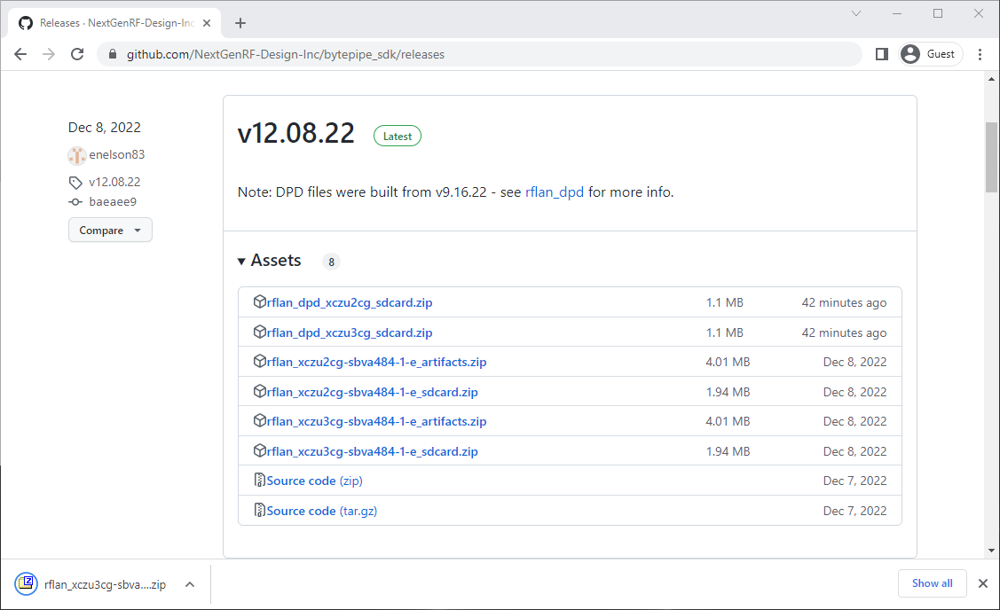

# Overview
In order to boot the BytePipe SOM from a micro-SD card on a carrier board such as the [HDK](../hardware/hdk/hdk.md) or [RadioCarbon](../hardware/RadioCarbon/RadioCarbon.md), the card needs to be properly formatted and contain the appropriate files for the specific version of SOM (BP-2CG or BP-3CG).  If the SOM version is unknown, see [SOM Identification](../som_id/).

If you purchased the HDK Kit with SOM, a pre-formatted micro-SD card was included which contained a release of the RFLAN application.  To boot using a different version of RFLAN, simply insert the micro-SD card into a laptop or PC, delete the existing files on the card, and copy the new files to the root folder.  Details on this process can be found below in [Preparing a micro-SD Card](#preparing-a-micro-sd-card).

# Preparing a micro-SD Card
To prepare a micro-SD card for use with RFLAN based applications, a PC or laptop is required.  This can be done in Microsoft Windows or Linux-based OS's such as Ubuntu.  See instructions below for [Windows 10](#microsoft-windows) or [Ubuntu 22.04 LTS](#ubuntu).

## Microsoft Windows
If using Microsoft Windows (Windows 10), follow the steps below:

1. Insert the micro-SD card into the PC, using an adapter if required.
2. If the card is already formatted, skip to step 3.  If the card is not formatted, a pop-up window will appear.

    - If the pop-up window appears, click "Format disk".

      

    - This will bring up another window, shown below.

      

    - If the card is 32GB or less, it should default to FAT or FAT32 for the file system.  Ensure this is the case, leave the other settings at default, and then click "Start".  For larger cards, see [Additional Details](#additional-details) below.
    - A warning will appear, click "OK".

      

    - Another pop-up will appear when the process is complete.  Click "OK".

      

    - The card should now appear in File Explorer.

3. Download the desired files from the GitHub repo using Chrome.  These will be in a .zip file.  If downloading from the latest releases link, click on the desired .zip file hyperlink.

4. The file might be automatically saved to the "Downloads" folder, or a pop-up may appear asking where to save the file.  Save it to the "Downloads" folder.  A downloads bar will appear at the bottom of the screen.

5. Click on the up arrow by the file in the lower-left and select "Show in Folder".  Alternatively, open File Explorer and navigate to the "Downloads" folder.  

6. To extract the files, right-click on the .zip file and select "Extract All...".  A third-party utility such as [7-Zip](https://www.7-zip.org/) can also be used but the steps will vary slightly.

7. A pop-up should appear.  These options can be left at default.  Click "Extract".

8. The extracted files will now be shown in a new File Explorer window.  Note that the actual files may differ than shown below depending on the .zip file that was downloaded in the previous steps.

9. Select all of the files by pressing "Ctrl+A", then right-click and select "Copy" (or press "Ctrl+C").

10. Navigate back to the micro-SD card in File Explorer, then right-click and select "Paste" (or press "Ctrl+V").

11. The files should now be on the micro-SD card.

12. Eject the micro-SD card by right-clicking on the card in the Navigation pane, then selecting "Eject".

13. The card can now be inserted into the micro-SD card slot on the HDK, RadioCarbon, or other carrier board.  If everything is set up properly, the [CLI](../../src/rflan#cli-interface) will show the boot sequence.

## Ubuntu
If using a Linux OS (Ubuntu 22.04 LTS), follow the steps below:

1. Insert the micro-SD card into the PC, using an adapter if required.
2. If the card is already formatted, skip to step 3.  If the card is not formatted, the card may not be mounted automatically.

    - Open "Disks" from the Application menu (located in the "Utilities" folder or by searching for "disks").
  
      

    - On the left-hand side, select the device containing the micro-SD card.

      
  
    - Click the "Additional partition options" button (the small gear icon) in the lower-left corner of the "Volumes" detail.

      

    - Then select "Format Partition..."

      

    - A window will pop up with options.  If the card is 32GB or less, it should default to FAT for the file system.  Ensure this is the case, leave the other settings at default, and then click "Next".  For larger cards, see [Additional Details](#additional-details) below.

      

    - On the next screen, click "Format".

      

    - When it is complete, the volume should now show the formatting details.

      

    - Click the "Mount selected partition" button (the small play icon) in the lower-left corner of the "Volumes" detail to mount the drive.

      

    - Next, open "Files" from the Application menu by searching for "files".

      

    - Select the card volume in the navigation pane on the left-hand side.  It should appear empty.  **Note:** If the card was originally formatted using Windows, a folder titled "System Volume Information" may exist.  These files should be left as-is.

      

3. Download the desired files from the GitHub repo using Firefox.  These will be in a .zip file.  If downloading from the latest releases link, click on the desired .zip file hyperlink.

4. The will be automatically saved to the "Downloads" folder and a status bar will appear in the top right of the screen.  Once complete, click the "Show in Folder" icon to the right of the filename.

5. Alternatively, open Files and navigate to the "Downloads" folder.

6. To extract the files, right-click on the .zip file and select "Extract Here".

7. The files will be extracted into a sub-folder of the same name.  Double-click the folder.

8. The extracted files will now be shown.  Note that the actual files may differ than shown below depending on the .zip file that was downloaded in the previous steps.

9. Select all of the files by pressing "Ctrl+A", then right-click and select "Copy" (or press "Ctrl+C").

10. Navigate back to the micro-SD card in Files, then right-click and select "Paste" (or press "Ctrl+V").

11. The files should now be on the micro-SD card.

12. Unmount the micro-SD card by clicking small up-arrow to the right of the volume name in the navigation pane.

13. The card can now be inserted into the micro-SD card slot on the HDK, RadioCarbon, or other carrier board.  If everything is set up properly, the [CLI](../../src/rflan#cli-interface) will show the boot sequence.

# Additional Details
## Supported micro-SD Cards
NextGen RF Design does not qualify specific brands of micro-SD cards for use with the BytePipe SOM as most commonly available cards should be compatible, however, there are some basic requirements in order for the card to be recognized and properly boot.

## Size and Formatting
The primary partition of the micro-SD card must be formatted as FAT or FAT32, so a 1GB to 32GB card is recommended as these will typically be pre-formatted as these types.  If the primary partition is formatted using any other file allocation table format, such as exFAT, NTFS, or any Linux-based format, the SOM will not boot.

In order to use a micro-SD card larger than 32GB, a primary partition of 32GB or smaller will need to be created.  This can be done on MS Windows or Linux machines with built-in or third-party tools.  The detailed instructions on this process are beyond the scope of this documentation, but are readily available on the internet.

**NOTE:** Extreme caution should always be used when partitioning and formatting devices as unintended data loss can occur if settings are not properly selected. 

## Boot Files
At a minimum, the card must contain a boot.bin (case insensitive) file in the root folder in order for the SOM to boot.  RFLAN-based applications will automatically run commands contained in plain text files named adrv9001_setup.txt and rflan_setup.txt if they exist in the root folder.  These can be used to automate any command that can be entered via the CLI.  Comment lines can be added by starting with `//`.

## Other Files
It is ok to store different versions of files, including the boot.bin, in sub-folders on the micro-SD card as only the files in the root folder will used during the boot sequence.

## Linux Builds
The micro-SD card used for Linux builds may vary, but typically include a small (1GB) partition for the MBR formatted as FAT or FAT32, and a larger partition for the Linux File System formatted as ext4.

# DISCLAIMER
THIS SOFTWARE IS COVERED BY A DISCLAIMER FOUND [HERE](https://github.com/NextGenRF-Design-Inc/bytepipe_sdk/blob/main/DISCLAIMER.md).
