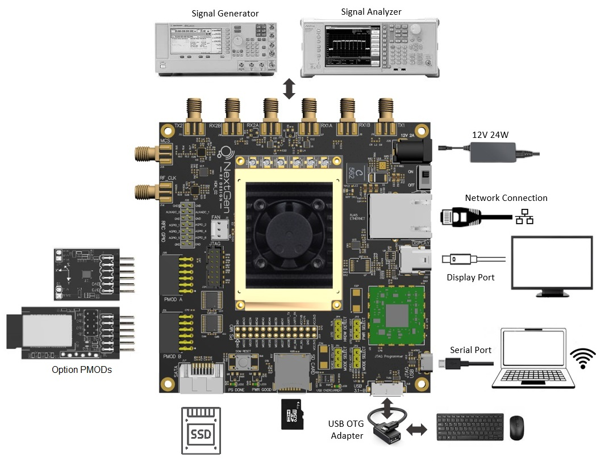

---

# Unboxing

If you havn't already unboxed the BytePipe hardware development kit (HDK) refer to the following video for help with the setup.

# Overview

The BytePipe hardware development kit supports a number of different configurations.  At a minimum a 12V 24W power supply (included with the HDK), an SD card flashed with the latest software release, and either a serial port connected to a PC and/or an Ethernet network connection are suggested.  Additional items such as a display connected to the display port, keyboard and mouse, PMODs, and SSD are optional.

The BytePipe_x9002 SOM includes two RF transmit ports and four RF receive ports.  Each port can be accessed through SMA connectors on the HDK or through the U.FL connectors on the top side of the SOM.  For initial evaluation it is suggested to connect the SMA ports of the HDK through a combination of power splitters to a signal analyzer and signal generator.  For the purpose of this quick start tutorial we are going to connect both transmit (TX1/TX2) and both primary receive ports (RX1A/RX2A) through a RF combiner to the signal analyzer.  This will allow transmit signals to be viewed on the signal analyzer.  The combiner with only 30dB or so of port isolation will allow the BytePipe to receive the transmitted signals. 

If it is desired to connect a keyboard and mouse an [OTG USB Adapter](https://www.amazon.com/UGREEN-Adapter-Samsung-Controller-Smartphone/dp/B00LN3LQKQ/ref=sr_1_5?dchild=1&keywords=usb+otg+adapter&qid=1624389445&sr=8-5) is required.  If using a display it should be connected using a mini display port cable. The display must natively support display port and no display port adapters should be used.

:memo: Note: Both the OTG and display port are only supported when using a Linux release.

# DISCLAIMER

THIS SOFTWARE IS COVERED BY A DISCLAIMER FOUND [HERE](../../DISCLAIMER.md).
