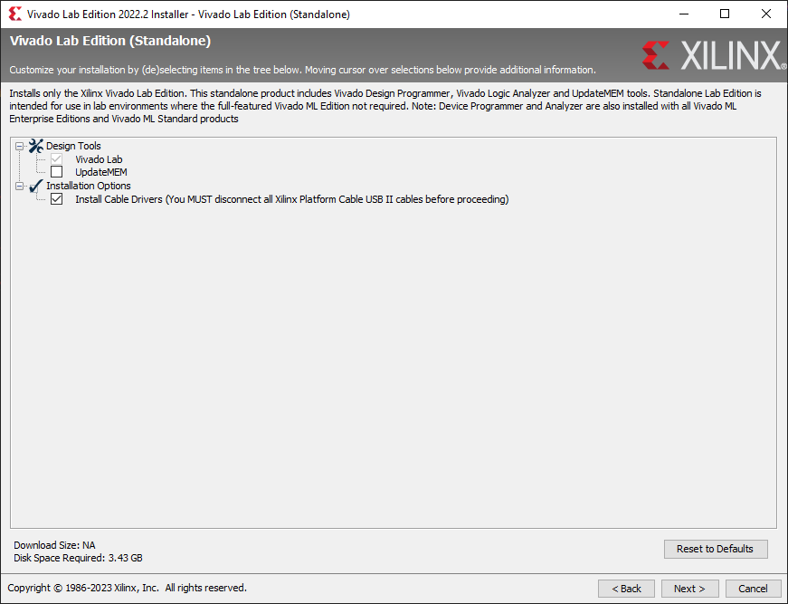
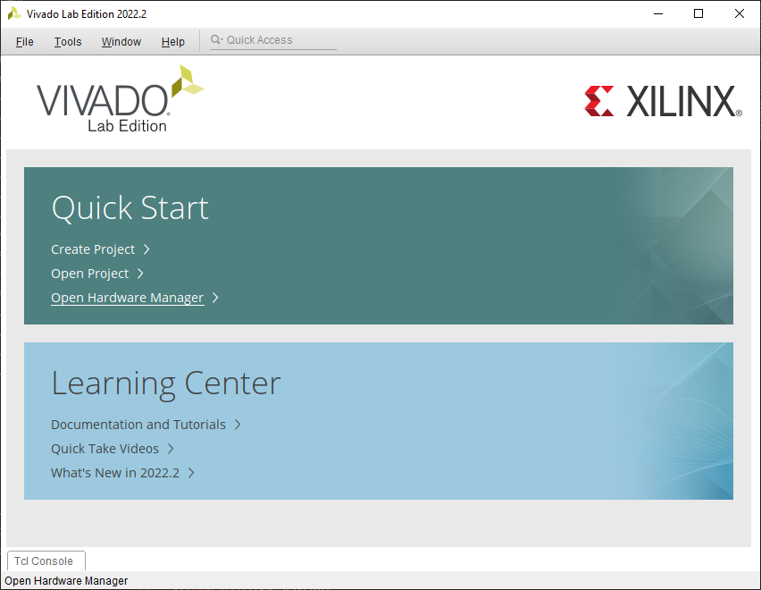
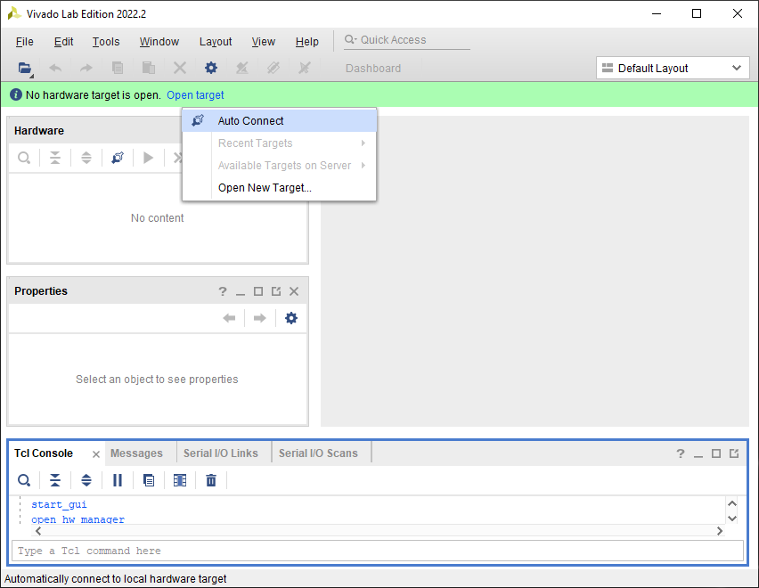
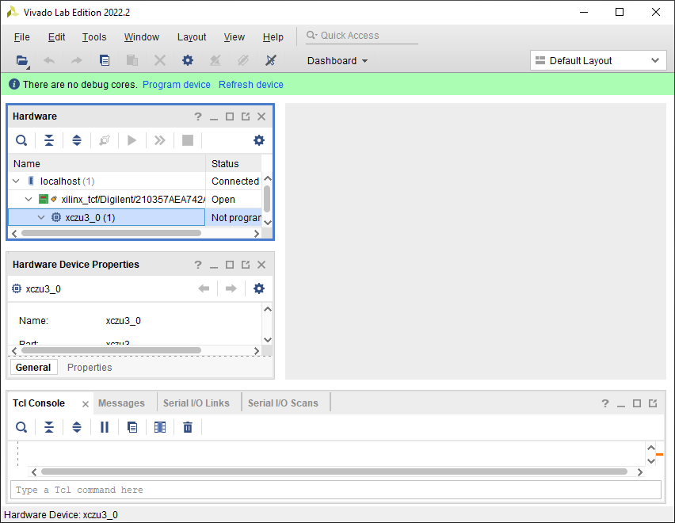
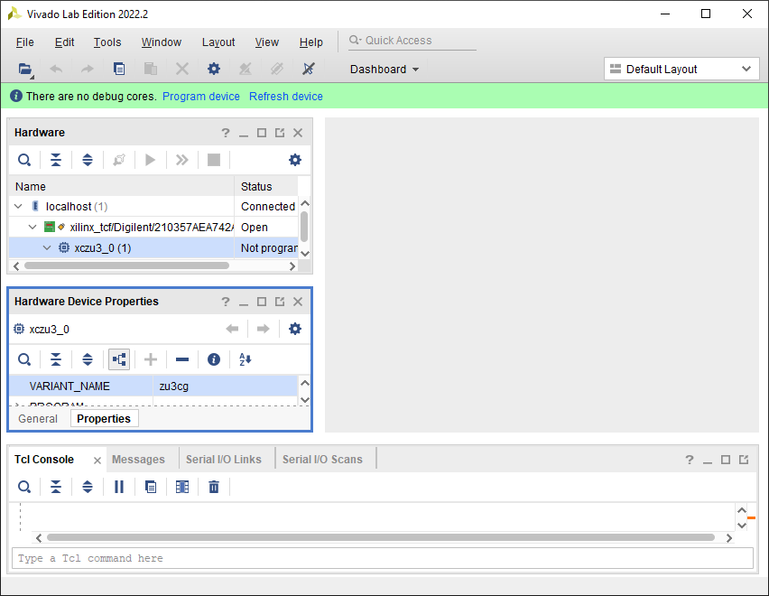
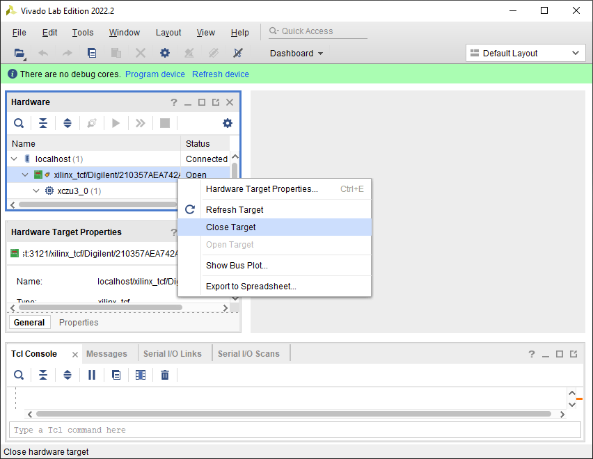

---

# SOM Identification
The BytePipe SOM can be ordered with several versions of the Xilinx ZYNC®- UltraScale+ SoC.  The boot.bin file on the micro-SD card needs to be compiled specifically for each version or it will fail to boot.  The SOM should have a label on the side of the gold anodized shield closest to the micro-SD card holder when installed on an HDK (the end opposite from the RF connectors).  This label includes the full SOM model number - i.e. "BP-3CG1E-9002".  Ensure the micro-SD card contains a boot.bin matching the SOM version for the programmable logic size and processing system (the "3CG" in the previous example).

The earliest SOMs shipped without this label.  If your SOM does not have this label it is most likely a "3CG".  Attempting to boot a SOM with the incorrect software version will not damage the SOM, it will simply fail to boot (nothing will show in the CLI and the "PS DONE" LED on the HDK will remain off).  If you have a SOM without a label, or with a label that has become illegible, and you are unsure of which version it is, there are three methods that can be used to identify it.

  1. Try booting with the various versions of pre-compiled RFLAN SD card files found in [Releases](https://github.com/NextGenRF-Design-Inc/bytepipe_sdk/releases).
  2. Connect to the SOM using Vivado from Xilinx and read the SoC ID.  See section [Vivado](#vivado) below.
  3. Contact NextGen RF Design and provide the full SOM serial number as shown on a small label on the bottom of the SOM (which should be a format of xxxx-nnn or xxxx-nnnnn).

**WARNING** Do NOT attempt to remove the gold anodized shield as this will void the warranty and potentially cause damage to sensitive components.

## Vivado
Follow the steps below to identify the SOM version using Vivado.

  1. Download and install Vivado from the [Xilinx Download Center](https://www.xilinx.com/support/download.html).  Note that this software tool is a very large download (near 90GB) and requires a license to activate - see [Xilinx Licensing](https://www.xilinx.com/support/licensing_solution_center.html) for more info.  If you do not plan to do any hardware development and only need the tool to identify a SOM, the Lab Solutions version can be used and does not require any licensing.  This is about a 1.5GB download and when installing, you can uncheck "UpdateMEM" to reduce the install space requirement to around 3.5GB.

  

  2. Run Vivado.  At the startup screen, click "Open Hardware Manager".

  

  3. Ensure the SOM is installed on the HDK and connect it to the PC with a USB cable to the JTAG/USB connector.  A micro-SD card does not need to be installed.  Power on the HDK/SOM.

  4. In the Vivado HW Manager, there will be a notification "No hardware target is open. Open target".  Click "Open target" and select "Auto Connect".

  

  5. If properly set up, the Xilinx SoC information should now show in the Hardware box on the left-hand side of the page.  If a warning popped up, just hit "OK".  Left-click the "xczu..." under "localhost - xilinx_...".

  

  6. The Hardware Device Properties box below should now show information on that device.  Select the "Properties" tab at the bottom, and scroll down to the "VARIANT_NAME" property.  This should contain the specific SOM variant.

  

  7. In the Hardware window, right-click on the "xilinx_..." item under "localhost" and select "Close Target".

  

  8. Power off the SOM/HDK and close out of Vivado.

# DISCLAIMER
THIS SOFTWARE IS COVERED BY A DISCLAIMER FOUND [HERE](https://github.com/NextGenRF-Design-Inc/bytepipe_sdk/blob/main/DISCLAIMER.md).
