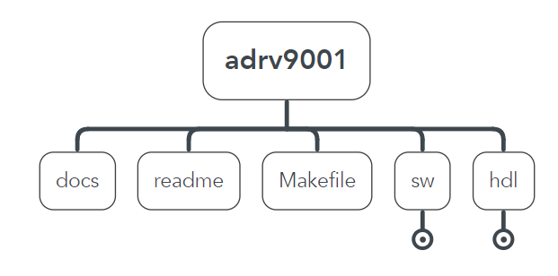
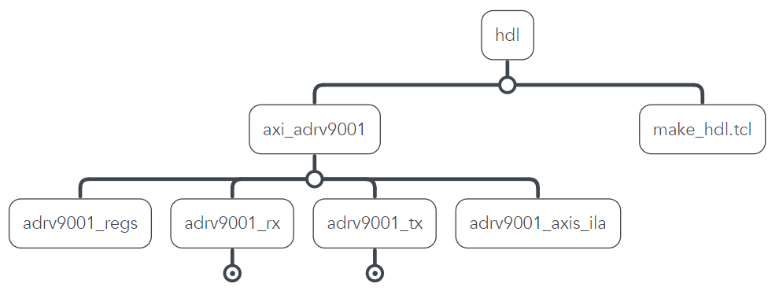
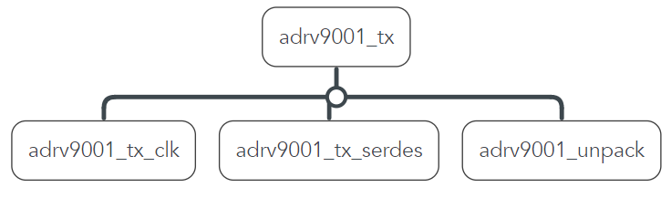
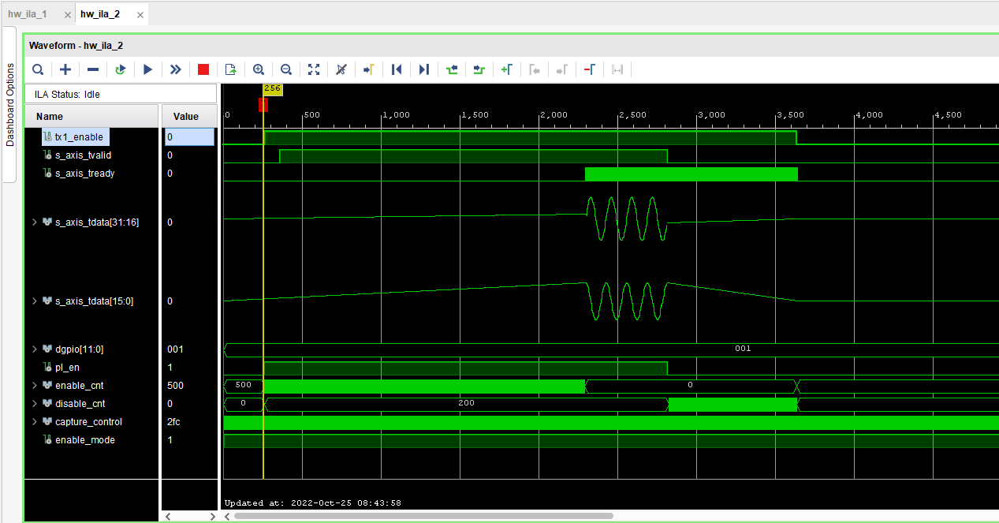
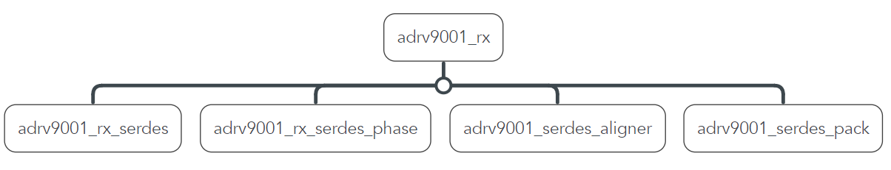
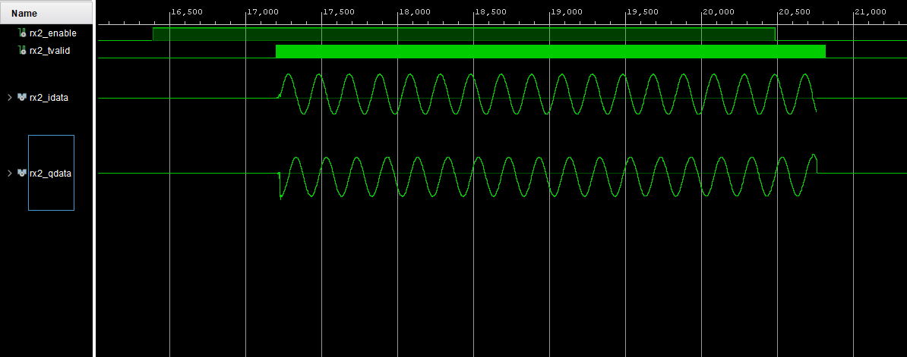
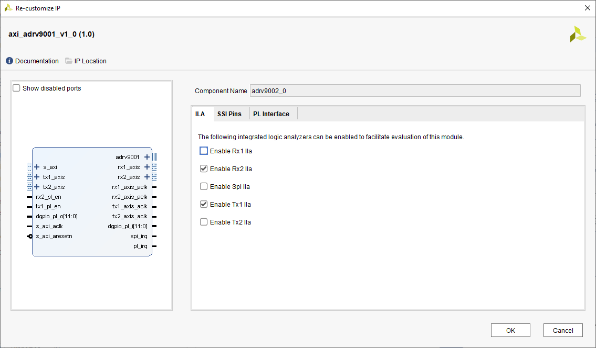
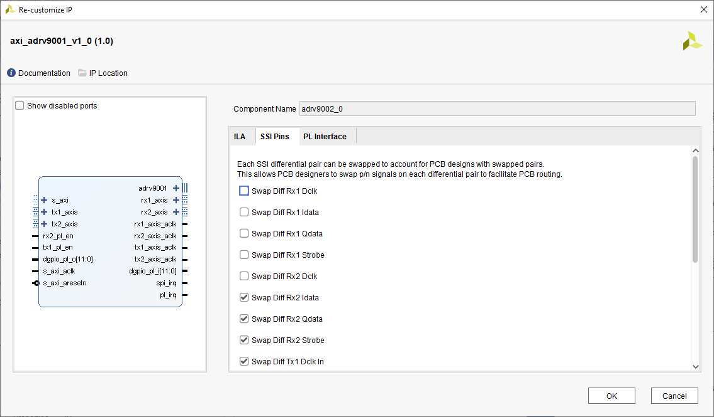
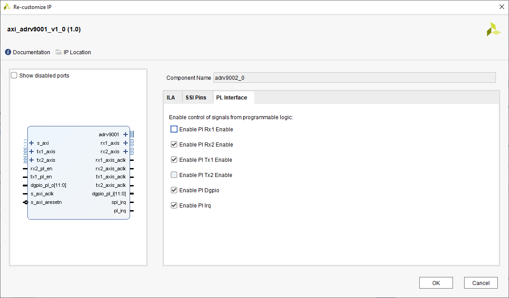
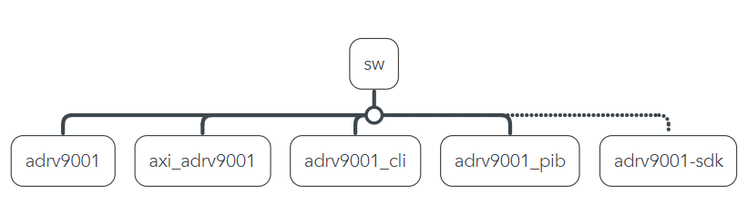

# ADRV9001

The ADRV9001 module provides the hardware interface between the BytePipe programmable logic and ADRV9002.  This interface has been optimized for the BytePipe and production style products.  Included in this driver is the HDL required for the programmable logic along with the software drivers for communication from the CPU to the programmable logic.  

# Programmable Logic (HDL)

The adrv9001 programmable logic converts the Synchronous Serial Interface (SSI) connected to the ADRV9002 to independent transmit and receive AXI STREAM interfaces.  This module also provides a AXI4 interface for controlling the ADRV9002 GPIO and TDD timing.  The following diagram shows the programmable logic structure.  The programmable logic can be built by executing a single script (make_hdl.tcl).  The top-level module, axi_adrv9001.v, implements the adrv9001 configurable registers, two adrv9001 transmit interfaces, two adrv9001 receive interfaces, and an optional integrated logic analyzer.  

The resulting axi_adrv9001 standalone ip is shown below.  Each transmit and receive interface to the users programmable logic is implemented as a AXI STREAM interface consisting of axis_tdata, axis_tvalid, and axis_tready signals.  Each AXI STREAM interface has a corresponding clock output operating at 2x the sample rate.

# ADRV9001 Transmit Programmable Logic

The ADRV9001 transmit programmable logic is responsible for converting the AXI STREAM data to ADRV9001 SSI data.  This is done by unpacking the AXI STREAM data into serial bits using built-in SERDES.  The AXI STREAM data is clocked in at twice the sample rate using the AXI STREAM axis_tvalid and axis_tready signals.  Each bit is clocked out using the SERDES at 16x the sample rate.  For the highest sample rate of 61.44MSps the resulting clock rate is 491.52MHz with data clocked on both the rising and falling edge of the clock.    

The following diagram shows the timing associated with the transmit AXI STREAM and ADRV9001 enable signals.  The transmit enable signal is controlled by driving tx1_pl_en from the programmable logic.  When enabling the transmitter, it is assumed data is valid at the input of the adrv9001 module either from a DMA or custom programmable logic module.  Before data is accepted by the transmit programmable logic, the transmit enable signal is driven high for `tx1_enable_cnt` samples based on the programmed `tx1_enable_delay`.  This allows the ADRV9001 transmitter to transition from primed to enabled.  Data is then clocked into the module by driving tx1_tready high every other clock cycle.  The transmit enable signal remains high for the duration of `tx1_pl_en` followed by `tx1_disable_cnt` number of samples to ensure the data is flushed from the ADRV9001 pipeline.  In the following example `tx1_enable_delay` equals 500 samples and `tx1_disable_dealy` equals 200 samples.  This allows the user data source to drive `tx1_pl_en` high without having to account for power up and power down times. 

# ADRV9001 Receive Programmable Logic

The ADRV9001 receive programmable logic is responsible for converting the ADRV9001 SSI data to AXI STREAM data.  This is done by packing serial SSI data using built-in SERDES to AXI STREAM data.  The AXI STREAM data is clocked out at twice the sample rate using the AXI STREAM axis_tvalid signal.     

The following diagram shows the timing associated with the receive AXI STREAM and ADRV9001 enable signals.  The receive enable signal is controlled by driving rx1_pl_en from the programmable logic.  When enabling the receiver, it is assumed upstream modules are ready to receive data such as a DMA or other custom module.  Before AXI STREAM data is available the receive enable signal is driven high for `rx1_enable_cnt` samples based on the programmed `rx1_enable_delay`.  This allows the ADRV9001 receiver to transition from primed to enabled.  Data is then clocked out using the AXI STREAM interface by driving rx1_tvalid high every other clock cycle.  The AXI STREAM data continues to be clocked out as long as `rx1_pl_en` is high.  When `rx1_pl_en` is driven low by the user's programmable logic the ADRV9001 begins transitioning from enabled to primed.  During this transition period valid AXIS STREAM samples are clocked out for a duration of `rx1_disable_delay` number of samples.  This allows the upstream user's programmable logic to disable the receiver by driving `rx1_pl_en` low slightly early allowing for efficient use of time without losing valid received samples.  The following example shows `rx1_enable_dealy` equal to 500 and `rx1_disable_delay` equal to 300.  Notice after the `adrv9001_enable` pin is driven low effectively disabling the receiver an additional 200 or so valid samples are clocked out.

# ADRV9001 Programmable Logic Configuration

The ADRV9001 programmable logic is created as a standalone IP module.  The following shows the integrated logic analyzer (ILA) configuration options for the IP.  Each transmit and receive interface has the option for enabling an integrated logic analyzer (ILA).  When an ILA is enabled, users can access the corresponding signals through JTAG using the hardware manager in vivado.

In addition to the ILA configuration each SSI differential pair can be swapped for designs such as the BytePipe where it is advantageous for PCB routing to swap the positive and negative signals of a differential pair.  

The following shows configuration options for enabling programmable logic control signals.  If the PL enable pins are enabled the user has the option of enabling the corresponding transmit or receive channel using the programmable logic or using SPI.  Enable the PL DGPIO allows the programmable logic to interface to the 12 digital IO connected to the ADRV9001.  Enabling the PL IRQ signal allows programmable logic to interface to the IRQ output pin of the ADRV9001.

# ADRV9001 Register Programmable Logic

The ADRV9001 module provides several registers for control and configuration.  The following table defines each registers function and address.  

| Address  | Bit Field | Field             | Description                                                                             |
|----------|-----------|-------------------|-----------------------------------------------------------------------------------------|
| 0x0000   | [31:1]    | unused            |                                                                                         |
|          | [0]       | tx1_enable_mode   | Transmit channel 1 enable mode. 0 = processing system (PS), 1 = programmable logic (PL) |
| 0x0001   | [31:1]    | unused            |                                                                                         |
|          | [0]       | tx2_ps_en         | Transmit channel 2 enable mode. 0 = processing system (PS), 1 = programmable logic (PL) |
| 0x0002   | [31:1]    | unused            |                                                                                         |
|          | [0]       | rx1_ps_en         | Receive channel 1 enable mode. 0 = processing system (PS), 1 = programmable logic (PL)  |
| 0x0003   | [31:1]    | unused            |                                                                                         |
|          | [0]       | rx2_ps_en         | Receive channel 2 enable mode. 0 = processing system (PS), 1 = programmable logic (PL)  |
| 0x0004   | [31:1]    | unused            |                                                                                         |
|          | [0]       | rstn              | ADRV9001 Reset Pin                                                                      |
| 0x0005   | [31:16]   | unused            |                                                                                         |
|          | [15:0]    | tx1_enable_delay  | Delay in samples between rising edge of adrv9001_tx1_enable to rising edge of axis_tready. Allows the transmitter to power up before enabling data.  |         
| 0x0006   | [31:16]   | unused            |                                                                                                                                                      |
|          | [15:0]    | tx2_enable_delay  | Delay in samples between rising edge of adrv9001_tx2_enable to rising edge of axis_tready. Allows the transmitter to power up before enabling data.  |      
| 0x0007   | [31:16]   | unused            |                                                                                                                                                      |
|          | [15:0]    | rx1_enable_delay  | Delay in samples between rising edge of adrv9001_rx1_enable to rising edge of axis_tvalid. Allows the receiver to power up before enabling data.     |     
| 0x0008   | [31:16]   | unused            |                                                                                                                                                      |
|          | [15:0]    | rx2_enable_delay  | Delay in samples between rising edge of adrv9001_rx2_enable to rising edge of axis_tvalid. Allows the receiver to power up before enabling data.     |   
| 0x0009   | [31:16]   | unused            |                                                                                                                                                      |
|          | [15:0]    | tx1_disable_delay | Delay in samples between falling edge of user enable or axis_tvalid to falling edge of adrv9001_tx1_enable. Allows the transmitter pipeline to flush.| 
| 0x000A   | [31:16]   | unused            |                                                                                                                                                      |
|          | [15:0]    | tx2_disable_delay | Delay in samples between falling edge of user enable or axis_tvalid to falling edge of adrv9001_tx2_enable. Allows the transmitter pipeline to flush.| 
| 0x000B   | [31:16]   | unused            |                                                                                                                                                      |
|          | [15:0]    | rx1_disable_delay | Delay in samples between falling edge of user enable to falling edge of axis_tvalid. Allows the receiver pipeline to flush and ensures all IQ data is received by the BBP for the duration of time the receiver is enabled.  | 
| 0x000C   | [31:16]   | unused            |                                                                                                                                                      |
|          | [15:0]    | rx2_disable_delay | Delay in samples between falling edge of user enable to falling edge of axis_tvalid. Allows the receiver pipeline to flush and ensures all IQ data is received by the BBP for the duration of time the receiver is enabled.  | 
| 0x000D   | [31:12]   | unused            |                                                                         |
|          | [11:0]    | dgpio_t           | ADRV9001 Digital GPIO direction (0 = output, 1 = input)                 |
| 0x000E   | [31:12]   | unused            |                                                                         |
|          | [11:0]    | dgpio_i           | Corresponds to ADRV9001 Digital GPIO output value when writing.         |
|          | [11:0]    | dgpio_i           | Corresponds to ADRV9001 Digital GPIO input value when reading.          |
| 0x000F   | [31:0]    | tx1_ps_data       | Transmit data from processing system (tx1_data_src = 1). |
| 0x0010   | [31:0]    | tx2_ps_data       | Transmit data from processing system (tx2_data_src = 1). |
| 0x0011   | [31:1]    | unused            |                                                                         |
|          | [0]       | tx1_data_src      | Transmit data source. 0=AXI_STREAM, 1=processing system (PS)            |
| 0x0012   | [31:1]    | unused            |                                                                         |
|          | [0]       | tx2_data_src      | Transmit data source. 0=AXI_STREAM, 1=processing system (PS)            |

# ADRV9001 Software

The ADRV9001 software modules provide an interface and hardware abstraction layer to the Analog Devices ADRV9001-SDK Evaluation Software found [here](https://www.analog.com/media/en/evaluation-boards-kits/evaluation-software/adrv9001-sdk-eval-software.zip).  

