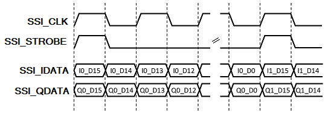

# adrv9001

The adrv9001 module provides the hardware interface between the BytePipe programmable logic and ADRV9002.  This interface has been optimized for the BytePipe and consumes significantly less resources then the adrv9001-sdk axi_adrv9001 module.  Included in this driver is the HDL requried for the programmable logic along with the software drivers for communication from the CPU to the programmable logic.  

# Programmable Logic

The adrv9001 programmable logic converts the Synchrounous Serial Interface (SSI) connected to the ADRV9002 to independent transmit and receive AXI STREAM interfaces.  This module also provides a AXI4 interface for controlling the ADRV9002 GPIO.   

