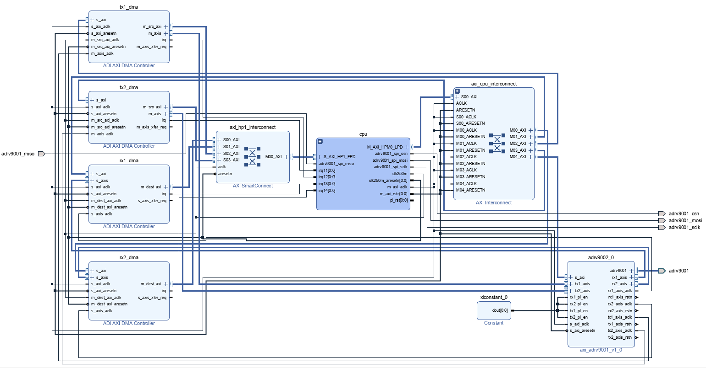
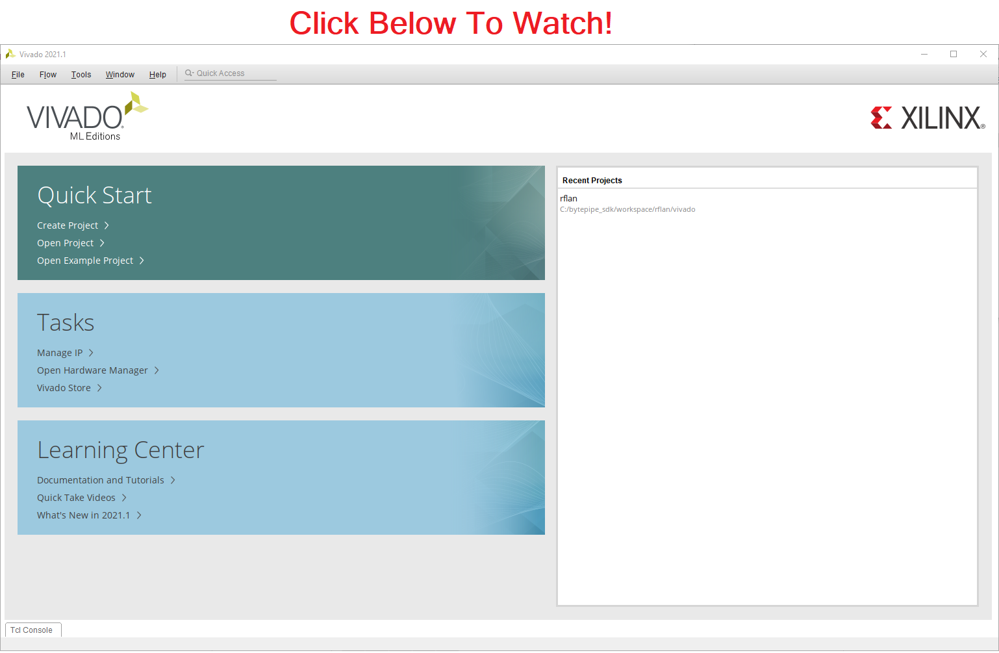
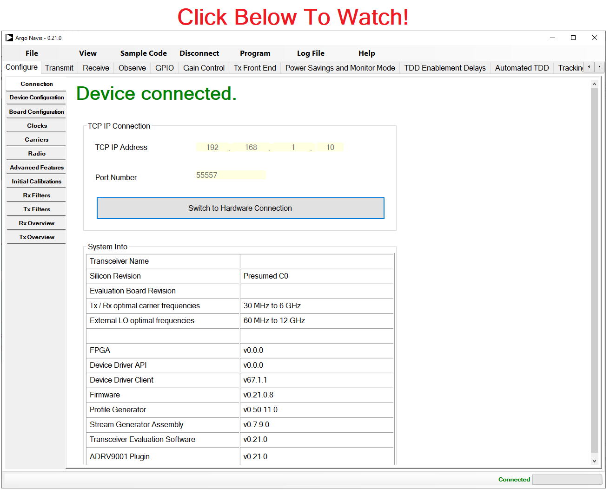

# RFLAN

The RFLAN application is an embedded C real-time application running on the Cortex R5 real-time processing unit (RPU).  The programmable logic includes the [ADRV9001](../adrv9001/README.md) synchronous serial interface along with DMAs for streaming IQ data or modem data to and from shared memory.  The RFLAN firmware configures and controls the ADRV9001.  It also directs DMA data to and from shared memory to the command line interface (CLI) using a serial port or Ethernet.  The following diagram shows the main components of the RFLAN including firmware running on the RPU and programmable logic.  The RFLAN can operate as a standalone application or integrated with a Linux application running on the Cortex A53 using interprocessor communication (IPC).  

To evaluate the RFLAN application, the executables can be downloaded from the latest release folder found [here](https://github.com/NextGenRF-Design-Inc/bytepipe_sdk/releases) or built from source files.


# Programmable Logic

The RFLAN programmable logic consists of the ADRV9002 IP, ZynqUltrascale+ CPU, and transmit and receive DMAs as shown below.  The programmable logic allows for streaming of IQ data to and from the processor for evaluation of the BytePipe_x9002.  It also serves as a starting point for developing custom applications by inserting custom programmable logic between the ADRV9001 and DMAs which can be used for data transfer or debugging.  This is shown in the [rflan_qpsk example](../rflan_qpsk/README.md).  Additional information regarding the ADRV9002 can be found [here](../adrv9001/README.md).

To build the programmable logic see `Building Source` found below.

[]()

# Real-Time Processing Unit (RPU) Software

The RFLAN software is designed to execute on a single Cortex-R5 real-time processing unit (RPU).  The RFLAN software provides all of the basic configuration and control of the ADRV9002 and DMAs.  Users can interact with the RFLAN through a command line interface (CLI) connected via the serial port or Ethernet port.  The RFLAN application allows for evaluation of the BytePipe_x9002 and serves as a starting point for custom production designs.  The RFLAN software is capable of interfacing to a Petalinux application running on the application processing unit (APU).  

The following diagram shows the main software components with several applications running in parallel, along with a collection of libraries including general libraries (lib), the chip support library (csl), and adrv9001 library.  


The following diagram provides an overview of each library component.  The adrv9001 library primarily uses the [adrv9001 software library](../adrv9001/README.md).  The RFLAN adrv9001 library does include its own default profile generated from Analog Devices Transceiver Evaluation Software (TES).  The default profile can easily be updated to support a variety of applications with directions found in the following sections.


# CLI Interface

## Serial Connection
The command line interface (CLI) provides an external user interface accessible through a serial port or Ethernet connection.  Both interfaces are operational simultaneously allowing users to use one or both interfaces.  The serial port is accessible through the JTAG/USB interface using a USB micro cable connected to J26 on the [BytePipe Hardware Development Kit](../../docs/hardware/hdk/hdk.md).  [Tera Term](https://download.cnet.com/Tera-Term/3000-2094_4-75766675.html) is the preferred serial terminal operating at 115200 baud.  


## Ethernet Connection
To access the CLI using Ethernet, connect an Ethernet cable directly between the RJ45 connector on the [BytePipe Hardware Development Kit](../../docs/hardware/hdk/hdk.md) and a dedicated NIC on a PC.  The RFLAN Ethernet stack [(lwip)](https://docs.xilinx.com/v/u/en-US/xapp1026) is configured to use a static IP address.

The rflan_setup.txt file on the SD card contains commands automatically executed at boot.  This file will need to be edited in order to enable lwip.  The first command sets the IP address and the second command either disables (0) or enables (1) lwip.  Comment lines can be added using "//".

```
// Set IP address to the following
RflanSetParam IpAddr 192.168.1.88

// Disable IP interface
RflanSetParam LwipEnable 0
```

Edit this file to set the desired IP address, and to enable lwip by changing the last lines to:

```
// Enable IP interface
RflanSetParam LwipEnable 1
```
Deleting this line will also enable lwip as it is enabled by default.  When properly configured, the serial connection CLI will show additional lines indicating the status of autonegotiation, link speed, IP address, and that the CLI socket has been opened, as shown below.


To connect to the BytePipe using a Windows PC, the dedicated NIC IP address should be configured to use the same subnet of the BytePipe as shown below.


[PuTTY](https://www.putty.org/) is the preferred tool for interfacing to the CLI via Etherent.  The following diagram shows the PuTTY configuration.


Once connected, CLI commands can be executed by typing in the PuTTY terminal.  The following shows the results of the `help` command which provides a list of supported CLI commands.  Users can easily implement their own custom commands supporting a range of custom applications.  For additional information on the CLI interface watch the following video found [here](https://youtu.be/2NFF3URMyvA) or by clicking the following figure.

[](https://youtu.be/2NFF3URMyvA)

# Building Source

Building the source files is straightforward using the supplied build scripts and video tutorials.  The first step in building the RFLAN source files is to build the HDL.  An alternative to building the HDL from source is to download the latest released version.  To build the HDL from source see the [Building HDL](#building-hdl) section below.  To use the latest pre-built HDL release follow instructions for [Building RPU Software](#building-rpu-software).  The source files can be built anywhere on the host machine.  It is good to build them in a separate folder from the source files so they can be deleted without affecting the source.  The following example assumes the bytepipe_sdk repository is cloned or downloaded to the users `C:` drive.  

```
cd c:
git clone https://github.com/NextGenRF-Design-Inc/bytepipe_sdk.git
cd bytepipe_sdk/
mkdir workspace
cd workspace/
```

# Building Programmable Logic

The following describes the process for building the HDL from source files.  The HDL is built using [Vivado 2021.1](https://www.xilinx.com/support/download/index.html/content/xilinx/en/downloadNav/vivado-design-tools/2021-1.html). For additional information on setting up the build environment refer [here](../../docs/build_environment/BuildEnv.md). 

Start by launching cygwin on your windows machine and execute the following commands.  If Vivado is not installed at `C:/Xilinx/` update the path accordingly.  The build script will download the necessary source files and build the HDL.  When the build is finished the following output will be generated: `workspace/rflan/rflan_xzcuxxx.xsa`.  Once the build is completed the project can be opened using Vivado.  

```
export PATH=/cygdrive/c/Xilinx/Vivado/2021.1/bin/:$PATH
make -f ../src/rflan/Makefile hdl
```

Please review the video found below for additional information.

[](https://youtu.be/DPGf76sNKHY)

# Building RPU Software

The software is built using the Xilinx Vitis IDE.  The build script will automatically download the latest HDL outputs if not previously generated.  Start by launching cygwin on your windows machine and execute the following commands.  If Vitis is not installed at `C:/Xilinx/` update the path accordingly.  The script will generate the hardware platform, board support package, and RFLAN application.  Once the script is finished the project can be opened using Vitis with the workspace set to `workspace/rflan`. 

```
export PATH=/cygdrive/c/Xilinx/Vitis/2021.1/bin/:$PATH
make -f ../src/rflan/Makefile sw
```

Please review the video found below for additional information.

[](https://youtu.be/-x7LC3vSTFg)

# Building ADRV9002 Profile

The ADRV9002 configuration is generated from Analog Devices Transceiver Evaluation Software (TES).  The RFLAN includes a default configuration found in `src/rflan/sw/adrv9001/profile'.  To update the profile, new settings need to be exported from TES and then compiled into the RFLAN. 

```
export PATH=/cygdrive/c/Xilinx/Vitis/2021.1/bin/:$PATH
make -f ../src/rflan/Makefile profile
```

Please review the video found below for additional information.

[](https://youtu.be/SMOLgKAgsfg)


# Programming BytePipe RFLAN

To program the BytePipe with the RFLAN application, execute the following command once the code has been built.  This will create a folder called `sd_card` with the contents to be copied to the sd card.  

```
make -f ../src/rflan/Makefile sd_card
```

Please review the video found below for additional information.

[](https://youtu.be/JeQZI49h6uE)

# MATLAB bpToolbox

The RFLAN application can be controlled from MATLAB through the CLI interface accessible using a serial port or Ethernet port.  For additional information see [bpToolbox](../bpToolbox/README.md).