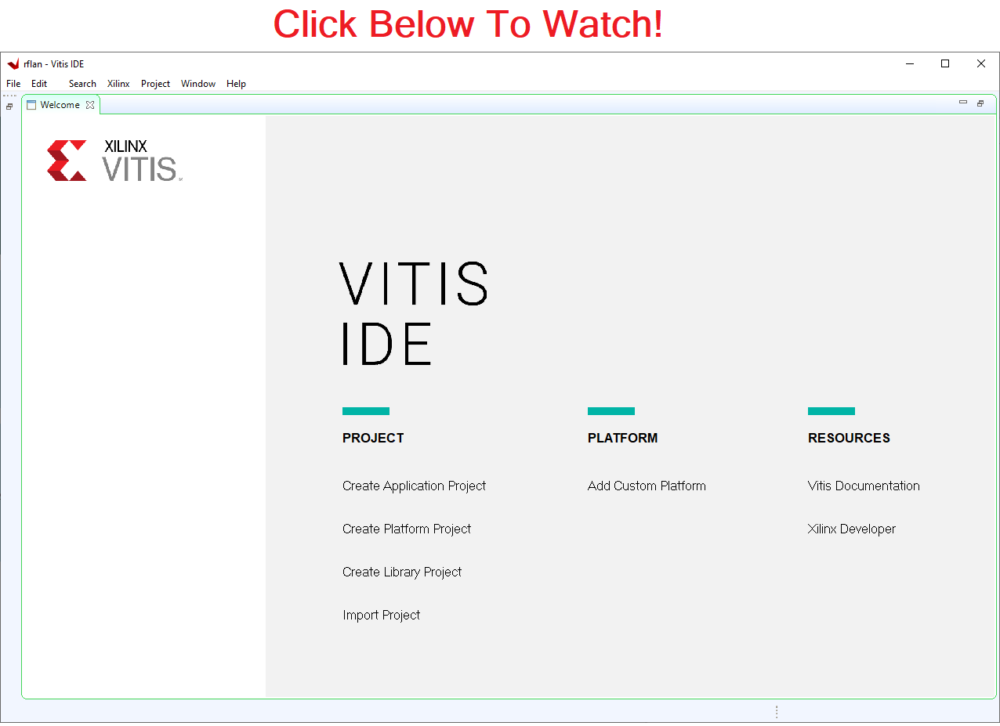

# RFLAN

The rflan application is an embedded C real-time application running on the Cortex R5 real-time processing unit (RPU).  The programmable logic includes the [adrv9001](../adrv9001/README.md) synchrounous serial interface along with DMAs for streaming IQ data or modem data to and from shared memory.  The RFLAN firmware configures and controls the ADRV9001.  It also directs DMA data to and from shared memory to one of the following external interfaces:  

| Physical Interface | Protocol |
|--------------------|----------|
| UART               | CLI      |
| IPC                | CLI      |
| Ethernet           | CLI      |
| Ethernet           | RTL-SDR  |
| USB                | RTL-SDR  |
| SATA               | Binary   |
| SD / eMMC          | Text     |


The following diagram shows the main components of the RFLAN including firmware running on the RPU and programmable logic.  The RFLAN can operate as a standalone application or integrated with a Linux application running on the Cortex A53 using interproccessor communication (IPC).  

The command line interface (CLI) are human readable commands accesable through UART or Ethernet using TCP socket 2233.  The RTL-SDR interface is accessible through USB or TCP socket 2244.  Additional information regarding the RTL-SDR can be found [here](https://www.mathworks.com/hardware-support/rtl-sdr.html). In addition to the high speed external peripherials DMA data can be streamed to internal memory including LPDDR4, SD card, or eMMC.  Data can also be streamed to external memory using the SATA interface. Compile options for enabling or disabling UART, Ethernet, and USB is available allowing the Linux application or rflan application to support a variety of configurations. 

To evaluate the rflan application the latest executables can be downloaded from the latest release folder found [here](https://github.com/NextGenRF-Design-Inc/bytepipe_sdk/releases) or built from source files.


# CLI Interface


# Building Source

Building the source files is straightforward using the supplied build scripts and video tutorials.  The first step in building the rflan source files is to build the HDL.  An alternative to building the HDL from source is to download the latest released version.  To build the HDL from source see the [Building HDL](#building-hdl) section below.  To use the latest pre-built HDL release follow instructions for [Building RPU Software](#building-rpu-software).  The source files can be built anywhere on the host machine.  It is good to build them in a seperate folder from the source files so they can be deleted without effecting the source.  The following example assumes the bytepipe_sdk repository is cloned or downloaded to the users `C:` drive.  

```
cd c:
git clone https://github.com/NextGenRF-Design-Inc/bytepipe_sdk.git
cd bytepipe_sdk/
mkdir workspace
cd workspace/
```

# Building HDL

The following describes the process for building the HDL from source files.  The HDL is built using [Vivado 2021.1](https://www.xilinx.com/support/download/index.html/content/xilinx/en/downloadNav/vivado-design-tools/2021-1.html). For additional information on setting up the build environment refer [here](../../docs/build_environment/BuildEnv.md). 

Start by launching cygwin on your windows machine and execute the following commands.  If Vivado is not installed at `C:/Xilinx/` update the path accordingly.  The build script will download the necessary source files and build the HDL.  When the build is finished the following output will be generated: `workspace/rflan/rflan_xzcuxxx.xsa`.  Once the build is completed the project can be opended using Vivado.  

```
export PATH=/cygdrive/c/Xilinx/Vivado/2021.1/bin/:$PATH
make -f ../src/rflan/Makefile hdl
```

Please review the video found below for additional information.


[]()

# Building RPU Software

The software is built using the Xilinx Vitis IDE.  The build script will automatically download the latest HDL outputs if not previously generated.  Start by launching cygwin on your windows machine and execute the following commands.  If Vitis is not installed at `C:/Xilinx/` update the path accordingly.  The script will generate the hardware platform, board support package, and rflan application.  Once the script is finished the project can be openend using Vitis with the workspace set to `workspace/rflan`. 

```
export PATH=/cygdrive/c/Xilinx/Vitis/2021.1/bin/:$PATH
make -f ../src/rflan/Makefile sw
```

Please review the video found below for additional information.


[]()

# Building ADRV9002 Profile

The ADRV9002 configuration is generated from Analog Devices Tranceiver Evaluation Software (TES).  The RFLAN includes a default configuration found in `src/rflan/sw/adrv9001/profile'.  To update the profile new settings need to be exported from TES and then compiled into the RFLAN. 

```
export PATH=/cygdrive/c/Xilinx/Vitis/2021.1/bin/:$PATH
make -f ../src/rflan/Makefile profile
```

Please review the video found below for additional information.


[](https://youtu.be/SMOLgKAgsfg)


# Programming BytePipe RFLAN

To program the BytePipe with the RFLAN application execute the following command once the code has been built.  This will create a folder called `sd_card` with the contents to be copied to the sd card.  

```
make -f ../src/rflan/Makefile sd_card
```

Please review the video found below for additional information.


[](https://youtu.be/JeQZI49h6uE)

# MATLAB bpToolbox

The RFLAN application can be controlled from MATLAB through the CLI interface accessible using a serial port or ethernet port.  For additional information see [bpToolbox](../bpToolbox/README.md).