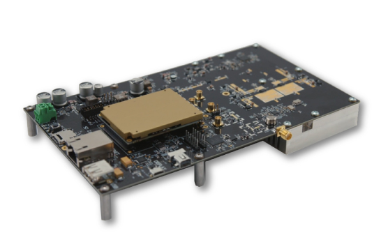
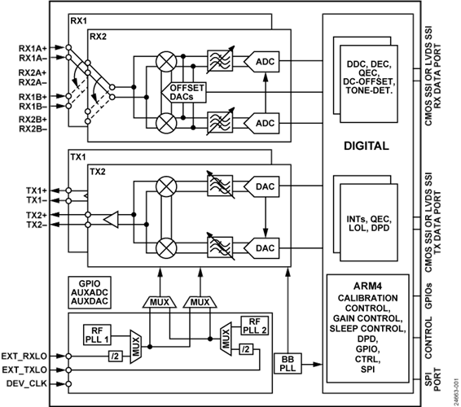
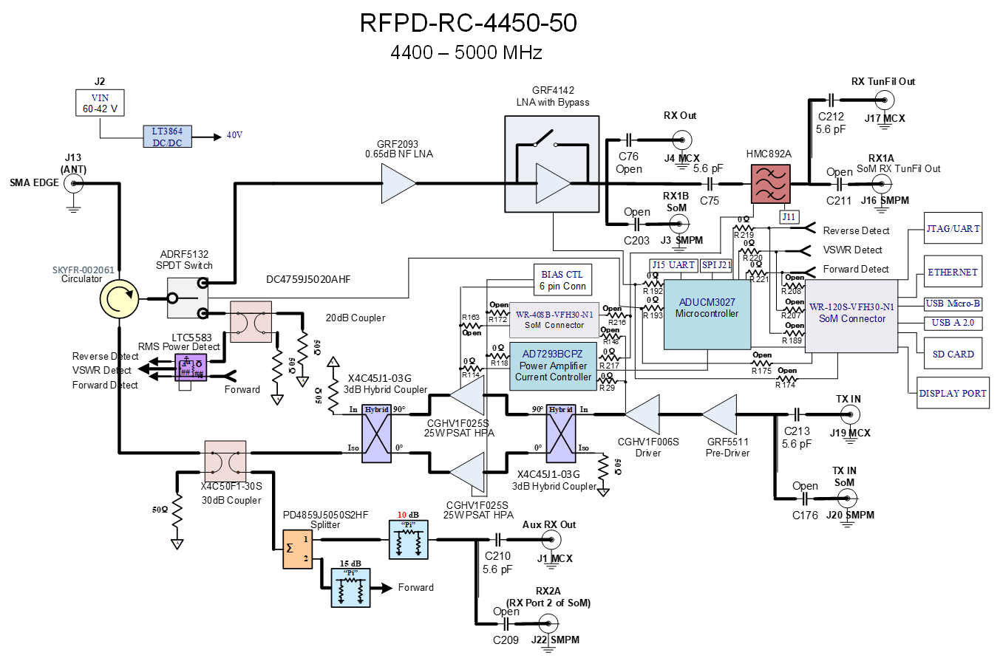
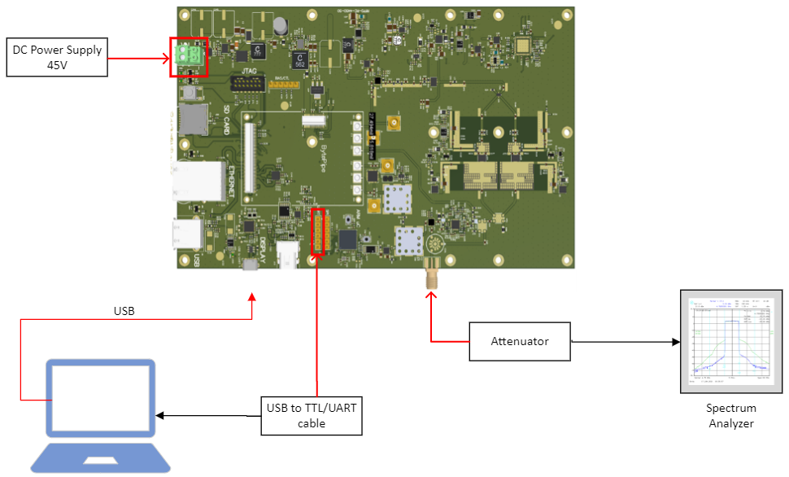
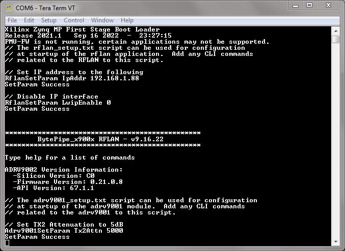
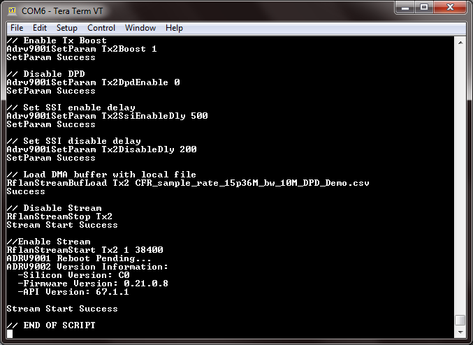
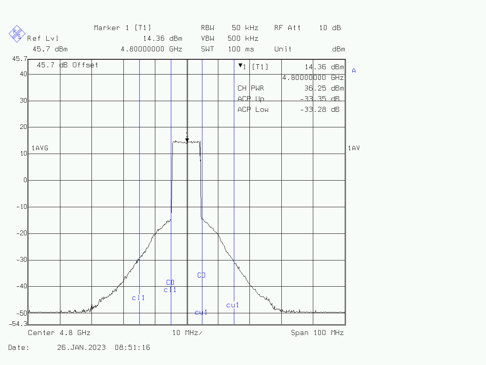
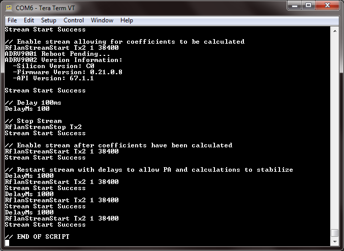
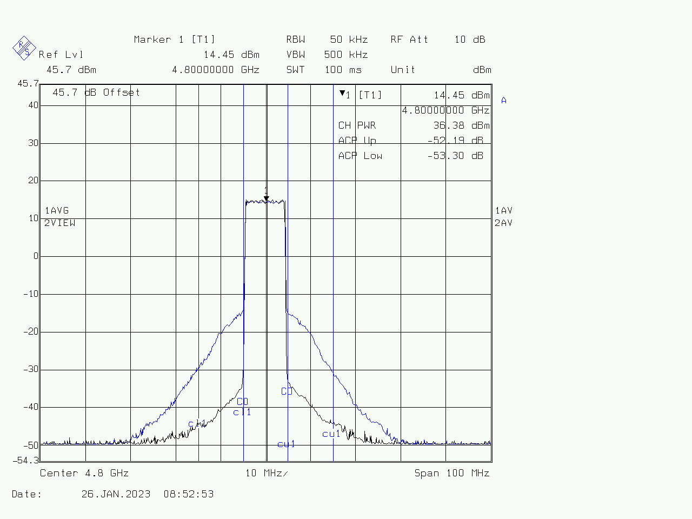
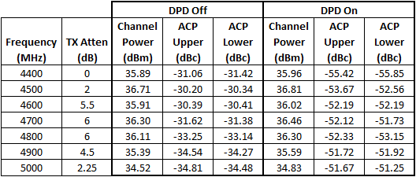

# RFLAN Digital Pre-Distortion (DPD)
## Overview
The BytePipe_x9002 is a highly integrated RF System on Module (SOM).  It integrates a RF transceiver, baseband processor (BBP), and all the necessary peripherals onto a single module.  This application note describes how to use the BytePipe x9002's internal Digital Pre-Distortion (DPD) function to linearize Richardson RFPD's RadioCarbon RFFE.  

## Theory of Operation
The BytePipe_x9002 is a highly integrated RF System on Module (SOM).  It integrates a RF transceiver, baseband processor (BBP), and all the necessary peripherals onto a single module.  

### RF Transceiver
The BytePipe_x9002 uses the Analog Devices Inc.'s ADRV9002 Agile Transceiver™.  The ADRV9002 is a highly integrated RF transceiver with two transmitters, two receivers, two integrated synthesizers, and an integrated DPD engine.   It operates from 30MHz to 6000MHz and supports both narrow band and wideband bandwidths from 12.5kHz to 40MHz.  This application note will describe the operation of the ADRV9002 integrated DPD and provide instructions on how this can be demonstrated on a RadioCarbon RF Front End.  



### RadioCarbon
For this application note, we will use Richardson RFPD’s RadioCarbon RFPD-RC-4450-50, which has been designed for easy integration with the BytePipe SOM, however other Power Amplifiers may be linearized by using the BytePipe Hardware Development Kit (HDK) and including the user’s own peripherals such as a feedback coupler and PA bias controls. 



## Test Setup and Operation
The following sections describe the equipment and accessories required for this test setup.  This will demonstrate the DPD capabilities of the ADRV9002 by showing a 10MHz wide signal with DPD disabled vs. enabled.

### Required Equipment
* RichardsonRFPD RadioCarbon™ RFPD-RC-4450-50
* TTL to USB Serial Converter Cable
* RadioCarbon GUI Software (included on USB drive with the RadioCarbon board)
* NextGen RF Design BytePipe™ SoM
* SMPM Barrel Adapters (min qty 2)
* SoM heatsink and fan assembly
* Micro SD Card (1GB - 32GB)
* DPD Demo Software Files (see download link in later section)
* Micro-B USB Cable
* TeraTerm Software 
* Power Attenuator (5W, 20dB or greater recommended)
* SMA cable and RF Adapters, as necessary
* Spectrum Analyzer (with adequate dynamic range and ability to measure accurate ACP)
* DC Power Supply capable of at least 3A @ 45V
* Additional Heatsink and/or Fan

### Recommended Test Setup
At a minimum, a PC running a terminal emulator supporting serial connections is required to configure the BytePipe SOM.  Ensure the BytePipe SOM is installed on the RadioCarbon board using at least two SMPM barrel adapters – one for Tx2 and one for Rx2A as indicated on the SOM.  SMPM barrel adapters can be used in the other four locations as well, but are not specifically required for this demo.

**Note:** Ensure adequate heatsinking and/or fans are used to prevent the SOM and RFFE from overheating.



## Software Setup
### RadioCarbon GUI
The RadioCarbon RFFE must be set up using a USB to TTL/UART cable to set bias level configuration and enable the PA prior to running the DPD demo.  Documentation for the RFFE can be found at the RichardsonRFPD shop website: https://shop.richardsonrfpd.com/Products/Product/RFPD-RC-4450-50#

Additional documentation for the RadioCarbon can be found here: https://github.com/NextGenRF-Design-Inc/bytepipe_sdk/blob/main/docs/hardware/RadioCarbon/RadioCarbon.md

### BytePipe CLI
The command line interface (CLI) provides an external user interface accessible through a serial port or Ethernet connection. Both interfaces are operational simultaneously allowing users to use one or both interfaces. The serial port is accessible through the USB interface using a micro-B USB cable connected to the RadioCarbon USB connector. For this demo it is recommended to use the USB interface and a [Tera Term](https://download.cnet.com/Tera-Term/3000-2094_4-75766675.html) serial terminal operating at 115200 baud as the COM port will enumerate even with the RadioCarbon board unpowered.  This allows for the boot sequence to be shown immediately when the board is powered.  If using the Ethernet connection, the board must be powered in order for the TCP/IP connection to be established.  If this is desired, the rflan_setup.txt file on the SD card will need to be modified to remove the line disabling the IP interface.  To do so, open the file in a text editor such as [Notepad++](https://notepad-plus-plus.org/) and delete or comment out the line ‘RflanSetParam LwipEnable 0’.  More information is available at: https://github.com/NextGenRF-Design-Inc/bytepipe_sdk/blob/main/src/rflan/README.md#cli-interface.

### BytePipe SD Card
The SD card files required to run this DPD demo can be downloaded from the NextGen RF Design GitHub.  To accurately replicate the demo detailed in this document, be sure to use the files specific to this demo which can be found at https://github.com/NextGenRF-Design-Inc/bytepipe_sdk/tree/main/src/rflan_dpd/sd_card and use the version matching your specific SOM architecture (either rflan_dpd_xczu3cg_sdcard.zip or rflan_dpd_xczu2cg_sdcard.zip).  This DPD-specific build includes an IQ stream file and two script files, tx_dpd_enabled.txt and tx_dpd_disabled.txt, which can be called easily from the CLI using the `ExecuteScript <filename>` command.

The micro-SD card must be formatted as FAT or FAT32, so a 1GB to 32GB card is recommended.  Ensure the .zip file is extracted to the root folder of the SD card.  The card should contain the following files:
* adrv9001_setup.txt
* BOOT.BIN
* CFR_sample_rate_15p36M_bw_10M_DPD_Demo.csv
* rflan_setup.txt
* tx_dpd_disabled.txt
* tx_dpd_enabled.txt

**NOTE:** Additional information regarding micro-SD cards and supported formats can be found here: https://github.com/NextGenRF-Design-Inc/bytepipe_sdk/blob/main/docs/sd_card/README.md

### BytePipe Operation
Begin the BytePipe DPD Demo by inserting the micro-SD card in the RFFE micro-SD card slot, opening a TeraTerm window and connecting to the CLI, then apply power to the RFFE.  If configured properly, the CLI should show a brief boot sequence output from the SOM.



As noted in the boot sequence, the `help` command will give a list of available commands and the appropriate context for use.

Once booted, execute the DPD disabled script by entering `ExecuteScript tx_dpd_disabled.txt`.  This output can be observed on the spectrum analyzer at a center frequency of 4.80GHz, as shown below.  Note the adjacent channel power caused by non-linearities in the gain stages.




The DPD enabled script can be executed by entering `ExecuteScript tx_dpd_enabled.txt`.  Note: The DPD disabled trace is stored in the spectrum analyzer (blue trace) screenshot for comparison.




The Tx output can be stopped by entering `RflanStreamStop Tx2`. 

## Common Commands
The demo scripts are optimized for use with Richardson RFPD’s RadioCarbon RFPD-RC-4450-50 and default to a center frequency of 4.80GHz.  These scripts can be modified with a text editor such as [Notepad++](https://notepad-plus-plus.org/), or commands can be manually entered in order to make adjustments.  The commands used to change the most common parameters are detailed below.

### Tx Attenuation
This parameter can be adjusted from 0 to 40dB in 0.001dB increments using the command `Adrv9001SetParam Tx2Attn <value>`.  The value should be entered by multiplying the desired attenuation in dB by 1000.  For example:

Desired attenuation of 0dB, enter:

```
Adrv9001SetParam Tx2Attn 0
```

Desired attenuation of 0.5dB, enter:

```
Adrv9001SetParam Tx2Attn 500
```
Desired attenuation of 3.25dB, enter:
```
Adrv9001SetParam Tx2Attn 3250
```

Desired attenuation of 17.125dB, enter:
```
Adrv9001SetParam Tx2Attn 17125
```

### Center Frequency
To adjust the center frequency, the ADRV must be in the RfCalibrated state.  Enter this state by using `Adrv9001ToRfCalibrated Tx2`.  Change the center frequency by entering `Adrv9001SetParam Tx2CarrierFrequency <value>` where value is the desired frequency in Hz.  Then return the ADRV to the RfPrimed state by entering `Adrv9001ToRfPrimed Tx2`.  For example, to set the center frequency to 4.65GHz, enter the following commands prior to starting the stream:
```
Adrv9001ToRfCalibrated Tx2
Adrv9001SetParam Tx2CarrierFrequency 4650000000
Adrv9001ToRfPrimed Tx2
```
**Note:** These state commands can only be used if the ADRV is in SPI mode.  If it is in PIN mode, the state is controlled by a digital IO pin.  To set it to SPI mode, use the command Adrv9001SetParam Tx2EnableMode 0.

### TDD Operation
The DPD profile is set for TDD operation, and the DPD coefficient calculations may require iterations in order to minimize adjacent channel power.  However, in following this application note you are only beginning the transmission one time, so the coefficients are only calculated once.  It is recommended to manually start and stop the transmit waveform for best results.  This can be done by simply restarting the stream multiple times with some delay.  The stream should also be restarted if the Tx attenuation is changed while transmitting.  For example, to adjust the Tx attenuation and restart the stream, include the following commands in the script file:
```
Adrv9001SetParam Tx2Attn 3250
RflanStreamStart Tx2 1 38400
DelayMs 1000
RflanStreamStart Tx2 1 38400
DelayMs 1000
RflanStreamStart Tx2 1 38400
```

**Note:** If entering these commands manually, the `DelayMs` command is not required.  Just allow some time between each entry.

## Expected Results
The following results are typical measured values on an RFPD-RC-4450-50.  The objective is to measure the maximum output power achievable while meeting a -50dBc adjacent channel (ACP) requirement.  The results are as follows:



## Additional Information
Analog Devices has a guide on troubleshooting and fine-tuning DPD which can be found here:
https://www.analog.com/en/technical-articles/troubleshoot-and-fine-tune-digital-predistortion.html

**Note:** This guide is intended for use with the ZCU102/ADRV9002 developer platform so it should only be used as a reference when operating the RadioCarbon and BytePipe SOM.

## Building from Source
The DPD demo files were built using v9.16.22 source files.  While these files are available in the GitHub release history, the scripts pull files from Analog Device’s website and these files have since been updated with changes that prevent it from building properly.  For assistance in building DPD files from source, please contact NextGen RF Design.  Contact information can be found at https://www.nextgenrf.com/about/contact-us/

## RFLAN v9.16.22 Known Bugs
When executing the command `RflanStreamStop Tx2`, the device incorrectly responds with ‘Stream Start Success’.  The response should be ‘Stream Stop Success’, however the stream has been stopped.

# Appendix A: tx_dpd_disabled.txt
```
// This script enables the transmitter with DPD disabled

//Set Center Frequency
Adrv9001ToRfCalibrated Tx2
Adrv9001SetParam Tx2CarrierFrequency 4800000000
Adrv9001ToRfPrimed Tx2

// Set Attenuation to 6dB
Adrv9001SetParam Tx2Attn 6000

// Enable Tx Boost
Adrv9001SetParam Tx2Boost 1

// Disable DPD
Adrv9001SetParam Tx2DpdEnable 0

// Set SSI enable delay
Adrv9001SetParam Tx2SsiEnableDly 500

// Set SSI disable delay
Adrv9001SetParam Tx2DisableDly 200

// Load DMA buffer with local file 
RflanStreamBufLoad Tx2 CFR_sample_rate_15p36M_bw_10M_DPD_Demo.csv

// Disable Stream
RflanStreamStop Tx2

//Enable Stream
RflanStreamStart Tx2 1 38400

// END OF SCRIPT
```

# Appendix B: tx_dpd_enabled.txt
```
// This script enables the transmitter with DPD enabled

//Set Center Frequency
Adrv9001ToRfCalibrated Tx2
Adrv9001SetParam Tx2CarrierFrequency 4800000000
Adrv9001ToRfPrimed Tx2

// Set Attenuation to 6dB
Adrv9001SetParam Tx2Attn 6000

// Enable Tx Boost
Adrv9001SetParam Tx2Boost 1

// Set SSI enable delay
Adrv9001SetParam Tx2SsiEnableDly 500

// Set SSI disable delay
Adrv9001SetParam Tx2DisableDly 200

// Enable DPD
Adrv9001SetParam Tx2DpdEnable 1

// Set External Path Delay in picoseconds
Adrv9001SetParam Tx2ExternalPathDelay 3800

// Set External Loopback power to -18dBm
Adrv9001SetParam Tx2ExternalLoopbackPower -180

// Set number of samples to calculate DPD coefficients
Adrv9001SetParam Tx2DpdNumberofSamples 4096

// Set Normalization Lower threshold to -11dBm
Adrv9001SetParam Tx2DpdRxTxNormalizationLowerThreshold 85290344

// Set Normalization upper threshold to -6dBm
Adrv9001SetParam Tx2DpdRxTxNormalizationUpperThreshold 269711751

// Set Detection Power Threshold to -16dBm
Adrv9001SetParam Tx2DpdDetectionPowerThreshold 53942350

// Set Detection Peak Threshold to -10dBm
Adrv9001SetParam Tx2DpdDetectionPeakThreshold 214748364

// Load DMA buffer with local file
RflanStreamBufLoad Tx2 CFR_sample_rate_15p36M_bw_10M_DPD_Demo.csv

// Disable Stream
RflanStreamStop Tx2

// Enable stream allowing for coefficients to be calculated
RflanStreamStart Tx2 1 38400

// Delay 100ms
DelayMs 100

// Stop Stream
RflanStreamStop Tx2

// Enable stream after coefficients have been calculated
RflanStreamStart Tx2 1 38400

// Restart stream with delays to allow PA and calculations to stabilize
DelayMs 1000
RflanStreamStart Tx2 1 38400
DelayMs 1000
RflanStreamStart Tx2 1 38400
DelayMs 1000
RflanStreamStart Tx2 1 38400

// END OF SCRIPT
```

Source doc: DOC-1015 Rev. 2

For more info, see [RFLAN](../rflan/README.md)